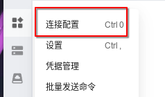
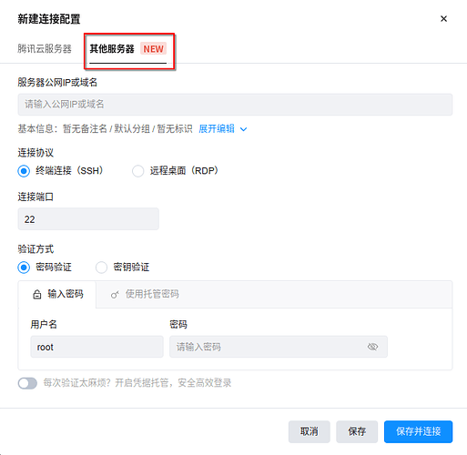
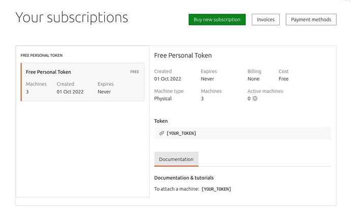

本文由本人自行转载的副本在：<https://linux.do/t/topic/267502>

## 前言

当我们拿到 VPS 之后，我们都需要做些什么呢？

如果选择将网站 / 服务放在知名厂商虚拟主机上，虚拟主机的厂商会负责基本的服务器安全措施。但如果放在 VPS 上，那么你就是服务器的安全负责人了。更多的权限代表着更多的义务，VPS 在具有更高的自由度的情况下自然有更高的风险。**而我们要做到的不是绝对安全，而是比大多数人安全。** 只要做到没那么容易被攻破那就是胜利。

本文使用的环境为 Ubuntu 24.04 LTS，其他发行版可大致参照思路。

在继续阅读本文之前，建议提前阅读由 [LUG@USTC](https://lug.ustc.edu.cn/) 编写的：<https://101.lug.ustc.edu.cn/>

:::note
本文与 <https://github.com/ustclug/Linux101-docs> 项目无关
:::

## 安全管理系统

有些 VPS 厂商默认提供的是 root 账户。众所周知，root 账户拥有整个系统最高的权限，这么高的权限自然是不安全的。正确的做法是创建一个非 root 账户，在必须使用 root 权限时使用 sudo 提权。

### 创建非 root 账户

使用以下命令创建一个具有提权能力的账户：

```bash
useradd -m -G sudo -s /bin/bash 用户名
```

然后我们给这个用户设置一个至少为 16 位的随机大小写字母 + 数字的密码（个人建议的最低安全性需求）：

```bash
passwd 用户名
```

> 建议把 root 用户的密码也改掉，云服务器的默认密码强度还是差点，而且有些服务商会通过邮件来发送默认密码，不太安全。

### 禁用 root SSH 密码登陆

先不提 root 登录本身就是危险的行为，root 账户的用户名固定为”root”，如果允许其通过密码登录，攻击者只需进行密码穷举即可尝试攻破系统。之前我们已经创建了非 root 账户，在这里我们只需要禁用 root 账户的 SSH 登录即可。

执行以下命令编辑 SSH 配置文件：

```bash
sudo vim /etc/ssh/sshd_config
```

进行如下设置：

```bash
# 禁止 Root 用户通过密码远程登录
PermitRootLogin prohibit-password
```

之后重启 SSH 服务生效：

```bash
sudo systemctl restart ssh
```

为什么不设置成 no：

> 另，直接禁掉 root 登录 `PermitRootLogin no` 我也不常用，更习惯和其他 sudoer 一样配密钥然后禁止密码登录仅允许密钥登录。我是一般能操做线下集群的机子才会这么配，不然出个故障没 root 用不了了，比如存储满了远程 ssh session 都建立不了。
>
> 理论上 PermitRootLogin 是好的，但在服务器寄掉需要救援时就会变麻烦，我其实更推荐只关闭远程密码登录，保留本地密码登录，出问题时可以通过 vnc 或者 ipmi 本地登录 root 进行救援。

### 修改 SSH 端口号

> 首先就要把 22 端口改了。
>
> 这是参照原帖里的基础上补充～
>
> 实际端口一般登上去就会改掉
>
> 登上去第一件事就是改 SSHD 的 端口并修改防火墙，22 全是猜密码的请求。
>
> 有个小技巧，就是改端口并重启 sshd 后当前的连接并没有断，向新端口发请求，能连上就是修改正确，要是不能建立新连接，还可以改回来，或查下防火墙的配置。

正常情况下，直接通过 `sudo vim /etc/ssh/sshd_config` 修改 SSH 端口，然后再使用 `sudo systemctl restart ssh.service` 重启 SSH 服务应用更改是可行的：

```bash
# 设置 SSH 端口
Port 自拟
```

但是在 **Ubuntu 22.10 或更高版本** 中各位可能发现这是 **无效** 的，各位会发现 SSH 服务在重启后依然监听原端口。

因为在 Ubuntu 22.10 或更高版本中，ssh 默认通过套接字激活。

在 Ubuntu 22.10、Ubuntu 23.04 和 Ubuntu 23.10 中进行修改的方法是：

```bash
sudo mkdir -p /etc/systemd/system/ssh.socket.d
sudo vim /etc/systemd/system/ssh.socket.d/listen.conf
sudo systemctl daemon-reload
sudo systemctl restart ssh.socket
sudo systemctl restart ssh.service
```

listen.conf 的参考配置为：

```bash
[Socket]
ListenStream=
ListenStream=2233
```

在 Ubuntu 24.04 中进行修改的方法是：

```bash
sudo vim /etc/ssh/sshd_config
sudo systemctl daemon-reload
sudo systemctl restart ssh.service
```

如果不在乎通过套接字激活节省的内存，可以通过以下命令恢复到非套接字激活：

:::warning
务必确认配置文件正常。
:::

```bash
sudo systemctl disable --now ssh.socket
sudo systemctl enable --now ssh.service
```

如有配置迁移（Ubuntu 22.10 及以上，Ubuntu 24.04 以下）：

```bash
sudo systemctl disable --now ssh.socket
rm -f /etc/systemd/system/ssh.service.d/00-socket.conf
rm -f /etc/systemd/system/ssh.socket.d/addresses.conf
sudo systemctl daemon-reload
sudo systemctl enable --now ssh.service
```

建议在 `/etc/ssh/sshd_config.d/` 创建一个 conf 文件来自定义 sshd 配置，而不是直接编辑 `/etc/ssh/sshd_config`，防止 OpenSSH 更新后配置冲突。

参考： [ssh - PasswordAuthentication no, but I can still login by password - Unix & Linux Stack Exchange](https://unix.stackexchange.com/questions/727492/passwordauthentication-no-but-i-can-still-login-by-password/727500#727500)

有些云服务商为了启用远程密码登录（sshd 默认禁用 ），会在 `/etc/ssh/sshd_config.d/` 自定义一个 conf 文件，修改 sshd 配置前先要排除它们的干扰。

```bash
# 查看 sshd_config.d 是否存在其他 conf 文件
sudo ls /etc/ssh/sshd_config.d/*.conf
# 如果存在，重命名，防止后续自定义配置被覆盖
sudo mv /etc/ssh/sshd_config.d/xxx.conf/etc/ssh/sshd_config.d/xxx.conf.bak
```

比如 CloudCone 就有一个 `/etc/ssh/sshd_config.d/50-cloud-init.conf`

sshd 配置修改完，先用 `sudo sshd -T` 看一下有效配置，免得被覆盖了都不知道:joy:。

```bash
# Root 用户登录方式
sudo sshd -T | grep -i "PermitRootLogin"
# 密码认证
sudo sshd -T | grep -i "PasswordAuthentication"
# ssh 端口
sudo sshd -T | grep -i "Port"
```

值得一提的是，`prohibit-password` 是 `without-password` 的别名，所以看到下面的输出是正常现象。

```bash
$ sudo sshd -T | grep -i "PermitRootLogin"
permitrootlogin without-password
```

参考：

* [Permit root to login via ssh only with key-based authentication - Unix & Linux Stack Exchange](https://unix.stackexchange.com/questions/99307/permit-root-to-login-via-ssh-only-with-key-based-authentication/99308#99308)
* [OpenSSH 7.0 更新日志](https://www.openssh.com/txt/release-7.0)

### Fail2ban 防暴力破解 SSH

执行以下命令安装 Fail2ban：

```bash
sudo apt install fail2ban
```

官方推荐的做法是利用 jail.local 来进行自定义设置：

```bash
sudo vim /etc/fail2ban/jail.local
```

可以参照以下配置文件来进行自己的配置（记得删注释）：

```bash
[sshd]
ignoreip = 127.0.0.1/8 # 白名单
enabled = true
filter = sshd
port = 22 # 端口，改了的话这里也要改
maxretry = 5 # 最大尝试次数
findtime = 300 # 多少秒以内最大尝试次数规则生效
bantime = 600 # 封禁多少秒，-1 是永久封禁（不建议永久封禁）
action = %(action_) s [port="%(port) s", protocol="%(protocol) s", logpath="%(logpath) s", chain="%(chain) s"] # 不需要发邮件通知就这样设置
banaction = iptables-multiport # 禁用方式
logpath = /var/log/auth.log # SSH 登陆日志位置
```

### 通知服务器 SSH 登录

> 很有用，我还加了一个在登录 ssh 时候自动发通知到企业微信机器人，以防偷家不知道

可以通过 PAM 模块在每次 ssh 登录时触发脚本来实现。

编辑 `/etc/pam.d/sshd`，在文件末尾添加：

```bash
session    optional    pam_exec.so 脚本路径
```

对于提到的用例，脚本大致如下：
参照：<https://developer.work.weixin.qq.com/document/path/91770>

2024 年 11 月 26 日注：修复了示例脚本的一些问题。

```bash
#!/bin/bash

if [ "$PAM_TYPE" != "open_session" ]; then
    exit 0
fi

ip=$PAM_RHOST
date=$(date +"% e % b % Y, % a % r")
name=$PAM_USER

webhook_url="https://qyapi.weixin.qq.com/cgi-bin/webhook/send?key=xxxxxxxxxxxxxxx"

curl -s -X POST "$webhook_url" \
    -H "Content-Type: application/json" \
    -d "{
    \"msgtype\": \"markdown\",
    \"markdown\": {
        \"content\": \"** 登录提醒 **\\n> 登录用户: $name\\n> 客户端 IP: $ip\\n> 登录时间: $date\"
    }
}"

```

请根据自己的用例替换 api 及调用方式。

写完了脚本需要给脚本加上运行权限。

`sudo chmod +x /usr/local/bin/notify_ssh_login.sh`

### 【严格】使用绝对路径运行命令

使用绝对路径可以精准指定要运行的程序或文件，可避免因环境变量被篡改等原因误执行潜在的恶意程序。

> 使用 su 的完整路径可以避免运行潜在的攻击者植入的 su。

### 使用密钥登录

:::tip
如果 VPS 厂商提供了 SSH 密钥绑定功能，可以忽略本节内容并按照 VPS 厂商提供的方法绑定。
:::

在 powershell 中运行：

```bash
ssh-keygen -t ed25519
```

直接使用默认的密钥路径即可。密码可以留空，也可以设置。

```bash
Generating public/private ed25519 key pair.
Enter file in which to save the key (C:\Users\<user>/.ssh/id_ed25519): # 直接回车
Enter passphrase (empty for no passphrase): # 可以留空，也可以设置
Enter same passphrase again: # 和上一个一样
```

然后我们在 VPS 上编辑 SSH 授权密钥文件：

```bash
vim ~/.ssh/authorized_keys
```

之后打开 C:\Users\<user>/.ssh/id_ed25519.pub，复制其内容并粘贴过去。

执行以下命令编辑 SSH 配置文件：

```bash
sudo vim /etc/ssh/sshd_config
```

进行如下设置：

```bash
PubkeyAuthentication yes
AuthorizedKeysFile .ssh/authorized_keys
PasswordAuthentication no
```

之后重启 SSH 服务生效：

```bash
sudo systemctl restart ssh
```

### 启用 UFW 防火墙

:::tip
如果 VPS 厂商提供了防火墙功能，且没有复杂的需求，可以忽略本节内容并使用 VPS 厂商提供的防火墙。
:::

在正式启用 UFW 之前，我们需要先设置规则。我们首先来设置 UFW 的默认行为：

```bash
sudo ufw default allow outgoing # 默认允许所有数据出站
sudo ufw default deny incoming # 默认禁止所有数据入站
```

我们可以通过以下命令查看 UFW 当前生效的规则：

```bash
sudo ufw status
sudo ufw status numbered  # 加上数字编号
```

我们可以通过以下命令允许或拒绝某端口的传入 / 传出流量（部分以 22、80、443 端口为例）：

```bash
# 允许 22 端口的 proto 协议的流量入站
sudo ufw allow in 22/proto

# 允许 22 端口的 proto 协议的流量出站
sudo ufw allow out 22/proto

# 在未指定 in/out 的情况下，默认为 in
sudo ufw allow 22/proto

# 在未指定 proto 的情况下，默认为 tcp 和 udp
sudo ufw allow 22

# 拒绝的话就把 allow 改成 deny
sudo ufw deny 22

# 允许从 start_port 到 end_port 的端口
sudo ufw allow start_port:end_port

# 允许复数个端口，以英文逗号分隔
sudo ufw allow port1,port2

# 允许来自于特定 ip 或 cidr 段的流量
sudo ufw allow from ip/cidr

# 允许来自于特定 ip 或 cidr 段端口 22 的流量
sudo ufw allow from ip/cidr to any port 22

# 允许来自于特定 ip 或 cidr 段端口 22 的 tcp 协议的流量
sudo ufw allow from ip/cidr to any proto tcp port 22

# 如果指定复数个端口，则必须指定协议
sudo ufw allow from ip to any proto tcp port 80,443

# comment 用于注释
sudo ufw allow from ip to any proto tcp port 80,443 comment "hello"
```

我们可以通过以下命令删除生效的规则：

```bash
sudo ufw delete allow 22 # 在规则前面加个 delete
sudo ufw delete 1 # 按照 numbered 的编号删除也行
```

在确定所有规则均成功设置后，通过以下命令启动 \ 关闭 \ 重启 UFW

:::warning
启动防火墙前务必保证 22 端口（或者其他 SSH 端口）被放行。
:::

```bash
sudo ufw enable|disable|reload
```

如果需要重置规则，请使用：

:::warning
重置规则前务必保证 UFW 处于关闭状态。
:::

```bash
sudo ufw reset
```

本人建议仅放行正在使用的端口，比如 22、80、443。

默认情况下，UFW 仅记录不符合规则的被拒绝的数据包。如果需要记录与该服务相关的每个详细信息，可以在 allow 后加上 log 以进行记录。

```bash
# 成功连接 ssh 的也记一下日志备查比较好
ufw allow log 22/tcp
```

### 禁止 ping 服务器

#### 使用 iptables 禁止 ping

* 查看当前 iptables 规则：
  * iptables -L -n
  * 这条命令可以列出当前 iptables 的规则，-L 表示列出规则，-n 表示以数字形式显示 IP 地址和端口号，而不是解析为主机名和服务名。  

* 禁止 ping（入站 ICMP Echo Request）：
  * iptables -A INPUT -p icmp --icmp - type 8 -j DROP
  * 这里 - A INPUT 表示在 INPUT 链（用于处理进入本机的数据包）的末尾添加一条规则。-p icmp 指定协议为 ICMP，--icmp - type 8 表示 ICMP 类型为 8（即 Echo Request），-j DROP 表示将匹配的数据包丢弃。  
  
* 保存 iptables 规则（如果需要永久生效）：
  * 对于不同的 Linux 发行版，保存 iptables 规则的方式不同。
  * 在 CentOS 等基于 RHEL 的系统中，可以使用 service iptables save 命令来保存规则。这条命令会将当前的 iptables 规则保存到 /etc/sysconfig/iptables 文件中，这样在系统重启后规则依然生效。
  * 在 Ubuntu 等 Debian 系系统中，需要安装 iptables - persistent 软件包。安装后可以使用 iptables - save > /etc/iptables/rules.v4（对于 IPv4 规则）来保存规则，这样在系统重启后也能恢复规则。

* 恢复 ping 功能

如果要恢复 ping 功能，可以删除刚才添加的禁止 ping 的规则。使用 iptables -D INPUT -p icmp --icmp - type 8 -j DROP 命令。其中 - D INPUT 表示从 INPUT 链中删除规则，其他参数和添加规则时相同。

#### 使用 ufw 禁止 ping

:::note
保守起见，与 destination-unreachable、time-exceeded、parameter-problem 相关的规则已移除。
:::

ufw 本身没有直接支持阻止 icmp 协议的命令。ufw 在 /etc/ufw/before.rules 中定义了针对 ping 的允许规则，我们可以修改 ACCEPT 为 DROP 来达成禁止 ping 的目的：

```bash
-A ufw-before-input -p icmp --icmp-type echo-request -j DROP
-A ufw-before-forward -p icmp --icmp-type echo-request -j DROP
```

> 佬，这个好像只能禁 v4 的，发现 v6 还可以 ping

如果需要设置 ipv6 的禁 ping 规则，可以修改 `/etc/ufw/before6.rules` ：

```bash
-A ufw6-before-output -p icmpv6 --icmpv6-type echo-request -j DROP
-A ufw6-before-output -p icmpv6 --icmpv6-type echo-reply -j DROP
```

:::info
其余 icmpv6 规则应保持不变
:::

### 限定 SSH 登录 IP

> 我办公室的网络是固定 ip，VPS 运营商的防火墙开 22 端口然后指定 IP 地址，这样以后需要别的 IP 访问的话，直接添加 IP 即可

如果拥有动态公网 IP 且厂商支持通过接口修改防火墙规则，可以直接使用厂商的接口。

> 如果是家里没有固定 ip 的可以使用类似腾讯云的 [orcaterm](https://orcaterm.cloud.tencent.com/) 终端来访问，基础功能是永久免费的，这是 [orcaterm 的 IP 段](https://www.tencentcloud.com/zh/document/product/213/39708?lang=zh)，然后用 ipset 把这些 IP 段添加进去，设置为仅这些 IP 可以访问 ssh 端口即可，记得设置之前先测试是否可以正常使用连接。如果是腾讯云用户，安全组里甚至可以把 ssh 端口直接关掉，之前用腾讯云的时候就只开了 80 和 443 端口

也可以使用 ufw 进行设置。

还可以使用 VPS 厂商提供的防火墙（如果支持），如果出现连接问题更方便更改配置。

[orcaterm](https://orcaterm.cloud.tencent.com/) 添加其他厂商云服务器步骤：






## 保证软件更新

### 日常更新系统

个人建议定期登录 VPS 运行 `sudo apt update && sudo apt upgrade` 来保证 VPS 内所有软件包均为最新。

不过 Ubuntu 默认会每天自动安装系统的安全更新，所以说这个频率没必要太勤。

### 开启 Ubuntu Pro

> 同样出色的操作系统，更多的安全更新
> 将平均 CVE（通用漏洞披露）暴露时间从 98 天减少到 1 天
> 具备扩展的 CVE 补丁、十年的安全维护、可选的支持和对整个开源应用程序堆栈的维护。

上面是 Ubuntu 官方的广告词。到底多有用我不知道，有修复总比没修复好，而且个人免费 5 台机器，开了不亏。

我们先来创建一个 Ubuntu One 帐户：<https://ubuntu.com/login>

注册结束之后，转到 <https://ubuntu.com/pro/dashboard> 查看 Token。



得到了 Token 之后，前往我们的 VPS，运行 `sudo pro attach [YOUR_TOKEN]`。等待一段时间，我们的 VPS 就成功开启 Ubuntu Pro 了。建议在开启之后再运行一次 `sudo apt update && sudo apt upgrade` 以确保系统安装了最新的安全更新。

## 隐藏公网 IP

> 隐藏公网 IP 并不是所有 VPS 使用者的共同安全需求，有一个胡诌的针对未来（指 ipv6 广泛使用）的方案就是只暴露源站 v6 地址给 CDN 用，这样 Censys 这样强扫的工具耗时会很长，不过也还是要配白名单。

### 防止 SSL 证书泄露 IP

> 本节 “防止 SSL 证书泄露 IP” 引自 “如何避免证书泄露源站 IP”，作者为秋未萌，根据 CC BY-SA 4.0 授权协议发布。本文其他部分根据 CC BY-NC-SA 4.0 授权协议发布，但本节内容使用 CC BY-SA 4.0 授权协议。

#### 申请并下载证书

* 注册并且登录 [ZeroSSL](https://app.zerossl.com/login)
* 到 [Dashboard](https://app.zerossl.com/dashboard) 找到 Create SSL Certificate，点击 New Certificate 蓝色按钮
* 在 Enter Domains 处输入源站 IP
* 其实过期也无妨，总之不让 censys 扫描到真正的域名证书就可以。因此选择 90 天证书
* CSR & Contat 保持不变
* 验证域名的办法选择 HTTP File Upload
  * 使用 NGINX 的话，如果你保持原先设置不变，即 `/etc/nginx/sites-available/default` 不变就没问题。当然，如果你改变了，记得保留 `server {listen 80; root /var/www/html;}` 就可以
  * 然后下载 Auth File，并且把它上传到 `/var/www/html/.well-known/pki-validation`。如果没有文件夹，就新建，记得让 NGINX 有权访问这些文件，否则还是会失败
  * 按照提示，点击一下 `.txt` 文件是不是可以访问。成功的话，就验证好了

#### 配置证书并且设置禁止 IP 80/433 的 HTTP 访问

* 下载 `*.zip` 文件，解压它。解压好的文件夹里面有好申请到的证书
* 将 `ca_bundle.crt` 和 `certificate.crt` 合并，方法是用 notepad3 或者 vsode 等可靠的编辑器打开 `certificate.crt`。然后把 `ca_bundle.crt` 内容复制进去。格式是：

```bash
-----BEGIN CERTIFICATE-----
certificate.crt 内容
-----END CERTIFICATE-----
-----BEGIN CERTIFICATE-----
ca_bundle.crt 内容
-----END CERTIFICATE-----
```

* 上传合并好的文件和 `private.key`
* 上传证书到一个 Nginx 有权限的文件夹，咱放在 `/etc/nginx/ip-certificate/`
* 设置 `/etc/nginx/sites-available/default` 文件。参考设置如下：

```bash
server {    
#HTTP Server Default Set    
    listen 80;
    listen 443 ssl http2 default_server;
    server_name ip;     

    #HTTP_TO_HTTPS_END    
    ssl_certificate /etc/nginx/ip-certificate/certificate.crt;
    ssl_certificate_key /etc/nginx/ip-certificate/private.key;
    ssl_protocols TLSv1.1 TLSv1.2 TLSv1.3;
    ssl_ciphers ECDHE-RSA-AES128-GCM-SHA256:HIGH:!aNULL:!MD5:!RC4:!DHE;
    ssl_prefer_server_ciphers on;
    ssl_session_cache shared:SSL:10m;
    ssl_session_timeout 10m;
    
    #Server ROOT
    index index.html;
    root /var/www/html/;
    index index.html;

    return 444; #NGINX HTPP Code 444
}
```

服务器后台输入 `nginx -t` 检查是否有误，正确即可 `sudo systemctl restart nginx` 重启。

直接输入 IP 作为网址检查是不是连接后立刻变成空白页

### Nginx 1.19.4 之后的新方法

如果各位的 Nginx 版本大于等于 1.19.4，可以直接使用 ssl_reject_handshake 配置项，通过简单的配置就能拒绝所有未匹配到域名的 TLS 握手：

```bash
server {
    listen 443 ssl default_server;
    server_name _;
    ssl_reject_handshake on;
}
```

如果出现如 `nginx: [emerg] unknown directive “ssl_reject_handshake”` 的报错，首先请检查 nginx 版本是否大于等于 1.19.4。`ssl_reject_handshake on;` 在 nginx 1.19.4 主线版加入。

如果是通过源代码编译安装的，请确认 ngx_http_ssl_module 模块是否启用。 该模块不是默认构建的，需要通过 `--with-http_ssl_module` 配置参数来启用。

### 真的安全了吗

前文中，我们只能确保攻击者无法通过直接访问 ip 获取默认证书来推断域名信息。然而又没有规定说攻击者只能用这种方式获取 IP 与域名的对应关系。可以看出，前文的规则依赖于 server_name 的匹配。攻击者完全可以携带正确的 server_name 握遍所有可能的非已知 CDN 的 IP 段，记录正确响应的目标。下面是判断（不包含遍历）的简单实现：

```python
# https://gist.github.com/Raven95676/39ffdba22144e39d7155ad9dc1bcca55
import ssl
import socket
def check (ip, domain):
    try:
        context = ssl.create_default_context ()
         with socket.create_connection ((ip, 443)) as sock:
            with context.wrap_socket (sock, server_hostname=domain) as ssl_sock:
                request = f"GET / HTTP/1.1\nHost: {domain}\nConnection: close\n\n"
                ssl_sock.sendall (request.encode ())
                ssl_sock.recv (4096)
        return True
    except Exception:
        return False

print (check ("192.168.0.256", "example.com"))
```

### 于是我们打个补丁


如果 VPS 厂商提供了防火墙功能，可以直接使用 VPS 厂商提供的防火墙。
:::

~~各位可以直接用这个方法~~

我们可以仅允许 CDN 的 CIDR 段访问服务器的 80/443 端口。先来添加允许的规则：

```bash
sudo ufw allow from "cidr 段" to any proto tcp port 80,443 comment "CDN 服务商"
```

comment 不是必须的，只是为了方便日后能认出来这规则是干什么的才加上的。

CDN 的 CIDR 段去找 cdn 服务商要，有的在官网也有公示。比如 Cloudflare 的 CIDR 段可以从这个网页获取：<https://www.cloudflare.com/ips-v4>

上面那个是 ipv4 的，ipv6 的可以从这个网页获取：<https://www.cloudflare.com/ips-v6>

对于 Cloudflare ，还有佬友编写的脚本可以在执行后更新 CF IP 到 ufw 443。

```bash
RULES=$(sudo ufw status numbered | grep 'Cloudflare IP' | awk -F"[][]" '{print $2}' | sort -nr)
for RULE in $RULES; do
    echo "Deleting rule $RULE"
    echo "y" | sudo ufw delete $RULE
done

for cfip in `curl -sw '\n' https://www.cloudflare.com/ips-v {4,6}`; do ufw allow proto tcp from $cfip to any port 443 comment 'Cloudflare IP'; done

ufw reload > /dev/null
```

由于特殊情况的存在，本人建议在部署该脚本之前先执行以下命令查看是否正确输出。

```bash
for cfip in `curl -sw '\n' https://www.cloudflare.com/ips-v {4,6}`; do echo $cfip; done
```

如果输出正常（如下），则可以部署：

```bash
173.245.48.0/20
103.21.244.0/22
… 略
2400:cb00::/32
2606:4700::/32
… 略
```

添加完了之后我们使用以下命令查看防火墙现有规则列表：

```bash
sudo ufw status numbered
```

使用以下命令删除之前可能存在的针对 80 和 443 端口允许所有流量的规则：

```bash
sudo ufw delete 序号
```

为什么不直接使用 Nginx 的 deny 配置项呢？因为 deny 会返回 403 Forbidden 状态码，而在此之前必须完成 TLS 握手。只有在 TLS 握手成功后，客户端才能发送 HTTP 请求并接收到响应。如果直接使用 deny，我们相当于在做无用功。

### 真的安全了…… 吗？

这其实算是 Cloudflare 特辑，不过如果使用其他 CDN 提供商，为了增强安全性也可以参考。众所周知，Cloudflare 不仅提供 CDN 服务，还有一系列其他产品，比如 Workers 和 WARP。而这些服务有一些需要注意的特点：

* 能对外发出请求
* 用的是 Cloudflare 的 IP 段

虽然 Cloudflare 对于滥用肯定是限制的，但是为了以防万一，我们还可以再做点安全措施 —— 经过身份验证的源服务器拉取。

:::info
必须确保 SSL/TLS 加密模式为完全或者完全（严格）
:::

下载[Cloudflare证书](https://developers.cloudflare.com/ssl/static/authenticated_origin_pull_ca.pem)并进行配置即可。

```bash
ssl_client_certificate 证书地址；
ssl_verify_client on;
```

然后在 SSL/TLS→源服务器这里开启经过身份验证的源服务器拉取。

雷池 WAF 社区版目前暂时无法稳定使用此方法，除非乐意在雷池前面再叠一层反代。

## 迈向全面容器化
>
> 我的建议是善用容器化技术进行隔离

本节暂不涉及 1panel 等运维面板或 portainer 等 docker 面板。

### Docker 基本使用

:::note
发现成熟的文档，不再重复造轮子。

本文与 <https://github.com/yeasy/docker_practice> 项目无关

~~小小的偷个懒~~
:::

附注：如果 `docker-compose` 提示找不到命令，试试 `docker compose`。docker compose 现已弃用 `version` 字段，现有的 compose 配置文件中 `version` 字段将被忽略并显示一条警告。

<https://yeasy.gitbook.io/docker_practice>

更新：添加 Docker 官中文档。

<https://docs.docker.net.cn/manuals/>

### UFW 管不了 Docker 的解决方案（推荐）

> 再写一点关于 docker 的问题吧，其实没必要用 ufw 来管理 docker 的端口开放，docker 会自己写入 iptables 规则用以管控端口，以 docker compose 为例：

#### 1. 对于数据库或者 redis 之类仅在应用内使用的服务

* 仅在容器内部网络内开放，compose 拉起时会创建一个名为 `第一个服务名_default` 的 bridge，可以用 `docker network ls` 查看。
* 容器默认对该内部网络开放所有端口。
* 同一网络内的其他容器可以通过容器名和端口访问该服务。
* 没有加入该网络的容器无法访问任何端口。
* 对于仅在内部网络中暴露端口的服务，**无需** 在 `ports` 下指定任何映射

#### 2. 对于需要进行反代的服务

* 仅在 127.0.0.1 监听即可防止外部端口访问，在对应容器处使用

```yaml
ports:
    - 127.0.0.1: 端口：端口
```

#### 3. 对于需要外部直接访问端口的服务

* 直接使用

```bash
ports:
      - 端口：端口
```

同样的，贴一个示例 compose.yml

```bash
services:
    rsshub:
        image: diygod/rsshub:latest
        restart: always
        ports:
            - 127.0.0.1:1200:1200
        environment:
            NODE_ENV: production
            CACHE_TYPE: redis
            REDIS_URL: "redis://redis:6379/"
            PUPPETEER_WS_ENDPOINT: "ws://browserless:3000"
        env_file:
            - .env
        healthcheck:
            test: ["CMD", "curl", "-f", "http://localhost:1200/healthz"]
            interval: 30s
            timeout: 10s
            retries: 3
        depends_on:
            - redis
            - browserless
 
    browserless:
        image: browserless/chrome
        restart: always
        ulimits:
            core:
                hard: 0
                soft: 0
        healthcheck:
            test: ["CMD", "curl", "-f", "http://localhost:3000/pressure"]
            interval: 30s
            timeout: 10s
            retries: 3
 
    redis:
        image: redis:alpine
        restart: always
        volumes:
            - ./data:/data
        healthcheck:
            test: ["CMD", "redis-cli", "ping"]
            interval: 30s
            timeout: 10s
            retries: 5
            start_period: 5s
    
    sb:
        image: ghcr.io/sagernet/sing-box
        container_name: sb
        restart: always
        volumes:
            - ./sing-box:/etc/sing-box/
        command: -D /var/lib/sing-box -C /etc/sing-box/run
```

此外，如果需要阻止外部端口访问，除去仅在 127.0.0.1 监听外还可以：

> 需要 Nginx/Caddy 等反代的服务，在 Compose 文件里可以配置一个 Docker 专用的 172 开头的内网 ip，且不配置端口。这样 Docker 就不会暴露公共端口，反代地址写 内网 ip: 默认端口即可。

比如 MySQL 的 Compose 文件配置，指定了使用内网 IP 为 `172.20.0.15`，注释了端口映射，在配置反向代理时 直接反代 `172.20.0.15:3306` 即可。

```bash
networks:
  default:
    external: true
    name: ${DOCKER_MY_NETWORK}
services:
  mysql:
    container_name: mysql8
    image: mysql:8
    # ports:
    #   - "3306:3306"
    environment:
      TZ: Asia/Shanghai
    networks:
      default:
        ipv4_address: 172.20.0.15
    restart: unless-stopped
```

### UFW 管不了 Docker 的解决方案（不太推荐）

> 本节 “UFW 管不了 Docker 的解决方案（不太推荐）” 引自项目 **[ufw-docker](https://github.com/chaifeng/ufw-docker)** 的 README，作者为 [chaifeng](https://github.com/chaifeng)，根据 GPL-3.0 license 授权协议发布。本文其他部分根据 CC BY-NC-SA 4.0 授权协议发布，但本节内容使用 GPL-3.0 license 授权协议。

目前新的解决方案只需要修改一个 UFW 配置文件即可，Docker 的所有配置和选项都保持默认。

修改 UFW 的配置文件 `/etc/ufw/after.rules`，在最后添加上如下规则：

```bash
# BEGIN UFW AND DOCKER
*filter
:ufw-user-forward - [0:0]
:ufw-docker-logging-deny - [0:0]
:DOCKER-USER - [0:0]
-A DOCKER-USER -j ufw-user-forward

-A DOCKER-USER -j RETURN -s 10.0.0.0/8
-A DOCKER-USER -j RETURN -s 172.16.0.0/12
-A DOCKER-USER -j RETURN -s 192.168.0.0/16

-A DOCKER-USER -p udp -m udp --sport 53 --dport 1024:65535 -j RETURN

-A DOCKER-USER -j ufw-docker-logging-deny -p tcp -m tcp --tcp-flags FIN,SYN,RST,ACK SYN -d 192.168.0.0/16
-A DOCKER-USER -j ufw-docker-logging-deny -p tcp -m tcp --tcp-flags FIN,SYN,RST,ACK SYN -d 10.0.0.0/8
-A DOCKER-USER -j ufw-docker-logging-deny -p tcp -m tcp --tcp-flags FIN,SYN,RST,ACK SYN -d 172.16.0.0/12
-A DOCKER-USER -j ufw-docker-logging-deny -p udp -m udp --dport 0:32767 -d 192.168.0.0/16
-A DOCKER-USER -j ufw-docker-logging-deny -p udp -m udp --dport 0:32767 -d 10.0.0.0/8
-A DOCKER-USER -j ufw-docker-logging-deny -p udp -m udp --dport 0:32767 -d 172.16.0.0/12

-A DOCKER-USER -j RETURN

-A ufw-docker-logging-deny -m limit --limit 3/min --limit-burst 10 -j LOG --log-prefix "[UFW DOCKER BLOCK]"
-A ufw-docker-logging-deny -j DROP

COMMIT
# END UFW AND DOCKER
```

然后重启 UFW，`sudo systemctl restart ufw`。现在外部就已经无法访问 Docker 发布出来的任何端口了，但是容器内部以及私有网络地址上可以正常互相访问，而且容器也可以正常访问外部的网络。**可能由于某些未知原因，重启 UFW 之后规则也无法生效，请重启服务器。**

如果希望允许外部网络访问 Docker 容器提供的服务，比如有一个容器的服务端口是 `80`。那就可以用以下命令来允许外部网络访问这个服务：

```bash
ufw route allow proto tcp from any to any port 80
```

这个命令会允许外部网络访问所有用 Docker 发布出来的并且内部服务端口为 `80` 的所有服务。

请注意，这个端口 `80` 是容器的端口，而非使用 `-p 0.0.0.0:8080:80` 选项发布在服务器上的 `8080` 端口。

如果有多个容器的服务端口为 80，但只希望外部网络访问某个特定的容器。比如该容器的私有地址为 `172.17.0.2`，就用类似下面的命令：

```bash
ufw route allow proto tcp from any to 172.17.0.2 port 80
```

如果一个容器的服务是 UDP 协议，假如是 DNS 服务，可以用下面的命令来允许外部网络访问所有发布出来的 DNS 服务：

```bash
ufw route allow proto udp from any to any port 53
```

同样的，如果只针对一个特定的容器，比如 IP 地址为 `172.17.0.2`：

```bash
ufw route allow proto udp from any to 172.17.0.2 port 53
```

## 长亭雷池 WAF+Cloudflare 单节点部署

~~思来想去没啥可写的~~

> 对安全要求更高的话可以像我一样再套上 WAF + 蜜罐。

### 部署

有一键部署命令：

```bash
bash -c "$(curl -fsSLk https://waf-ce.chaitin.cn/release/latest/setup.sh)"
```

或部署 LTS 版本：

```bash
RELEASE=lts bash -c "$(curl -fsSLk https://waf-ce.chaitin.cn/release/latest/setup.sh)"
```

由于本用例在雷池 WAF 前套了一层 Cloudflare，所以说需要将防护站点→全局配置→源 IP 获取方式设置为 “取 X-Forwarded-For 中上一级代理的地址”

如果出现其他问题，可前往官方文档的 [常见问题排查](https://docs.waf-ce.chaitin.cn/zh/%E5%B8%B8%E8%A7%81%E9%97%AE%E9%A2%98%E6%8E%92%E6%9F%A5) 查询。

### 使用域名访问雷池控制台的问题

~~最佳解决方案：不用域名~~

如果我们需要通过域名访问雷池控制台，会发现启用 Cloudflare 小黄云后，域名访问无法实现。这是因为 Cloudflare 的端口转发仅支持其指定的几个端口：

> Cloudflare 支持的 HTTP 端口： 80,8080,8880,2052,2082,2086,2095
>
> Cloudflare 支持的 HTTPS 端口： 443,2053,2083,2087,2096,8443

解决方案也很简单，打开 规则→Origin Rules，然后创建规则。传入请求匹配表达式大致如下：

```bash
(starts_with (http.request.full_uri, "https:// 域名"))
```

目标端口设置重写到 9443 即可

为了隐藏公网 IP，请设定限定仅 cloudflare cdn cidr 段访问 9443 端口的防火墙规则。

### 重定向问题

如果重定向时 URL 中意外出现端口号，可通过防护站点→站点详情→自定义 NGINX 配置添加以下内容进行解决：

```bash
proxy_redirect https://$host:[port] https://$host;
```

### 使用 WireGuard 隐藏管理面板

> 对于 VPS 的管理面板，不要将管理面板（例如长亭 WAF、宝塔面板等）暴露到公网
> 使用 Wireguard 等 VPN 访问是更加安全的选择
> Wireguard 可以在 [Installation - WireGuard](https://www.wireguard.com/install/) 查看到详细的安装方式

## 引用

* [开始使用 Ubuntu Pro 来自 Ubuntu 官网](https://ubuntu.com/pro/tutorial)
* 如何避免证书泄露源站 IP 作者：秋未萌
* [Ufw 使用指南 来自 Ubuntu 中文](https://wiki.ubuntu.org.cn/Ufw%E4%BD%BF%E7%94%A8%E6%8C%87%E5%8D%97)
* [Key-based authentication in OpenSSH for Windows 来自 Microsoft Learn](https://learn.microsoft.com/en-us/windows-server/administration/openssh/openssh_keymanagement)
* [Install Docker Engine on Ubuntu 来自 docker 官网](https://docs.docker.com/engine/install/ubuntu)
* <https://linux.do/t/topic/267502/2>
* <https://linux.do/t/topic/267502/3>
* <https://linux.do/t/topic/168843/11>
* <https://linux.do/t/topic/267502/18>
* <https://github.com/chaifeng/ufw-docker>
* <https://linux.do/t/topic/267502/23>
* <https://linux.do/t/topic/267502/42>
* <https://linux.do/t/topic/267502/44>
* <https://linux.do/t/topic/267502/20>
* <https://developer.work.weixin.qq.com/document/path/91770>
* <https://linux.do/t/topic/267502/21>
* <https://linux.do/t/topic/267502/22>
* <https://linux.do/t/topic/267502/57>
* <https://bugs.launchpad.net/ubuntu/+source/openssh/+bug/2069041>
* <https://linux.do/t/topic/242440/29>
* <https://linux.do/t/topic/267502/71>
* <https://linux.do/t/topic/267502/87>
* <https://linux.do/t/topic/267502/97>
* <https://linux.do/t/topic/267502/99>
* <https://linux.do/t/topic/267502/108>
* <https://linux.do/t/topic/267502/121>
* <https://linux.do/t/topic/267502/122>
* <https://linux.do/t/topic/267502/135>
* <https://linux.do/t/topic/267502/175>


