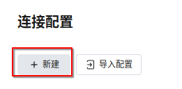

This article is a self-reposted copy at: <https://linux.do/t/topic/267502>

## Preface

When you get your hands on a VPS, what should you do with it?

If you host your website or services on shared hosting from a reputable provider, the provider handles the basic server security. On a VPS, though, you are the one responsible for security. More privileges come with more responsibility — a VPS gives you far more freedom and, naturally, carries far more risk. **The goal isn't absolute security; it's being more secure than most people.** If your server isn't easy to break into, that's a win.

This article is written for Ubuntu 24.04 LTS; the general ideas still apply to other distributions.

Before you continue, we recommend reading the material by [LUG@USTC](https://lug.ustc.edu.cn/): <https://101.lug.ustc.edu.cn/>

> [!NOTE]
> This article is unrelated to the <https://github.com/ustclug/Linux101-docs> project.

## Account Security

Some VPS providers hand you the root account by default. Root holds the highest privileges on the entire system, and leaving that much power exposed by default is naturally risky. The right approach is to create a non-root account and use sudo to elevate privileges only when root access is truly needed.

### Create a Non-root Account

Create an account that can elevate privileges with the following command:

```bash
useradd -m -G sudo -s /bin/bash <username>
```

Then set a password for this user — at least 16 characters of mixed upper/lowercase letters and digits (my personal minimum for acceptable security):

```bash
passwd <username>
```

> You should also change the root password. The default passwords on cloud servers are usually weak, and some providers even email the default credentials, which isn't great for security.

### Disable Root Password Login over SSH

Leaving aside the fact that logging in as root is inherently risky, the root username is always "root" — if password login is allowed for it, an attacker only needs to brute-force the password to try to break into your system. Since we've already created a non-root account, we can simply disable SSH login for root.

Edit the SSH configuration file:

```bash
sudo vim /etc/ssh/sshd_config
```

Set the following:

```bash
# Disable remote password login for the root user
PermitRootLogin prohibit-password
```

Then restart the SSH service to apply the change:

```bash
sudo systemctl restart ssh
```

Why not set it to `no`?

> I don't usually fully disable root login with `PermitRootLogin no` either. I'm more used to setting up keys like any other sudoer and disabling password login entirely, allowing keys only. I only configure it that way on machines where I can operate the out-of-band cluster console; otherwise one failure could leave you without root — for example, if the disk fills up, you can't even establish a remote SSH session.
>
> In theory `PermitRootLogin prohibit-password` is fine, but it becomes a hassle when the server dies and you need rescue access. I'd actually recommend only disabling remote password login while keeping local password login, so you can still log in as root locally via VNC or IPMI to rescue the machine when something goes wrong.

### Change the SSH Port

> The very first thing is to move SSH off port 22.
>
> This is a supplement added on top of the original post.
>
> In practice, most people change the port as soon as they log in.
>
> The first thing I do after logging in is change the sshd port and update the firewall — port 22 gets nothing but password-guessing attempts.
>
> One trick: after changing the port and restarting sshd, your current connection stays alive. Try connecting to the new port — if it connects, the change worked. If you can't establish a new connection, you can still revert the change or check your firewall configuration.

Normally, editing the SSH port via `sudo vim /etc/ssh/sshd_config` and restarting with `sudo systemctl restart ssh.service` is enough:

```bash
# Set the SSH port
Port <your-port>
```

However, on **Ubuntu 22.10 or newer** you may find this is **ineffective** — after restarting, the SSH service still listens on the original port.

That's because on Ubuntu 22.10 and newer, ssh is socket-activated by default.

On Ubuntu 22.10, Ubuntu 23.04, and Ubuntu 23.10, change it like this:

```bash
sudo mkdir -p /etc/systemd/system/ssh.socket.d
sudo vim /etc/systemd/system/ssh.socket.d/listen.conf
sudo systemctl daemon-reload
sudo systemctl restart ssh.socket
sudo systemctl restart ssh.service
```

A reference `listen.conf`:

```bash
[Socket]
ListenStream=
ListenStream=2233
```

On Ubuntu 24.04, change it like this:

```bash
sudo vim /etc/ssh/sshd_config
sudo systemctl daemon-reload
sudo systemctl restart ssh.service
```

If you don't care about the memory saved by socket activation, you can revert to a non-socket-activated setup with the following commands:

> [!WARNING]
> Make sure your configuration files are correct first.

```bash
sudo systemctl disable --now ssh.socket
sudo systemctl enable --now ssh.service
```

If you're migrating a configuration (from Ubuntu 22.10 and above, below 24.04):

```bash
sudo systemctl disable --now ssh.socket
rm -f /etc/systemd/system/ssh.service.d/00-socket.conf
rm -f /etc/systemd/system/ssh.socket.d/addresses.conf
sudo systemctl daemon-reload
sudo systemctl enable --now ssh.service
```

Instead of editing `/etc/ssh/sshd_config` directly, it's better to create a conf file under `/etc/ssh/sshd_config.d/` for your custom sshd settings. This prevents configuration conflicts after an OpenSSH update.

Reference: [ssh - PasswordAuthentication no, but I can still login by password - Unix & Linux Stack Exchange](https://unix.stackexchange.com/questions/727492/passwordauthentication-no-but-i-can-still-login-by-password/727500#727500)

Some cloud providers drop their own conf file into `/etc/ssh/sshd_config.d/` to enable remote password login (sshd disables it by default). Rule those out before modifying any sshd settings:

```bash
# Check whether sshd_config.d contains other conf files
sudo ls /etc/ssh/sshd_config.d/*.conf
# If so, rename them so your custom config isn't overridden
sudo mv /etc/ssh/sshd_config.d/xxx.conf/etc/ssh/sshd_config.d/xxx.conf.bak
```

CloudCone, for example, ships a `/etc/ssh/sshd_config.d/50-cloud-init.conf`.

After changing sshd settings, run `sudo sshd -T` first to inspect the effective configuration, so you're not blindsided by an override :joy:.

```bash
# How root is allowed to log in
sudo sshd -T | grep -i "PermitRootLogin"
# Password authentication
sudo sshd -T | grep -i "PasswordAuthentication"
# SSH port
sudo sshd -T | grep -i "Port"
```

Worth noting: `prohibit-password` is an alias of `without-password`, so seeing the output below is perfectly normal.

```bash
$ sudo sshd -T | grep -i "PermitRootLogin"
permitrootlogin without-password
```

References:

* [Permit root to login via ssh only with key-based authentication - Unix & Linux Stack Exchange](https://unix.stackexchange.com/questions/99307/permit-root-to-login-via-ssh-only-with-key-based-authentication/99308#99308)
* [OpenSSH 7.0 Release Notes](https://www.openssh.com/txt/release-7.0)

### Protect SSH from Brute Force with Fail2ban

Install Fail2ban:

```bash
sudo apt install fail2ban
```

The officially recommended approach is to customize settings via jail.local:

```bash
sudo vim /etc/fail2ban/jail.local
```

Use the following config as a starting point for your own (remember to remove the comments):

```bash
[sshd]
ignoreip = 127.0.0.1/8 # Whitelist
enabled = true
filter = sshd
port = 22 # Port; update this if you changed the SSH port
maxretry = 5 # Maximum number of attempts
findtime = 300 # Window in seconds within which maxretry applies
bantime = 600 # Ban duration in seconds; -1 is a permanent ban (not recommended)
action = %(action_) s [port="%(port) s", protocol="%(protocol) s", logpath="%(logpath) s", chain="%(chain) s"] # Use this if you don't need email notifications
banaction = iptables-multiport # Ban method
logpath = /var/log/auth.log # SSH login log location
```

### SSH Login Notifications

> Very useful. I also added a WeCom bot notification that fires automatically on every SSH login, so I'd know right away if someone got in.

You can use a PAM module to trigger a script on every SSH login.

Edit `/etc/pam.d/sshd` and append:

```bash
session    optional    pam_exec.so /path/to/script
```

For the use case above, the script looks roughly like this:
Reference: <https://developer.work.weixin.qq.com/document/path/91770>

Note (Nov 26, 2024): Fixed some issues in the example script.

```bash
#!/bin/bash

if [ "$PAM_TYPE" != "open_session" ]; then
    exit 0
fi

ip=$PAM_RHOST
date=$(date +"% e % b % Y, % a % r")
name=$PAM_USER

webhook_url="https://qyapi.weixin.qq.com/cgi-bin/webhook/send?key=xxxxxxxxxxxxxxx"

curl -s -X POST "$webhook_url" \
    -H "Content-Type: application/json" \
    -d "{
    \"msgtype\": \"markdown\",
    \"markdown\": {
        \"content\": \"**Login Alert**\\n> User: $name\\n> Client IP: $ip\\n> Login time: $date\"
    }
}"

```

Replace the API key and delivery method with whatever fits your own use case.

Once the script is written, make it executable:

`sudo chmod +x /usr/local/bin/notify_ssh_login.sh`

### [Strict] Run Commands with Absolute Paths

Using absolute paths pins down exactly which program or file runs, so a tampered environment variable can't trick you into executing a potentially malicious program.

> Using the full path to su avoids running a fake su planted by an attacker.

### Log In with SSH Keys

> [!TIP]
> If your VPS provider offers SSH key binding, you can skip this section and follow the provider's method.

Run this in PowerShell:

```bash
ssh-keygen -t ed25519
```

Just accept the default key path. You can leave the passphrase empty or set one.

```bash
Generating public/private ed25519 key pair.
Enter file in which to save the key (C:\Users\<user>/.ssh/id_ed25519): # Press Enter to accept the default
Enter passphrase (empty for no passphrase): # Leave empty or set a passphrase
Enter same passphrase again: # Same as above
```

Then edit the authorized keys file on the VPS:

```bash
vim ~/.ssh/authorized_keys
```

Next, open C:\Users\<user>/.ssh/id_ed25519.pub, copy its contents, and paste them in.

Edit the SSH configuration file:

```bash
sudo vim /etc/ssh/sshd_config
```

Set the following:

```bash
PubkeyAuthentication yes
AuthorizedKeysFile .ssh/authorized_keys
PasswordAuthentication no
```

Then restart the SSH service to apply the change:

```bash
sudo systemctl restart ssh
```

### Enable the UFW Firewall

> [!TIP]
> If your VPS provider offers a firewall and you don't have complex requirements, you can skip this section and use the provider's firewall.

Before enabling UFW, we need to set up rules first. Let's start with UFW's default policies:

```bash
sudo ufw default allow outgoing # Allow all outbound traffic by default
sudo ufw default deny incoming # Deny all inbound traffic by default
```

View the currently active UFW rules:

```bash
sudo ufw status
sudo ufw status numbered  # Show rules with numbers
```

Allow or deny traffic on a port with the following commands (22, 80, and 443 used as examples):

```bash
# Allow inbound traffic on port 22/proto
sudo ufw allow in 22/proto

# Allow outbound traffic on port 22/proto
sudo ufw allow out 22/proto

# Without specifying in/out, it defaults to in
sudo ufw allow 22/proto

# Without specifying a protocol, both tcp and udp are allowed
sudo ufw allow 22

# To deny instead, change allow to deny
sudo ufw deny 22

# Allow a port range from start_port to end_port
sudo ufw allow start_port:end_port

# Allow multiple ports, comma-separated
sudo ufw allow port1,port2

# Allow traffic from a specific IP or CIDR range
sudo ufw allow from ip/cidr

# Allow traffic from a specific IP or CIDR range to port 22
sudo ufw allow from ip/cidr to any port 22

# Allow tcp traffic from a specific IP or CIDR range to port 22
sudo ufw allow from ip/cidr to any proto tcp port 22

# If you specify multiple ports, you must specify the protocol
sudo ufw allow from ip to any proto tcp port 80,443

# comment adds a description to the rule
sudo ufw allow from ip to any proto tcp port 80,443 comment "hello"
```

Delete active rules with:

```bash
sudo ufw delete allow 22 # Prefix the rule with delete
sudo ufw delete 1 # Or delete by the number from "ufw status numbered"
```

Once all rules are in place, start, stop, or reload UFW:

> [!WARNING]
> Before enabling the firewall, make sure port 22 (or whatever your SSH port is) is allowed.

```bash
sudo ufw enable|disable|reload
```

To reset all rules:

> [!WARNING]
> Make sure UFW is disabled before resetting the rules.

```bash
sudo ufw reset
```

My advice: only allow the ports you actually use, such as 22, 80, and 443.

By default, UFW only logs dropped packets that don't match a rule. If you want detailed logging for a service, add `log` after `allow`:

```bash
# Log successful SSH connections too, for the record
ufw allow log 22/tcp
```

### Block Ping

#### Block Ping with iptables

* Check current iptables rules:
  * `iptables -L -n`
  * This lists the current iptables rules: `-L` lists the rules, and `-n` displays IP addresses and port numbers numerically instead of resolving them to hostnames and service names.  

* Block ping (inbound ICMP Echo Request):
  * `iptables -A INPUT -p icmp --icmp-type 8 -j DROP`
  * Here, `-A INPUT` appends a rule to the end of the INPUT chain (which handles packets destined for this machine). `-p icmp` specifies the ICMP protocol, `--icmp-type 8` is ICMP type 8 (Echo Request), and `-j DROP` drops matching packets.  
  
* Save iptables rules (if you want them to persist):
  * How to save iptables rules differs between Linux distributions.
  * On RHEL-based systems like CentOS, use the `service iptables save` command. It writes the current rules to `/etc/sysconfig/iptables` so they survive a reboot.
  * On Debian-based systems like Ubuntu, install the `iptables-persistent` package. After installation, use `iptables-save > /etc/iptables/rules.v4` (for IPv4 rules) to save the rules so they're restored after a reboot.

* Restore ping

To restore ping, delete the rule you just added with the `iptables -D INPUT -p icmp --icmp-type 8 -j DROP` command. `-D INPUT` removes a rule from the INPUT chain; the other parameters are the same as when adding the rule.

#### Block Ping with UFW

> [!NOTE]
> To err on the side of caution, the rules related to destination-unreachable, time-exceeded, and parameter-problem have been removed.

UFW has no direct command for blocking the icmp protocol. UFW defines allow rules for ping in `/etc/ufw/before.rules`; change `ACCEPT` to `DROP` there to block ping:

```bash
-A ufw-before-input -p icmp --icmp-type echo-request -j DROP
-A ufw-before-forward -p icmp --icmp-type echo-request -j DROP
```

> Heads-up: this only blocks IPv4 — the box is still pingable over IPv6.

To block ping over IPv6 as well, edit `/etc/ufw/before6.rules`:

```bash
-A ufw6-before-output -p icmpv6 --icmpv6-type echo-request -j DROP
-A ufw6-before-output -p icmpv6 --icmpv6-type echo-reply -j DROP
```

> [!INFO]
> Leave the remaining icmpv6 rules unchanged.

### Restrict SSH Access by IP

> My office network has a static IP, so I open port 22 in the VPS provider's firewall and restrict it to that IP. Whenever I need access from another IP, I just add it.

If you have a dynamic public IP and your provider offers an API for modifying firewall rules, you can use that directly.

> If you don't have a static IP at home, you can use a web terminal like Tencent Cloud's [orcaterm](https://orcaterm.cloud.tencent.com/) — the basic features are free forever. Here are [orcaterm's IP ranges](https://www.tencentcloud.com/zh/document/product/213/39708?lang=zh); load them into ipset and allow only those IPs to reach the SSH port. Test that the connection actually works before applying the rule. If you're a Tencent Cloud user, you can even drop the SSH port entirely in the security group — when I used Tencent Cloud, I only opened ports 80 and 443.

You can also do this with UFW.

Or use the firewall provided by your VPS provider (if supported) — it's easier to adjust when you run into connectivity problems.

Steps for adding servers from other providers to [orcaterm](https://orcaterm.cloud.tencent.com/):





## Keep Software Updated

### Update Regularly

My advice is to log into your VPS periodically and run `sudo apt update && sudo apt upgrade` to keep every package up to date.

That said, Ubuntu installs security updates automatically every day by default, so you don't need to do this too often.

### Enable Ubuntu Pro

> The same great OS, with more security updates
> Reducing the average CVE (Common Vulnerabilities and Exposures) exposure time from 98 days to 1 day
> Extended CVE patching, ten years of security maintenance, optional support, and maintenance for your entire open-source application stack

That's Ubuntu's official marketing copy. I can't tell you exactly how useful it is, but a fix is better than no fix — and it's free for up to 5 machines for personal use, so enabling it costs you nothing.

First, create an Ubuntu One account: <https://ubuntu.com/login>

After registering, go to <https://ubuntu.com/pro/dashboard> to find your token.


Once you have your token, head to the VPS and run `sudo pro attach [YOUR_TOKEN]`. After a short wait, Ubuntu Pro is enabled. I'd recommend running `sudo apt update && sudo apt upgrade` once more afterwards to make sure the latest security updates are installed.

## Hide the Public IP

> Hiding the public IP isn't a security requirement shared by every VPS user. One off-the-cuff idea for the future (once IPv6 is widely deployed) is to expose only the origin's IPv6 address to the CDN — mass scanners like Censys would take a very long time to sweep it. You'd still want an allowlist, though.

### Stop SSL Certificates from Leaking Your IP

> This section, "Stop SSL Certificates from Leaking Your IP," is quoted from "How to Prevent Certificates from Leaking Your Origin IP" by Qiu Weimeng, published under the CC BY-SA 4.0 license. The rest of this article is published under the CC BY-NC-SA 4.0 license, but this section uses the CC BY-SA 4.0 license.

#### Apply for and Download a Certificate

* Sign up and log in to [ZeroSSL](https://app.zerossl.com/login)
* Go to the [Dashboard](https://app.zerossl.com/dashboard), find "Create SSL Certificate," and click the blue "New Certificate" button
* Enter your origin IP under "Enter Domains"
* Expiry doesn't really matter — the point is to keep Censys from scanning a real certificate for your domain. So choose a 90-day certificate
* Leave CSR & Contact unchanged
* Choose "HTTP File Upload" as the domain validation method
  * If you use NGINX and haven't touched `/etc/nginx/sites-available/default`, you're fine. Of course, if you've changed it, just make sure a `server {listen 80; root /var/www/html;}` block remains
  * Then download the Auth File and upload it to `/var/www/html/.well-known/pki-validation`. Create the folder if it doesn't exist, and make sure NGINX can access these files, or validation will still fail
  * As prompted, click the `.txt` file to check whether it's accessible. If it loads, validation is done

#### Configure the Certificate and Block IP-Based HTTP Access on Ports 80/443

* Download the `*.zip` file and extract it. The extracted folder contains the certificate you applied for
* Merge `ca_bundle.crt` and `certificate.crt`: open `certificate.crt` in a reliable editor such as notepad3 or VSCode, then paste the contents of `ca_bundle.crt` into it. The format is:

```bash
-----BEGIN CERTIFICATE-----
contents of certificate.crt
-----END CERTIFICATE-----
-----BEGIN CERTIFICATE-----
contents of ca_bundle.crt
-----END CERTIFICATE-----
```

* Upload the merged file and `private.key`
* Upload the certificate to a folder NGINX can access — we put it in `/etc/nginx/ip-certificate/`
* Configure `/etc/nginx/sites-available/default`. Reference config:

```bash
server {    
#HTTP Server Default Set    
    listen 80;
    listen 443 ssl http2 default_server;
    server_name ip;     

    #HTTP_TO_HTTPS_END    
    ssl_certificate /etc/nginx/ip-certificate/certificate.crt;
    ssl_certificate_key /etc/nginx/ip-certificate/private.key;
    ssl_protocols TLSv1.1 TLSv1.2 TLSv1.3;
    ssl_ciphers ECDHE-RSA-AES128-GCM-SHA256:HIGH:!aNULL:!MD5:!RC4:!DHE;
    ssl_prefer_server_ciphers on;
    ssl_session_cache shared:SSL:10m;
    ssl_session_timeout 10m;
    
    #Server ROOT
    index index.html;
    root /var/www/html/;
    index index.html;

    return 444; #NGINX HTPP Code 444
}
```

Run `nginx -t` on the server to check for errors; if it's valid, restart with `sudo systemctl restart nginx`.

Type your IP directly into a browser and check whether the connection immediately turns into a blank page.

### The Newer Method (Nginx 1.19.4+)

If your Nginx version is 1.19.4 or newer, you can use the `ssl_reject_handshake` directive to reject every TLS handshake that doesn't match a configured domain:

```bash
server {
    listen 443 ssl default_server;
    server_name _;
    ssl_reject_handshake on;
}
```

If you get an error like `nginx: [emerg] unknown directive "ssl_reject_handshake"`, first check whether your Nginx version is at least 1.19.4 — `ssl_reject_handshake on;` was added in Nginx 1.19.4 (mainline).

If you compiled Nginx from source, make sure the `ngx_http_ssl_module` module is enabled. It isn't built by default; you need the `--with-http_ssl_module` configure option.

### Are We Safe Now?

In the previous sections, we only ensured that an attacker can't fetch a default certificate by visiting your IP directly and infer your domain from it. Nothing says an attacker has to learn IP-to-domain mappings that way, though. As you can see, the rules above all rely on `server_name` matching. An attacker could easily walk through every non-CDN IP range carrying the correct `server_name`, recording which targets respond correctly. Here's a simple implementation of that check (without the scanning part):

```python
# https://gist.github.com/Raven95676/39ffdba22144e39d7155ad9dc1bcca55
import ssl
import socket
def check (ip, domain):
    try:
        context = ssl.create_default_context ()
         with socket.create_connection ((ip, 443)) as sock:
            with context.wrap_socket (sock, server_hostname=domain) as ssl_sock:
                request = f"GET / HTTP/1.1\nHost: {domain}\nConnection: close\n\n"
                ssl_sock.sendall (request.encode ())
                ssl_sock.recv (4096)
        return True
    except Exception:
        return False

print (check ("192.168.0.256", "example.com"))
```

### Patching It Up

> [!TIP]
> If your VPS provider offers a firewall, you can just use the provider's firewall.

~~You can just use this method~~

We can allow only the CDN's CIDR ranges to reach ports 80/443 on the server. First, add the allow rules:

```bash
sudo ufw allow from "CIDR range" to any proto tcp port 80,443 comment "CDN provider"
```

The comment isn't required — it's just so you can recognize what the rule is for later.

Ask your CDN provider for its CIDR ranges — some publish them on their website. For example, Cloudflare's CIDR ranges are available at: <https://www.cloudflare.com/ips-v4>

That's the IPv4 list; the IPv6 one is at: <https://www.cloudflare.com/ips-v6>

For Cloudflare, a community member also wrote a script that syncs Cloudflare's IPs into UFW for port 443 when run:

```bash
RULES=$(sudo ufw status numbered | grep 'Cloudflare IP' | awk -F"[][]" '{print $2}' | sort -nr)
for RULE in $RULES; do
    echo "Deleting rule $RULE"
    echo "y" | sudo ufw delete $RULE
done

for cfip in `curl -sw '\n' https://www.cloudflare.com/ips-v {4,6}`; do ufw allow proto tcp from $cfip to any port 443 comment 'Cloudflare IP'; done

ufw reload > /dev/null
```

Because of the special circumstances involved, I'd suggest running the following command first to check that the output is correct before deploying the script:

```bash
for cfip in `curl -sw '\n' https://www.cloudflare.com/ips-v {4,6}`; do echo $cfip; done
```

If the output looks right (like below), you can deploy it:

```bash
173.245.48.0/20
103.21.244.0/22
… (omitted)
2400:cb00::/32
2606:4700::/32
… (omitted)
```

After adding the rules, list the current firewall rules:

```bash
sudo ufw status numbered
```

Delete any pre-existing rules that allow all traffic on ports 80 and 443:

```bash
sudo ufw delete <number>
```

Why not just use Nginx's `deny` directive? Because `deny` returns a 403 Forbidden status code — and before it can, the TLS handshake must complete. Only after a successful TLS handshake can the client send an HTTP request and receive a response. So using `deny` directly here would be doing pointless work.

### Are We Really Safe…?

This is really a Cloudflare special, but the ideas apply to other CDN providers too if you want extra security. Cloudflare offers more than CDN services — there's a whole lineup of products like Workers and WARP. Some of these services have characteristics worth noting:

* They can make outbound requests
* They use Cloudflare's IP ranges

Cloudflare certainly restricts abuse, but just in case, we can take one more security measure — Authenticated Origin Pulls.

> [!INFO]
> Make sure the SSL/TLS encryption mode is set to Full or Full (strict).

Download the [Cloudflare certificate](https://developers.cloudflare.com/ssl/static/authenticated_origin_pull_ca.pem) and configure it:

```bash
ssl_client_certificate /path/to/certificate.pem;
ssl_verify_client on;
```

Then enable Authenticated Origin Pulls under SSL/TLS → Origin Server.

The SafeLine WAF community edition can't stably use this method yet, unless you're willing to put another reverse proxy in front of it.

## Moving Toward Full Containerization

> My advice: make good use of containerization for isolation.

This section doesn't cover server panels like 1Panel or Docker panels like Portainer.

### Docker Basics

> [!NOTE]
> There's mature documentation available, so I won't reinvent the wheel.
>
> This article is unrelated to the <https://github.com/yeasy/docker_practice> project.
>
> ~~Just being a little lazy~~

Side note: if `docker-compose` says the command isn't found, try `docker compose`. The `version` field is deprecated in docker compose — it will be ignored with a warning in existing compose files.

<https://yeasy.gitbook.io/docker_practice>

Update: added the official Chinese Docker documentation.

<https://docs.docker.net.cn/manuals/>

### When UFW Can't Control Docker (Recommended)

> One more thing about Docker: you don't really need UFW to manage which ports Docker exposes — Docker writes its own iptables rules to control them. Using docker compose as an example:

#### 1. For Services Used Only Within the App (Databases, Redis, etc.)

* Only expose them on the internal container network. When compose brings up the stack, it creates a bridge named `<first-service-name>_default`, which you can see with `docker network ls`.
* Containers expose all their ports on this internal network by default.
* Other containers on the same network can reach the service by container name and port.
* Containers not attached to that network can't access any of its ports.
* For services only exposed on the internal network, **no** port mapping is needed under `ports`.

#### 2. For Services Behind a Reverse Proxy

* Binding to 127.0.0.1 only keeps the port from being reachable from outside; use this on the container in question:

```yaml
ports:
    - 127.0.0.1:<port>:<port>
```

#### 3. For Services That Need Direct External Port Access

* Map the port directly:

```bash
ports:
      - <port>:<port>
```

And here's an example compose.yml:

```bash
services:
    rsshub:
        image: diygod/rsshub:latest
        restart: always
        ports:
            - 127.0.0.1:1200:1200
        environment:
            NODE_ENV: production
            CACHE_TYPE: redis
            REDIS_URL: "redis://redis:6379/"
            PUPPETEER_WS_ENDPOINT: "ws://browserless:3000"
        env_file:
            - .env
        healthcheck:
            test: ["CMD", "curl", "-f", "http://localhost:1200/healthz"]
            interval: 30s
            timeout: 10s
            retries: 3
        depends_on:
            - redis
            - browserless
 
    browserless:
        image: browserless/chrome
        restart: always
        ulimits:
            core:
                hard: 0
                soft: 0
        healthcheck:
            test: ["CMD", "curl", "-f", "http://localhost:3000/pressure"]
            interval: 30s
            timeout: 10s
            retries: 3
 
    redis:
        image: redis:alpine
        restart: always
        volumes:
            - ./data:/data
        healthcheck:
            test: ["CMD", "redis-cli", "ping"]
            interval: 30s
            timeout: 10s
            retries: 5
            start_period: 5s
    
    sb:
        image: ghcr.io/sagernet/sing-box
        container_name: sb
        restart: always
        volumes:
            - ./sing-box:/etc/sing-box/
        command: -D /var/lib/sing-box -C /etc/sing-box/run
```

Additionally, if you need to keep external ports blocked, besides binding to 127.0.0.1 there's another option:

> For services that need a reverse proxy (Nginx/Caddy, etc.), configure a Docker-private IP starting with 172 in the Compose file and don't configure a port. This way Docker won't expose any public port, and the reverse proxy can just point at the private IP and its default port.

For example, this MySQL Compose file assigns the private IP `172.20.0.15` and comments out the port mapping; when configuring the reverse proxy, simply proxy to `172.20.0.15:3306`:

```bash
networks:
  default:
    external: true
    name: ${DOCKER_MY_NETWORK}
services:
  mysql:
    container_name: mysql8
    image: mysql:8
    # ports:
    #   - "3306:3306"
    environment:
      TZ: Asia/Shanghai
    networks:
      default:
        ipv4_address: 172.20.0.15
    restart: unless-stopped
```

### When UFW Can't Control Docker (Not Recommended)

> This section, "When UFW Can't Control Docker (Not Recommended)," is quoted from the README of the project **[ufw-docker](https://github.com/chaifeng/ufw-docker)** by [chaifeng](https://github.com/chaifeng), released under the GPL-3.0 license. The rest of this article is published under the CC BY-NC-SA 4.0 license, but this section uses the GPL-3.0 license.

The current new solution only requires modifying one UFW config file; keep all of Docker's own config and options at their defaults.

Edit UFW's config file `/etc/ufw/after.rules` and append the following rules:

```bash
# BEGIN UFW AND DOCKER
*filter
:ufw-user-forward - [0:0]
:ufw-docker-logging-deny - [0:0]
:DOCKER-USER - [0:0]
-A DOCKER-USER -j ufw-user-forward

-A DOCKER-USER -j RETURN -s 10.0.0.0/8
-A DOCKER-USER -j RETURN -s 172.16.0.0/12
-A DOCKER-USER -j RETURN -s 192.168.0.0/16

-A DOCKER-USER -p udp -m udp --sport 53 --dport 1024:65535 -j RETURN

-A DOCKER-USER -j ufw-docker-logging-deny -p tcp -m tcp --tcp-flags FIN,SYN,RST,ACK SYN -d 192.168.0.0/16
-A DOCKER-USER -j ufw-docker-logging-deny -p tcp -m tcp --tcp-flags FIN,SYN,RST,ACK SYN -d 10.0.0.0/8
-A DOCKER-USER -j ufw-docker-logging-deny -p tcp -m tcp --tcp-flags FIN,SYN,RST,ACK SYN -d 172.16.0.0/12
-A DOCKER-USER -j ufw-docker-logging-deny -p udp -m udp --dport 0:32767 -d 192.168.0.0/16
-A DOCKER-USER -j ufw-docker-logging-deny -p udp -m udp --dport 0:32767 -d 10.0.0.0/8
-A DOCKER-USER -j ufw-docker-logging-deny -p udp -m udp --dport 0:32767 -d 172.16.0.0/12

-A DOCKER-USER -j RETURN

-A ufw-docker-logging-deny -m limit --limit 3/min --limit-burst 10 -j LOG --log-prefix "[UFW DOCKER BLOCK]"
-A ufw-docker-logging-deny -j DROP

COMMIT
# END UFW AND DOCKER
```

Then restart UFW with `sudo systemctl restart ufw`. From now on, the outside can no longer access any port published by Docker, while containers can still communicate with each other on private network addresses, and containers can still access the external network normally. **The rules may fail to take effect after restarting UFW due to some unknown reason — if so, reboot the server.**

To allow external access to a service provided by a Docker container — say a container's service port is `80` — use the following command:

```bash
ufw route allow proto tcp from any to any port 80
```

This allows external access to every service published by Docker whose internal service port is `80`.

Note that this `80` is the container's port, not the `8080` port published on the server with something like `-p 0.0.0.0:8080:80`.

If multiple containers have service port 80 but you only want a specific one reachable from outside — say its private address is `172.17.0.2` — use a command like:

```bash
ufw route allow proto tcp from any to 172.17.0.2 port 80
```

If a container's service uses UDP, say a DNS service, use the following command to allow external access to all published DNS services:

```bash
ufw route allow proto udp from any to any port 53
```

Similarly, to target just one specific container, e.g. the IP `172.17.0.2`:

```bash
ufw route allow proto udp from any to 172.17.0.2 port 53
```

## Chaitin SafeLine WAF + Cloudflare Single-Node Deployment

~~After racking my brain, there's not much to write~~

> If you need stronger security, stack a WAF and a honeypot in front like I did.

### Deployment

There's a one-click deployment command:

```bash
bash -c "$(curl -fsSLk https://waf-ce.chaitin.cn/release/latest/setup.sh)"
```

Or deploy the LTS version:

```bash
RELEASE=lts bash -c "$(curl -fsSLk https://waf-ce.chaitin.cn/release/latest/setup.sh)"
```

Since this setup puts Cloudflare in front of the SafeLine WAF, you need to set Protected Sites → Global Config → Origin IP retrieval to "Take the address of the previous proxy from X-Forwarded-For".

If other issues come up, check the [troubleshooting](https://docs.waf-ce.chaitin.cn/zh/%E5%B8%B8%E8%A7%81%E9%97%AE%E9%A2%98%E6%8E%92%E6%9F%A5) section of the official documentation.

### Accessing the SafeLine Console via a Domain

~~Best solution: don't use a domain~~

If you want to access the SafeLine console via a domain, you'll find it doesn't work once Cloudflare's orange cloud is enabled. That's because Cloudflare's port forwarding only supports a fixed set of ports:

> HTTP ports supported by Cloudflare: 80, 8080, 8880, 2052, 2082, 2086, 2095
>
> HTTPS ports supported by Cloudflare: 443, 2053, 2083, 2087, 2096, 8443

The solution is simple: go to Rules → Origin Rules and create a rule. The incoming request match expression looks roughly like:

```bash
(starts_with (http.request.full_uri, "https://<your-domain>"))
```

Set the destination port rewrite to 9443.

To hide your public IP, add a firewall rule that only lets Cloudflare's CDN CIDR ranges reach port 9443.

### Redirect Issues

If a port number unexpectedly appears in the URL after a redirect, add the following under Protected Sites → Site Details → Custom NGINX Config:

```bash
proxy_redirect https://$host:[port] https://$host;
```

### Hide the Admin Panel with WireGuard

> Don't expose your VPS admin panels (such as the SafeLine WAF or BT Panel) to the public internet.
> Accessing them over a VPN like WireGuard is a more secure choice.
> Detailed WireGuard installation instructions are available at [Installation - WireGuard](https://www.wireguard.com/install/).

## References

* [Getting Started with Ubuntu Pro, from the Ubuntu official site](https://ubuntu.com/pro/tutorial)
* How to Prevent Certificates from Leaking Your Origin IP — by Qiu Weimeng
* [UFW User Guide, from Ubuntu Chinese Wiki](https://wiki.ubuntu.org.cn/Ufw%E4%BD%BF%E7%94%A8%E6%8C%87%E5%8D%97)
* [Key-based authentication in OpenSSH for Windows, from Microsoft Learn](https://learn.microsoft.com/en-us/windows-server/administration/openssh/openssh_keymanagement)
* [Install Docker Engine on Ubuntu, from the Docker official site](https://docs.docker.com/engine/install/ubuntu)
* <https://linux.do/t/topic/267502/2>
* <https://linux.do/t/topic/267502/3>
* <https://linux.do/t/topic/168843/11>
* <https://linux.do/t/topic/267502/18>
* <https://github.com/chaifeng/ufw-docker>
* <https://linux.do/t/topic/267502/23>
* <https://linux.do/t/topic/267502/42>
* <https://linux.do/t/topic/267502/44>
* <https://linux.do/t/topic/267502/20>
* <https://developer.work.weixin.qq.com/document/path/91770>
* <https://linux.do/t/topic/267502/21>
* <https://linux.do/t/topic/267502/22>
* <https://linux.do/t/topic/267502/57>
* <https://bugs.launchpad.net/ubuntu/+source/openssh/+bug/2069041>
* <https://linux.do/t/topic/242440/29>
* <https://linux.do/t/topic/267502/71>
* <https://linux.do/t/topic/267502/87>
* <https://linux.do/t/topic/267502/97>
* <https://linux.do/t/topic/267502/99>
* <https://linux.do/t/topic/267502/108>
* <https://linux.do/t/topic/267502/121>
* <https://linux.do/t/topic/267502/122>
* <https://linux.do/t/topic/267502/135>
* <https://linux.do/t/topic/267502/175>


