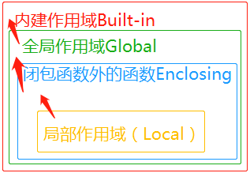
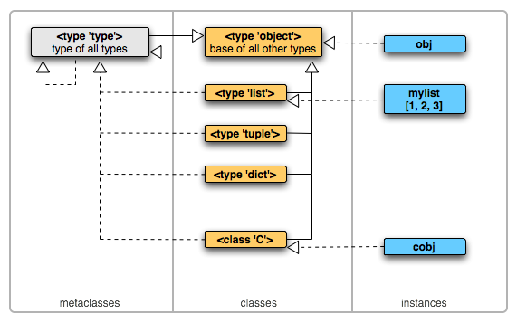
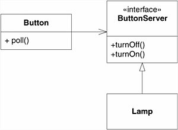

## OOP: A Prologue

When requirements grow complex, programming purely in a procedural style starts to hurt code readability and maintainability. Suppose you're developing a library management program. At first, you might record book information in the most straightforward way possible:

```python
book1_title = "Python Crash Course"
book1_author = "Eric Matthes"
book1_isbn = "978-7115613639"
book1_stock = 5

book2_title = "Fluent Python"
book2_author = "Luciano Ramalho"
book2_isbn = "978-1492056355"
book2_stock = 3
```

Before long you realize that every new book means redefining a whole pile of variables. Then a lightbulb goes off: pull each book's data out and store it in a list:

```python
books = [
    ["Python Crash Course", "Eric Matthes", "978-7115613639", 5],
    ["Fluent Python", "Luciano Ramalho", "978-1492056355", 3]
]
```

But now every lookup relies on indexes like `books[0][0]` or `books[2][3]`, which is hardly intuitive — read this code in isolation and you have no idea what those indexes refer to. Luckily, you remember that Python has something called a dictionary:

```python
books = [
    {
        "title": "Python Crash Course",
        "author": "Eric Matthes",
        "isbn": "978-7115613639",
        "stock": 5,
    },
    {
        "title": "Fluent Python",
        "author": "Luciano Ramalho",
        "isbn": "978-1492056355",
        "stock": 3,
    },
]
```

OK, that feels good enough, so you start writing the features:

```python
def borrow(book: dict) -> None:
    if book["stock"] > 0:
        book["stock"] -= 1
        print(f"'{book['title']}' borrowed successfully! Remaining stock: {book['stock']}")
    else:
        print("Insufficient stock!")


def show_info(book: dict) -> None:
    print(
        f'"{book["title"]}" by {book["author"]} (ISBN: {book["isbn"]}), stock: {book["stock"]}'
    )


def find_book(isbn: str) -> dict | None:
    for book in books:
        if book["isbn"] == isbn:
            return book
    return None


book = find_book("978-1492056355")
if book:
    show_info(book)
    borrow(book)
else:
    print("Book not found!")
```

Not bad — you've taken your first step. But a mature library management system doesn't just manage books. It also has to record who borrowed which book, track each book's loan history including borrow and return dates, calculate fines for overdue books, and support queries about any user's borrowing status. If you keep going procedural, you'll find yourself adding a user dict that nests a list of dicts for borrowed books, while each book dict nests a list of who borrowed it plus a loan history. Your code ends up crammed with loops, conditionals, and nested lookups — touch one thing and everything else moves. The code runs, sure, but readability and maintainability take a serious hit.

At this point you might be thinking: wouldn't it be nice to bundle data and its related operations together? That's exactly when classes step onto the stage.

## Conventions

- This article targets Python 3.12; any feature introduced after Python 3.12 will be explicitly noted.
- For freshness, every reference is labeled with its year.
- For freshness, any reference older than two years must be verified by hands-on testing.
- Code blocks default to the contents of `main.py`.
- Comments starting with `Output:` show what that line prints.
- Comments starting with `Raise:` show the exception that line will raise.
- This article assumes you're already comfortable with basic procedural Python.

## Basic Concepts

In case you haven't come across these concepts yet, let's briefly go over some fundamentals before we start.

### Magic Methods

Every method surrounded by double underscores is a magic method, the most common being `__init__()`. We won't dig into magic methods here — that comes in later chapters. One thing to keep in mind: never define your own methods with names that start and end with double underscores. They may not have a special meaning today, but there's no guarantee that will stay true.

### Decorators

This is also covered in a later chapter. In short, a decorator modifies the behavior of a function or method, and it's usually written as `@xxxx`.

### Namespaces

Say you're looking for a friend named Zhang Wei — but there are 294,282 people named Zhang Wei in the country (2019). How do you know which Zhang Wei you mean? You need more than just the name: which city they live in, which company they work for, and so on.

Similarly, if methods or variables with the same name are defined in multiple places, the Python interpreter can't tell which one you mean. That's where the concept of namespaces comes in. A namespace groups names: the same name in different namespaces points to different objects. When you write code, you just prefix the method or variable name with its module name, and the interpreter knows exactly which one to call.

Here's an example from computer systems: a folder (directory) can contain many folders. Within a single folder, no two files can share the same name, but files in different folders can have the same name.


(Image source: Runoob Tutorial)

Here's a code example:

```python
# File: module1.py
def echo():
    return "from module 1"
```

```python
# File: module2.py
def echo():
    return "from module 2"
```

```python
# File: main.py
import module1
import module2
print(module1.echo())  # Output: from module 1
print(module2.echo())  # Output: from module 2
```

In Python, the `.` operator accesses an object's attributes and methods. For instance, in `module1.echo()`, `module1` is a module object and `echo` is one of its methods, invoked via `.`. With `module1.echo()` and `module2.echo()`, we've explicitly told the interpreter which module's method to call.

### Scope and Closures

Now let's talk about scope in Python. As the name suggests, scope is the region where a name is effective — in other words, "where this name can be used". Python's scoping follows the LEGB rule, which looks up a variable in this order:

1. **Local**: the local scope of the current function.
2. **Enclosing**: the scope of the enclosing function that contains the current one (if nested functions are involved).
3. **Global**: the current module's global scope.
4. **Builtin**: Python's built-in scope.

The diagram below makes it more intuitive:


(Image source: Runoob Tutorial)

Lookup proceeds one level at a time from the innermost scope outward, and an inner variable with the same name shadows the outer one. For example:

```python
x = "global variable"
def main():
    x = "local variable"
    print(x)

main()  # Output: local variable
print(x)  # Output: global variable
```

Every time a function is called, it creates its own local scope. Arguments passed in are copied into the function's parameters, which are only accessible inside the function's local scope. Once the function finishes, its local variables are released from memory by the garbage collector:

```python
def add(a, b):
    print(f"Inside the function: a = {a}")
    return a + b


result1 = add(2, 3)  # Output: Inside the function: a = 2
result2 = add(5, 7)  # Output: Inside the function: a = 5

print(a)  # Raise: NameError: name 'a' is not defined
```

So you could say scope has a kind of "enclosure". You may have already realized that namespaces are an abstraction of scopes: they exploit scope's ability to "seal names inside" in order to achieve grouping.

When you define a function inside another function, the inner function belongs to the outer function's local scope:

```python
def outer():
    print("Outer function executed")
    
    def inner():
        print("Inner function executed")
    
    inner()

outer()
inner()  # Raise: NameError: name 'inner' is not defined.
```

Calling it from inside the outer function's local scope works fine, but trying to call it from the global scope raises a `NameError`, because `inner` isn't defined there.

However, there is a way to access the function from outside its local scope: return the inner function object instead of calling it, and assign the returned function to a variable:

```python
def outer():
    def inner():
        return "Inner function called"
    
    return inner

func = outer()
print(func())   # Output: Inner function called
```

The `outer` function has already finished running, so its local scope should have been destroyed — why does `inner` still work? Because the Python interpreter keeps any object in memory as long as there's still a reference to it.

What if the inner function references a variable from the outer function's scope? Here's an example:

```python
def power(exponent):
    def inner(base):
        return base ** exponent
    return inner

power_of_two = power(2)
power_of_three = power(3)

print(power_of_two(5))  # Output: 25
print(power_of_three(5))  # Output: 125
```

Theoretically, when `power` finishes executing, its local scope — including local variables like `exponent` — should be gone. But at runtime, `power_of_two` still accesses `exponent` and gets the right answer. That's because Python handles this case specially. Variables defined in an enclosing scope rather than the function's own local scope are called non-local variables. When an inner function references variables from an outer function, Python stores those free variables (variables used inside a function but not defined there) in a special attribute, `__closure__`. Such variables — `exponent` in this example — are called non-local free variables. That way they stay in memory even after the enclosing function's local scope is destroyed. A function that carries its defining environment around with it like this is called a closure.

Even though a closure can read non-local variables, trying to assign to one directly just creates a local variable — it won't modify the non-local one. That's where `nonlocal` comes in. It tells the interpreter that a variable refers to a name already bound in the nearest enclosing scope, rather than creating a new local variable:

```python
def main():
    x = 1
    def a():
        nonlocal x
        x = 2
    def b():
        x += 3  # Raise: UnboundLocalError: cannot access local variable 'x' where it is not associated with a value
    print(x)  # Output: 1
    a()
    print(x)  # Output: 2
    b()
    print(x)

main()
```

You might wonder why `x += 3` raises `UnboundLocalError`. Because `x += 3` is equivalent to `x = x + 3`; Python first needs to read the value of `x` to do the addition, but since direct assignment only creates a local variable, `x` is marked as local — and a local `x` was never assigned, so the interpreter raises `UnboundLocalError`.

Of course, if you don't rebind the variable (for example, you only mutate a mutable object), you can use it directly:

```python
def main():
    x = []

    def a():
        x.append(1)

    print(x)  # Output: []
    a()
    print(x)  # Output: [1]


main()
```

If you want to modify a global-scope variable instead, use `global`:

```python
x = 1
def a():
    global x
    x = 2

print(x)  # Output: 1
a()
print(x)  # Output: 2
```

## A First Look at Classes and Objects

At the heart of object-oriented programming is abstraction — distilling things from the real world into objects, and using objects as the basic unit that encapsulates data and behavior to build programs.

Think about how you interact with everyday objects. You watch TV using the remote for power, volume, and channels — you never need to understand how the circuits inside work. OOP works the same way: related data and the methods that operate on that data are packaged together into a class. Callers only need to know what interfaces are available; they don't care about the implementation details.

We use classes to create objects — this is called instantiation, and the objects produced are called instances of the class. Many languages describe classes as blueprints. In Python, though, a class is less like a blueprint and more like a factory, with instances as the products rolling off the line. Normally — unless you have a specific reason to do otherwise — you work with the products (instances), not the factory (class) itself.

In Python, the `class` keyword defines a class. For instance, let's define a `Book` class:

```python
class Book:
    pass
```

To instantiate it, just call it:

```python
my_book = Book()
```

This creates a new instance of `Book` and assigns it to the local variable `my_book`. You can use the magic attribute `__class__` to find out which class an instance belongs to, and the magic attribute `__name__` to get the class's name.

```python
print(x.__class__)  # Output: <class '__main__.Book'>
print(x.__class__.__name__)  # Output: Book
```

A factory that produces nothing isn't much use — we want products with real information. For instance, every book should have its own title, author, and ISBN:

```python
class Book:
    def __init__(self, title, author, isbn, stock):
        self.title = title
        self.author = author
        self.isbn = isbn
        self.stock = stock

python_crash_course = Book("Python Crash Course", "Eric Matthes", "978-7115613639", 5)
fluent_python = Book("Fluent Python", "Luciano Ramalho", "978-1492056355", 3)

print(python_crash_course.title)  # Output: Python Crash Course
print(fluent_python.title)  # Output: Fluent Python
```

`__init__()` is a magic method that's called automatically when a new instance is created, saving you from calling it manually.

Every instance has its own independent copy of the data. `python_crash_course`'s `title` and `fluent_python`'s `title` don't affect each other. Attributes bound to a specific instance are called instance attributes. Usually you can inspect all the attributes of an instance created from a custom class via `__dict__`:

```python
print(python_crash_course.__dict__)  # Output: {'title': 'Python Crash Course', 'author': 'Eric Matthes', 'isbn': '978-7115613639', 'stock': 5}
print(fluent_python.__dict__)  # Output: {'title': 'Fluent Python', 'author': 'Luciano Ramalho', 'isbn': '978-1492056355', 'stock': 3}
```

Functions defined in a class are called methods. A method that needs to access or modify the instance's own attributes should be an instance method. The first parameter of an instance method must receive the instance object itself; by convention, this parameter is named `self`. Let's add a method to `Book` that displays book information:

```python
class Book:
    def __init__(self, title, author, isbn, stock):
        self.title = title
        self.author = author
        self.isbn = isbn
        self.stock = stock

    def get_book_info(self):
        return f'"{self.title}" by {self.author} (ISBN: {self.isbn}), stock: {self.stock}'


fluent_python = Book("Fluent Python", "Luciano Ramalho", "978-1492056355", 3)
print(fluent_python.get_book_info())  # Output: "Fluent Python" by Luciano Ramalho (ISBN: 978-1492056355), stock: 3
```

Sometimes an attribute or behavior belongs to the whole class rather than to any particular instance. For example, a library needs to know how many distinct titles it holds. That information doesn't belong to any single book — it belongs to the `Book` class as a whole. Attributes shared by all instances are called class attributes.

Correspondingly, a method that operates on class attributes rather than instance attributes is usually defined as a class method. Class methods are marked with the `@classmethod` decorator, and their first parameter must receive the class object itself; by convention, this parameter is named `cls`:

```python
class Book:
    _all_isbns = set()

    def __init__(self, title, author, isbn, stock):
        self.title = title
        self.author = author
        self.isbn = isbn
        self.stock = stock
        self._add_isbn(isbn)

    def get_book_info(self):
        return f'"{self.title}" by {self.author}, stock: {self.stock}'

    @classmethod
    def get_store_info(cls):
        return f"Welcome to the library! We currently hold {len(cls._all_isbns)} distinct titles."

    @classmethod
    def _add_isbn(cls, isbn: str):
        cls._all_isbns.add(isbn)

python_crash_course = Book("Python Crash Course", "Eric Matthes", "978-7115613639", 5)
fluent_python = Book("Fluent Python", "Luciano Ramalho", "978-1492056355", 3)


print(Book.get_store_info())  # Output: Welcome to the library! We currently hold 2 distinct titles.
print(fluent_python.get_store_info())  # Output: Welcome to the library! We currently hold 2 distinct titles.
```

Class methods can be called directly on the class. Calling them through an instance also works and produces the same result, but it's not recommended.

`self` and `cls` are just conventions — what matters is that they occupy the first parameter position. As long as they come first, the name doesn't affect whether the code runs. You could even swap `self` and `cls` on a whim:

```python
class Book:
    _all_isbns = set()

    def __init__(cls, title, author, isbn, stock):
        cls.title = title
        cls.author = author
        cls.isbn = isbn
        cls.stock = stock
        cls._add_isbn(isbn)

    @classmethod
    def get_store_info(self):
        return f"Welcome to the library! We currently hold {len(self._all_isbns)} distinct titles."

    @classmethod
    def _add_isbn(self, isbn: str):
        self._all_isbns.add(isbn)

    def get_book_info(cls):
        return f'"{cls.title}" by {cls.author} (ISBN: {cls.isbn}), stock: {cls.stock}'
```

It would run, sure — but if anyone else ever takes over the project, you'd better hope you can run even faster. That's the whole point of conventions: the next person to touch the code shouldn't have to pause and puzzle out what each parameter is for.

When a method needs neither instance attributes nor class attributes but is still functionally tied to the class, use a static method. For example, let's add a method that validates ISBNs:

```python
class Book:
    _all_isbns = set()

    def __init__(self, title, author, isbn, stock):
        if not self._is_valid_isbn(isbn):
            raise ValueError("Invalid ISBN")
        self.title = title
        self.author = author
        self.isbn = isbn
        self.stock = stock
        self._add_isbn(isbn)

    def get_book_info(self):
        return f'"{self.title}" by {self.author}, stock: {self.stock}'

    @classmethod
    def get_store_info(cls):
        return f"Welcome to the library! We currently hold {len(cls._all_isbns)} distinct titles."

    @classmethod
    def _add_isbn(cls, isbn: str):
        cls._all_isbns.add(isbn)

    @staticmethod
    def _is_valid_isbn(isbn: str) -> bool:
        clean = isbn.replace("-", "").replace(" ", "")
        if len(clean) != 13 or not clean.isdigit():
            return False

        total = sum(int(d) * (1 if i % 2 == 0 else 3) for i, d in enumerate(clean))
        return total % 10 == 0

fluent_python = Book("Fluent Python", "Luciano Ramalho", "123-4567890123", 3)  # Raise: ValueError: Invalid ISBN
```

Class attributes can be assigned via class methods or directly on the class, but not on an instance. An instance can read a class attribute, but trying to assign to it creates a new instance attribute instead of modifying the class attribute (mutating a mutable object is the exception):

```python
class Book:
    _all_isbns = set()
    test = 1

    def __init__(self, title, author, isbn, stock):
        self.title = title
        self.author = author
        self.isbn = isbn
        self.stock = stock
        self._add_isbn(isbn)

    @classmethod
    def _add_isbn(cls, isbn: str):
        cls._all_isbns.add(isbn)

python_crash_course = Book("Python Crash Course", "Eric Matthes", "978-7115613639", 5)
print(Book.__dict__) # {'__module__': '__main__', '_all_isbns': {'978-7115613639'}, 'test': 1, '__init__': <function Book.__init__ at 0x0000020EF37AD1C0>, '_add_isbn': <classmethod(<function Book._add_isbn at 0x0000020EF37AD260>)>, '__dict__': <attribute '__dict__' of 'Book' objects>, '__weakref__': <attribute '__weakref__' of 'Book' objects>, '__doc__': None}
print(python_crash_course.__dict__) # {'title': 'Python Crash Course', 'author': 'Eric Matthes', 'isbn': '978-7115613639', 'stock': 5}
python_crash_course._all_isbns.add("978-1492056355")
python_crash_course.test = 123
print(Book.__dict__) # {'__module__': '__main__', '_all_isbns': {'978-7115613639', '978-1492056355'}, 'test': 1, '__init__': <function Book.__init__ at 0x0000020EF37AD1C0>, '_add_isbn': <classmethod(<function Book._add_isbn at 0x0000020EF37AD260>)>, '__dict__': <attribute '__dict__' of 'Book' objects>, '__weakref__': <attribute '__weakref__' of 'Book' objects>, '__doc__': None}
print(python_crash_course.__dict__) # {'title': 'Python Crash Course', 'author': 'Eric Matthes', 'isbn': '978-7115613639', 'stock': 5, 'test': 123}
```

### Reuse Through Inheritance

When you write a class, you don't always have to start from scratch. If the class you want is a specialized version of an existing class, use inheritance. When one class inherits from another, it automatically gets all of the parent's attributes and methods. The original class is called the parent class, and the new class is the child class. A child class not only inherits everything from its parent — it can also define its own attributes and methods.

Say we have a `Vehicle` class and we want to write a `Car` class — inheritance fits perfectly. The syntax is straightforward: put the base class's name in parentheses when defining the class.

```python
class Vehicle:
    def __init__(self, brand):
        self.brand = brand

    def drive(self):
        print("The vehicle is driving")

class Car(Vehicle):
    def __init__(self, brand):
        super().__init__(brand)

    def honk(self):
        print("Beep beep")
```

`super()` lets us call methods on the parent class. That line invokes `Vehicle`'s `__init__()`, so `Car` instances get all the attributes defined there.

A child class can also provide a new implementation of a method with the same name as the parent's — this is called overriding. It lets the child class tailor inherited behavior to its own needs:

```python
class Car(Vehicle):
    def __init__(self, brand):
        super().__init__(brand)

    def drive(self):
        print(f"{self.brand} car is driving")

    def honk(self):
        print("Beep beep")
```

Suppose you accidentally spell `drive` as `driv` — a method that doesn't exist in the parent. When you call `drive` on the child, it would silently fall back to the parent's `drive`. To let type checkers catch this mistake, annotate the method with `@override` to make the override relationship explicit:

```python
from typing import override

class Vehicle:
    def __init__(self, brand):
        self.brand = brand

    def drive(self):
        print("The vehicle is driving")


class Car(Vehicle):
    def __init__(self, brand):
        super().__init__(brand)

    @override
    def driv(self):
        print(f"{self.brand} car is driving")

    def honk(self):
        print("Beep beep")
```

Python allows a class to inherit from multiple parent classes at once. For example:

```python
class Radio:
    def play_music(self, name):
        print(f"Radio is playing: {name}")

class MusicCar(Car, Radio):
    pass

my_music_car = MusicCar("Unknown")
my_music_car.drive()  # from Car
my_music_car.play_music("Big Fish - Zhou Shen")  # from Radio
```

When a class has multiple parents that may define methods with the same name, Python follows a well-defined, predictable order to look up methods (including for `super()`). That order is the MRO. Generally you don't need to know how Python computes it — you can just inspect the result with `__mro__`:

```python
print(MusicCar.__mro__) # Output: (<class '__main__.MusicCar'>, <class '__main__.Car'>, <class '__main__.Vehicle'>, <class '__main__.Radio'>, <class 'object'>)
```

From the output, the order is MusicCar -> Car -> Vehicle -> Radio -> object.

You can use `isinstance()` to check whether an object is an instance of a class or one of its subclasses:

```python
class Vehicle:
    def __init__(self, brand):
        self.brand = brand

    def drive(self):
        print("The vehicle is driving")


class Car(Vehicle):
    def __init__(self, brand):
        super().__init__(brand)

    def drive(self):
        print(f"{self.brand} car is driving")


class Bike(Vehicle):
    def __init__(self, brand):
        super().__init__(brand)

    def drive(self):
        print(f"{self.brand} bike is driving")

my_bike = Bike("Unknown")
my_car = Car("Unknown")

print(isinstance(my_bike, Bike))  # Output: True
print(isinstance(my_bike, Vehicle))  # Output: True
print(isinstance(my_car, Vehicle))  # Output: True
print(isinstance(my_car, Bike))  # Output: False
```

### Do We Really Need Inheritance?

Inheritance models an "is-a" relationship — a car is a vehicle, for instance. But we also run into "has-a" relationships: the `MusicCar` in the earlier example *has a* radio. In that case, instead of inheriting, it's usually better to compose: use an instance of the other class as an attribute. Here's a concrete example:

```python
class Radio:
    def play_music(self, name):
        print(f"Radio is playing: {name}")

class Car:
    def __init__(self, brand):
        self.brand = brand
        self.radio = Radio()

    def drive(self):
        print(f"{self.brand} car is driving")

    def play_music(self, name):
        self.radio.play_music(name)

my_car = Car("Unknown")
my_car.drive()  # Output: Unknown car is driving
my_car.play_music("Big Fish - Zhou Shen") # Output: Radio is playing: Big Fish - Zhou Shen
```

In practice, whether to use inheritance or composition comes down to whether the two classes have a clear hierarchical relationship. If they don't, composition is the better approach.

## Customizing Class Behavior

Sometimes we need to customize a class's behavior. We can do this with magic methods (in most cases) or metaclasses (in rare cases).

### With Magic Methods

#### Customizing Instantiation with `__new__`

The magic method we use most is `__init__()`. But `__init__()` isn't the first thing called — `__new__()` runs before it. By default, `__new__()` creates the instance and passes it as the first argument to `__init__()`, which receives the new instance and returns it. By overriding `__init__()` we can automatically add attributes to newly created instances; by overriding `__new__()` we can customize the instance creation process itself. For example, here's the singleton pattern:

```python
class A:
    _instance = None
    _initialized = False
    
    def __new__(cls, *args, **kwargs):
        if not cls._instance:
            cls._instance = super().__new__(cls)
        return cls._instance

    def __init__(self, test):
        if not self._initialized:
            self._initialized = True
            self.test = test

a1 = A(test=10)
a2 = A(test=20)

print(a1 is a2)  # Output: True
print(a2.test)  # Output: 10
```

Because we've overridden `__new__()`, we must explicitly call the parent's instantiation logic — that is, `super().__new__(cls)` (the parent is `object`, the root of all classes). We also must return an instance; otherwise the rest of the machinery never runs and instantiation is cut short. And if we returned an instance of some other class here, that's the instance the rest of the process would use.

Also, since `__init__()` runs on every instantiation, we need to limit how many times it takes effect — otherwise later instantiations would overwrite the existing singleton's state, unless that's the behavior you want.

There's one more magic method tied to an instance's lifecycle: `__del__()`. I don't recommend customizing it — the official Python docs advise against it too — and I won't cover it here. Instead of customizing `__del__`, just write a `close()` method.

#### Custom String Representations

When we `print` an object we defined, the output looks like `<__main__.Book object at 0x00000230AA7EA060>`:

```python
class Book:
    def __init__(self, title, author, isbn, stock):
        self.title = title
        self.author = author
        self.isbn = isbn
        self.stock = stock

fluent_python = Book("Fluent Python", "Luciano Ramalho", "978-1492056355", 3)
print(fluent_python)  # Output: <__main__.Book object at 0x00000230AA7EA060>
```

If you want an easy-to-read string representation of the object, it might seem like the only option is a `get_book_info` method — but is it really?

We can define an object's string representation with the magic method `__str__()`:

```python
class Book:
    def __init__(self, title, author, isbn, stock):
        self.title = title
        self.author = author
        self.isbn = isbn
        self.stock = stock
    
    def __str__(self):
        return f'"{self.title}" by {self.author} (ISBN: {self.isbn}) - Stock: {self.stock}'

fluent_python = Book("Fluent Python", "Luciano Ramalho", "978-1492056355", 3)
print(fluent_python)  # Output: "Fluent Python" by Luciano Ramalho (ISBN: 978-1492056355) - Stock: 3
```

Much clearer now, isn't it? But there's a catch: from this output you can't tell what attributes the class has or what values they hold — in short, it's not formal enough. That's when you define a `__repr__()`:

```python
class Book:
    def __init__(self, title, author, isbn, stock):
        self.title = title
        self.author = author
        self.isbn = isbn
        self.stock = stock

    def __str__(self):
        return f'"{self.title}" by {self.author} (ISBN: {self.isbn}) - Stock: {self.stock}'
    
    def __repr__(self):
        return f"Book(title={self.title}, author={self.author}, isbn={self.isbn}, stock={self.stock})"

fluent_python = Book("Fluent Python", "Luciano Ramalho", "978-1492056355", 3)
print(fluent_python)  # "Fluent Python" by Luciano Ramalho (ISBN: 978-1492056355) - Stock: 3
print(f"{fluent_python!s}")  # "Fluent Python" by Luciano Ramalho (ISBN: 978-1492056355) - Stock: 3
print(f"{fluent_python!r}")  # Book(title=Fluent Python, author=Luciano Ramalho, isbn=978-1492056355, stock=3)
```

When nothing is specified, printing shows what `__str__` defines. When you explicitly ask for the formal representation, you get what `__repr__` defines.

#### Comparisons with Magic Methods

The magic methods used for comparisons are:

- `__eq__(self, other)`: defines equality behavior (==).
- `__ne__(self, other)`: defines inequality behavior (!=).
- `__lt__(self, other)`: defines less-than behavior (<).
- `__le__(self, other)`: defines less-than-or-equal behavior (<=).
- `__gt__(self, other)`: defines greater-than behavior (>).
- `__ge__(self, other)`: defines greater-than-or-equal behavior (>=).

Here's an example: a class that represents a word. You might want to compare words in lexicographic (alphabetical) order — the default string comparison already does that — but you might also want to compare by other criteria, like word length or syllable count. In this example we'll compare by length. Here's the implementation:

```python
class Word(str):

    def __new__(cls, word):
        # Note that we have to use __new__. This is because str is an immutable
        # type, so we have to initialize the value at creation time
        if ' ' in word:
            print("Value contains spaces. Truncating to first space.")
            word = word[:word.index(' ')]  # the word is all characters before the first space
        return str.__new__(cls, word)

    def __gt__(self, other):
        return len(self) > len(other)
    def __lt__(self, other):
        return len(self) < len(other)
    def __ge__(self, other):
        return len(self) >= len(other)
    def __le__(self, other):
        return len(self) <= len(other)

word1 = Word('hello')
word2 = Word('world')
word3 = Word('python')

print(word1 > word2)  # Output: False
print(word1 < word3)  # Output: True
print(word2 >= word1) # Output: True
```

Note that we didn't define `__eq__()` and `__ne__()`. That's deliberate: defining them would produce some strange results (for example, `Word('foo') == Word('bar')` would return True). So we leave them out and fall back on `str`'s built-in comparison.

#### Context Managers

Context managers make sure resources are cleaned up properly after use. We can implement one with the magic methods `__enter__()` and `__exit__()`:

```python
class DatabaseConnection:
    def __init__(self, database_name):
        self.database_name = database_name
        self.connection = None
    
    def __enter__(self):
        print(f"Connecting to database: {self.database_name}")
        self.connection = self.database_name
        return self.connection
    
    def __exit__(self, exc_type, exc_value, traceback):
        print(f"Closing database connection: {self.database_name}")

with DatabaseConnection("user database") as conn:
    print(f"Using connection: {conn}")
    print("Performing database operations...")
```

`with` runs whatever `__enter__()` defines when entering the block and binds `__enter__()`'s return value to the target in the `as` clause (if there is one). When leaving the block, whatever `__exit__()` defines runs.

For async code, just switch to `__aenter__()` and `__aexit__()`.

#### Optimizing Attribute Access with **slots**

By default, Python objects store attributes in a dictionary. The upside is that you can add attributes dynamically; the downside is that it can use more memory and lookups are relatively slow. Defining `__slots__` prevents the class from creating a `__dict__` and a `__weakref__`.

To use `__slots__`, define an attribute named `__slots__` in the class and give it the allowed attribute names:

```python
class Book:
    __slots__ = ("title", "author", "isbn", "stock")

    def __init__(self, title, author, isbn, stock):
        self.title = title
        self.author = author
        self.isbn = isbn
        self.stock = stock
```

Note that without `__weakref__`, this class doesn't support weak references. If you need weak reference support, declare `__weakref__` in `__slots__` manually.

With inheritance, if the parent class defines `__slots__`, the child class must define its own too — otherwise child instances will have a `__dict__` and `__weakref__`.

#### Iterators and Generators

You may have noticed that most container objects work with the for statement:

```python
for char in "abc":
    print(char)
```

Behind the scenes, the for statement calls `iter()` on the container object. That function returns an iterator object with a `__next__()` method, which accesses the container's elements one at a time. When there are no more elements, `__next__()` raises `StopIteration` to signal the loop to end. You can call `__next__()` via `next()`. Here's the equivalent of `for char in "abc"` spelled out:

```python
>>> s = 'abc'
>>> it = iter(s)
>>> next(it)
'a'
>>> next(it)
'b'
>>> next(it)
'c'
>>> next(it)
Traceback (most recent call last):
  File "<stdin>", line 1, in <module>
StopIteration
```

To make one of our own classes iterable, we just implement the above. Define `__iter__()` to return an object with a `__next__()` method; if the class already defines `__next__()`, just return `self`:

```python
class Reverse:
    """Iterator for looping over a sequence backwards."""
    def __init__(self, data):
        self.data = data
        self.index = len(data)

    def __iter__(self):
        return self

    def __next__(self):
        if self.index == 0:
            raise StopIteration
        self.index = self.index - 1
        return self.data[self.index]
```

Now for a side note: is there an easier way to implement iteration? Yes — generators. Generators look like regular functions, but they use `yield` when they want to return data. They automatically create `__iter__()` and `__next__()`, and each call to `next()` on a generator resumes execution from where it left off. When all elements have been produced, it automatically raises `StopIteration`. With generators, creating an iterator can be as easy as writing a regular function:

```python
def reverse(data):
    for index in range(len(data)-1, -1, -1):
        yield data[index]
```

### With Metaclasses

> Metaclasses are deeper magic than 99% of users should ever worry about. If you wonder whether you need them, you don't. The people who actually need them know with certainty that they need them, and don't need an explanation why.
>
> ——Tim Peters

~~So I decided not to cover them.~~

Just kidding — let's continue.

#### Introduction

Let's start with "Hello, World!":

```python
print("Hello, World!".__class__)  # Output: <class 'str'>
print(str.__class__)  # Output: <class 'type'>
print(str.__bases__)  # Output: (<class 'object'>,)

print("Hello, World!".__bases__)  # Raise: AttributeError: 'str' object has no attribute '__bases__'. Did you mean: '__class__'?
```

In Python, everything is an object. Even basic data types are objects created by built-in classes (which is exactly why you can call methods directly on a string). As the code shows, the string `"Hello, World!"` is an instance of the built-in class `str`, and the string instance itself has no base classes. Turning to the built-in class `str`, it's an instance of the `type` class, and its base class is `object`. Since instances are what you get when a class is instantiated, the built-in class `str` must itself be instantiated by `type`.

```python
class Book:
    pass

print(Book.__class__)  # <class 'type'>
print(Book.__bases__)  # (<class 'object'>,)
```

The same holds for our custom classes: they inherit from `object` and are instances of `type`.

#### The Python Object System — From the Ground Up

> [!NOTE]
> This section is largely based on "Python Types and Objects" by Shalabh Chaturvedi, reorganized and adapted by me (Raven95676) for educational purposes. Since the original author retains all rights, this section is not released under the CC BY-NC-SA 4.0 license. If the original copyright holder believes this section infringes on their copyright, please contact me (Raven95676) to have the relevant content removed.
>
> The images referenced in this section are quite old; please read any occurrence of `<type 'object'>` in them as `<class 'object'>`.

We're going to build the Python object system from scratch, starting at the very beginning — a blank sheet of paper.


Before drawing anything, let's introduce the relationships. We connect objects with two kinds of relationships:

- Subclass-parent class relationship (inheritance): one object is a specialized version of another — "a catgirl is a kind of fantasy creature".
- Type-instance relationship (instantiation): one object is a concrete instance of another — "Nova the catgirl is an instance of catgirl".

Inheritance is drawn as a solid line from child to parent; instantiation is a dashed line from instance to type, as in the diagram below:


Let's start our exploration at the root of everything:

```python
print(object.__class__)  # Output: <class 'type'>
print(object.__bases__)  # Output: ()

print(type.__class__)  # Output: <class 'type'>
print(type.__bases__)  # Output: (<class 'object'>,)
```

`object` is instantiated by `type` and has no parent class. That makes `object` the starting point of inheritance. `type` is instantiated by itself, and its parent is `object`.

Let's put these findings on the diagram:


Now let's bring in the built-in data types `list`, `dict`, and `tuple`:

```python
print(list.__class__)  # Output: <class 'type'>
print(list.__bases__)  # Output: (<class 'object'>,)
print(tuple.__class__)  # Output: <class 'type'>
print(tuple.__bases__)  # Output: (<class 'object'>,)
print(dict.__class__)  # Output: <class 'type'>
print(dict.__bases__)  # Output: (<class 'object'>,)
```

They all inherit from `object` and are all instantiated by `type`. Now let's instantiate a list and see what happens:

```python
mylist = [1,2,3]
print(mylist.__class__)  # Output: <class 'list'>
print(mylist.__bases__)  # Raise: AttributeError: 'list' object has no attribute '__bases__'. Did you mean: '__class__'?
```

`mylist` is instantiated by `list` and has no parent class.

Let's add these findings to the diagram:


Now let's define our own class based on the existing `object` class (if you don't specify a base, the class inherits from `object` by default), then instantiate it:

```python
class C:
    pass

obj = object()
cobj = C()


print(C.__class__)  # Output: <class 'type'>
print(C.__bases__)  # Output: (<class 'object'>,)
print(obj.__class__)  # Output: <class 'object'>
print(cobj.__class__)  # Output: <class '__main__.C'>
```

Let's put these findings on the diagram:


In fact, what each of these three boxes represents is now plain to see:



The first box is the class of all classes — we call it the metaclass.

The second box is both the class of the third box and an instance of the first box — we call it the type object.

The third box is an instance of the second box — we simply call it the instance.

The metaclass instantiates type objects, and type objects instantiate classes. In other words, the creation of every new object ultimately boils down to instantiation.

So the following two snippets are essentially equivalent:

```python
class MyClass:
    pass

MyClass = type("MyClass", (), {})
```

#### Using Metaclasses

So now we——

We know: by default, classes are built with `type`.

We know: classes can be inherited from.

So can we inherit from `type`, create a new metaclass, and use that new metaclass to create classes? Of course we can — that's the very core of metaclasses.

Congratulations — we're finally ready to learn how to use metaclasses.

A basic metaclass typically inherits from `type` and overrides its `__new__()` or `__init__()`:

```python
class Meta(type):
    def __new__(cls, clsname: str, bases: tuple, clsdict: dict):
        return super().__new__(cls, clsname, bases, clsdict)

    def __init__(self, clsname: str, bases: tuple, clsdict: dict):
        super().__init__(clsname, bases, clsdict)
```

Here, `clsname` is the class name and will become the new class's `__name__` attribute. `bases` is the tuple of base classes and will become the `__bases__` attribute; if it's empty, `object` is added. `clsdict` is the dict of attribute and method definitions from the class body; it may be copied or wrapped before becoming the `__dict__` attribute.

Now let's give this metaclass a job: it will reject any class definition containing method names with mixed case:

```python
class NoMixedCaseMeta(type):
    def __new__(cls, clsname, bases, clsdict):
        for name in clsdict:
            if name.lower() != name:
                raise TypeError('Bad attribute name: ' + name)
        return super().__new__(cls, clsname, bases, clsdict)
```

How do you apply a metaclass? By specifying the `metaclass` parameter:

```python
class A(metaclass=NoMixedCaseMeta):
    def foo_bar(self):
        pass

class B(metaclass=NoMixedCaseMeta):
    def fooBar(self):  # Raise: TypeError: Bad attribute name: fooBar
        pass
```

From our discussion above, we know classes are instantiated by a metaclass, which defaults to `type`. So specifying `metaclass` is equivalent to going from:

```python
A = type('A', (), {'foo_bar': lambda self: None})
B = type('B', (), {'fooBar': lambda self: None})
```

to:

```python
A = NoMixedCaseMeta('A', (), {'foo_bar': lambda self: None})
B = NoMixedCaseMeta('B', (), {'fooBar': lambda self: None})  # Raise: TypeError: Bad attribute name: fooBar
```

## Practical OOP Tips in Python

### "Private" Attributes

Python doesn't have truly private attributes. But most Python code follows a convention: a name with a single leading underscore should be treated as a non-public part of the API (whether it's a function, method, or data member). If that implementation ever disappears or its behavior changes, you're on your own.

When a name has at least two leading underscores and at most one trailing underscore, it's replaced with `_classname__name`, where `classname` is the current class name without the leading underscores. This mechanism is called name mangling. It's generally used to avoid name clashes with names defined by subclasses.

Some tutorials online claim this mechanism can implement private attributes — that internal code can access the attribute while external code can't. The second half of that claim is wrong: renaming a name doesn't make it inaccessible. And personally, I wouldn't use name mangling for this purpose — no matter how you mangle it, the attribute is still accessible from anywhere, so why bother?

### Defining Interfaces with Abstract Base Classes

In large multi-developer projects, how do you make sure classes written by different developers all follow a unified interface? That's where abstract base classes come in. An ABC defines a set of methods that must be implemented; any subclass must implement every abstract method, or instantiating it raises an exception:

```python
from abc import ABC, abstractmethod


class CacheInterface(ABC):
    @abstractmethod
    def save_to_cache(self, key, value):
        pass

    @abstractmethod
    def load_from_cache(self, key):
        pass


class RedisCache(CacheInterface):
    def save_to_cache(self, key, value):
        print(f"Saved to Redis: {key} = {value}")

    def load_from_cache(self, key):
        print(f"Loaded from Redis: {key}")
        return f"cached_{key}"


class FileCache(CacheInterface):
    def save_to_cache(self, key, value):
        print(f"Saved to file: {key} = {value}")

    def load_from_cache(self, key):
        print(f"Loaded from file: {key}")
        return f"file_{key}"


class IncompleteCache(CacheInterface):
    def save_to_cache(self, key, value):
        print(f"Saved: {key} = {value}")


redis_cache = RedisCache()
file_cache = FileCache()
test = IncompleteCache()  # Raise: TypeError: Can't instantiate abstract class IncompleteCache without an implementation for abstract method 'load_from_cache'
```

### Using Enums

When writing code we often need to represent a fixed set of states or types — order status (pending payment, paid, shipped), for example. Enums are a much more elegant way to do this:

```python
from enum import Enum, auto

class OrderStatus(Enum):
    PENDING = "pending"
    PAID = "paid"
    SHIPPED = "shipped"
    DELIVERED = "delivered"
    CANCELLED = "cancelled"
```

If the concrete values don't matter, use `auto` to generate them automatically:

```python
class Priority(Enum):
    LOW = auto()
    MEDIUM = auto()
    HIGH = auto()
```

### Eliminating Duplicate Code with Decorators

#### Writing Your Own Decorators

Generally speaking, a decorator is a function that takes another function as an argument and returns a closure with extra behavior added (hence the name "decorator"). Suppose we need functions that generate email content:

```python
def welcome_message():
    print("Welcome to our team.")
```

Formal emails are expected to follow certain etiquette. But the added formatting and content are fixed — if every email-generating function copy-pasted the same boilerplate, a future change to the email format would force you to edit every function. To avoid that hassle, we can write a decorator:

```python
def email_decorator(func):
    def wrapper():
        print("Hello,")
        func()
        print("Best regards,\nRaven")
    return wrapper
```

Let's apply it:

```python
@email_decorator
def welcome_message():
    print("Welcome to our team.")

welcome_message()
```

When we call `welcome_message`, what actually runs is the closure `wrapper`: it prints the greeting, calls the original function, and finally prints the signature.

In fact, the code above with `@` is equivalent to this:

```python
welcome_message = email_decorator(welcome_message)
```

`@` is convenient syntactic sugar — decorators work perfectly fine without it.

Right now `welcome_message` takes no arguments. What if we want to extend it — say, to accept a department name? You might try this:

```python
@email_decorator
def welcome_message(department):
    print(f"Welcome to our {department} team.")

welcome_message()  # Raise: TypeError: email_decorator.<locals>.wrapper() takes 0 positional arguments but 1 was given
```

But that raises a `TypeError`. Look closely: `func()` inside our decorator takes no arguments — that's the root of the problem. To make the decorator more general, add `*args` and `**kwargs` so it accepts any number of arguments (though you can also add exactly the parameters you need):

```python
def email_decorator(func):
    def wrapper(*args, **kwargs):
        print("Hello,")
        func(*args, **kwargs)
        print("Best regards,\nRaven")

    return wrapper
```

You may have noticed that this decorator returns nothing. But the decorated function may need to return a value — in that case the decorator has to "catch" that value and return it. Let's use a decorator that measures a function's execution time as an example:

```python
import time

def timer_decorator(func):
    def wrapper(*args, **kwargs):
        start_time = time.time()
        result = func(*args, **kwargs)
        end_time = time.time()
        print(f"Function {func.__name__} took {end_time - start_time:.4f} seconds")
        return result
    return wrapper

@timer_decorator
def calc(n):
    def fibonacci(x):
        if x <= 1:
            return x
        return fibonacci(x - 1) + fibonacci(x - 2)

    result = fibonacci(n)

    return result

calc(35)
```

A detail many people miss: when you try to get metadata of the original function — like `__name__` — you get `wrapper` instead of the intuitive `calc`. That's expected, because `wrapper` is what's actually being called. But sometimes you genuinely need the original function's metadata. That's where the `wraps` decorator from the `functools` module comes in:

```python
import time

from functools import wraps


def timer_decorator(func):
    @wraps(func)
    def wrapper(*args, **kwargs):
        start_time = time.perf_counter()
        result = func(*args, **kwargs)
        end_time = time.perf_counter()
        print(f"Function {func.__name__} took {end_time - start_time:.4f} seconds")
        return result

    return wrapper
```

Back to our email decorator. Sometimes the decorator itself needs to take parameters — say, to customize the sender. In that case we add another layer on top of the existing decorator structure: a function called a decorator factory, which takes the parameters and "produces" a decorator:

```python
from functools import wraps


def email_decorator(from_who):
    def decorator(func):
        @wraps(func)
        def wrapper(*args, **kwargs):
            print("Hello,")
            func(*args, **kwargs)
            print(f"Best regards,\n{from_who}")

        return wrapper

    return decorator


@email_decorator(from_who="Raven")
def welcome_message(department):
    print(f"Welcome to our {department} team.")


welcome_message("Development")
```

Why do we need a decorator factory? Can't we just pass arguments directly? No — because the `@` syntax only passes the decorated function to the decorator. If we want the decorator itself to accept arguments, passing them directly won't work. The `@` syntax above is equivalent to:

```python
decorated_welcome = email_decorator(from_who="Raven")(welcome_message)
```

Here, `email_decorator(from_who="Raven")` runs first and returns a decorator function, which then receives `welcome_message` and produces the final decorated function.

Sometimes one decorator isn't enough. In that case you simply stack them. One thing to keep in mind: decorators are applied from the bottom up, so don't get the order wrong:

```python
from functools import wraps


def email_decorator(from_who):
    def decorator(func):
        @wraps(func)
        def wrapper(*args, **kwargs):
            print("Hello,")
            func(*args, **kwargs)
            print(f"Best regards,\n{from_who}")

        return wrapper

    return decorator

def add_studio_info(func):
    @wraps(func)
    def wrapper(*args, **kwargs):
        result = func(*args, **kwargs)
        print("---")
        print("Raven-Studio")
        return result
    return wrapper

@add_studio_info
@email_decorator(from_who="Raven")
def welcome_message(department):
    print(f"Welcome to our {department} team.")


welcome_message("Development")
```

Actually, the order is easy to understand. The `@` usage here is equivalent to:

```python
welcome_message = add_studio_info(email_decorator(from_who="Raven")(welcome_message))
```

Besides functions, classes can also be used as decorators. This is very useful when you need to manage state or organize complex logic together, and it typically requires overriding two magic methods, `__init__()` and `__call__()`:

```python
from functools import wraps


class EmailDecorator:
    def __init__(self, from_who):
        self.from_who = from_who

    def __call__(self, func):
        @wraps(func)
        def wrapper(*args, **kwargs):
            print("Hello,")
            func(*args, **kwargs)
            print(f"Best regards,\n{self.from_who}")

        return wrapper


@EmailDecorator(from_who="Raven")
def welcome_message(department):
    print(f"Welcome to our {department} team.")


welcome_message("Development")
```

`__init__()` receives the decorator's arguments; `__call__()` receives the function being decorated and returns the wrapped function.

Of course, decorators can also decorate classes — we'll cover that together in the "Metaclass Alternatives" section below.

#### Using the lru_cache Decorator

Now let's turn back to the Fibonacci calculation function:

```python
import time

from functools import wraps, lru_cache


def timer_decorator(func):
    @wraps(func)
    def wrapper(*args, **kwargs):
        start_time = time.perf_counter()
        result = func(*args, **kwargs)
        end_time = time.perf_counter()
        print(f"Function {func.__name__} took {end_time - start_time:.4f} seconds")
        return result
    return wrapper

@timer_decorator
def calc(n):
    @lru_cache(maxsize=4096)
    def fibonacci(x):
        if x <= 1:
            return x
        return fibonacci(x - 1) + fibonacci(x - 2)

    result = fibonacci(n)

    return result

calc(50)
```

`@lru_cache` caches the results of function calls. When the function is called again with the same arguments, it returns the cached result immediately instead of recomputing. Without `@lru_cache`, computing `calc(50)` takes a while; with it, the call finishes almost instantly.

Of course, `@lru_cache` isn't suitable for every situation. First, the arguments must be hashable — the internal implementation relies on a dictionary that uses the arguments as keys. Second, the function must be called frequently with the same arguments for caching to pay off. And if the function depends on data that changes dynamically without being passed as arguments (like the current time or global state), a cached result may be stale.

#### Ensuring Unique Enum Values with @unique

By default, enums allow multiple names to be aliases of the same value. If you need every value to be used only once, use the `@unique` decorator:

```python
from enum import Enum, unique

@unique
class Mistake(Enum):
    ONE = 1
    TWO = 2
    THREE = 3
    FOUR = 3  # Raise: ValueError: duplicate values found in <enum 'Mistake'>: FOUR -> THREE
```

#### Using the property Decorator

Suppose we're developing some management system and need a `Person` class to manage a person's information:

```python
class Person:
    def __init__(self, name, age):
        self.name = name
        self.age = age

x = Person("M", 30)
print(x.age)  # Output: 30
x.age = 360
print(x.age)  # Output: 360
```

Here's the problem: attribute assignment is completely uncontrolled — any value, no matter how unreasonable, gets accepted. We need validation when values are set. One option is writing `set_xxx`/`get_xxx` methods, but that isn't very elegant in Python. Instead, use the `@property` decorator:

```python
class Person:
    def __init__(self, name, age):
        self.name = name
        self._age = age

    @property
    def age(self):
        return self._age

    @age.setter
    def age(self, value):
        if 0 <= value < 150:
            self._age = value
        else:
            raise ValueError("Age must be between 0 and 150")

x = Person("M", 30)
print(x.age)  # Output: 30
x.age = 45
print(x.age)  # Output: 45
x.age = 360  # Raise: ValueError: Age must be between 0 and 150
```

Incidentally, if you don't define a setter, you get a read-only attribute:

```python
class Person:
    def __init__(self, name, age):
        self.name = name
        self._age = age

    @property
    def age(self):
        return self._age

x = Person("M", 30)
print(x.age)  # Output: 30
x.age = 360  # Raise: AttributeError: property 'age' of 'Person' object has no setter
```

You can also use `deleter` to define what happens when the attribute is deleted with `del`. For the record, if no deleter is defined, `del` raises an `AttributeError`:

```python
class Person:
    def __init__(self, name, age):
        self.name = name
        self._age = age

    @property
    def age(self):
        return self._age

    @age.setter
    def age(self, value):
        if 0 <= value < 150:
            self._age = value
        else:
            raise ValueError("Age must be between 0 and 150")

    @age.deleter
    def age(self):
        self._age = 0

x = Person("M", 30)
print(x.age)  # Output: 30
del x.age
print(x.age)  # Output: 0
```

#### Using the dataclass Decorator

When creating classes to store data in Python, you usually end up writing a lot of boilerplate. For example, a class to represent a product:

```python
class Product:
    def __init__(self, name: str, unit_price: float, quantity: int = 0):
        self.name = name
        self.unit_price = unit_price
        self.quantity = quantity

    def __repr__(self):
        return f"Product(name='{self.name}', unit_price={self.unit_price}, quantity={self.quantity})"

    def __eq__(self, other):
        if not isinstance(other, Product):
            return NotImplemented
        return (self.name, self.unit_price, self.quantity) == (
            other.name,
            other.unit_price,
            other.quantity,
        )
    
    def total_cost(self) -> float:
        return self.unit_price * self.quantity
```

Every data class means reams of repetitive code — not very elegant. Fortunately, the `@dataclass` decorator generates all that boilerplate for us:

```python
from dataclasses import dataclass

@dataclass
class Product:
    name: str
    unit_price: float
    quantity: int = 0

    def total_cost(self) -> float:
        return self.unit_price * self.quantity
```

When defining a dataclass, you can give fields default values. Note that all fields without defaults must come before fields with defaults, or you'll get a `TypeError`. For immutable objects, assigning a default directly is fine. For mutable objects, you must use `field`'s `default_factory` parameter to avoid all instances sharing the same mutable object (after all, defaults live on the class as class attributes):

```python
from dataclasses import dataclass, field


@dataclass
class Product:
    name: str
    unit_price: float
    quantity: int = 0
    tags: list[str] = field(default_factory=list)

    def total_cost(self) -> float:
        return self.unit_price * self.quantity
```

`default_factory` needs a callable that takes no arguments; the dataclass calls it to produce a fresh value whenever a default is needed. Passing `list` directly initializes an empty list. If you want the default to be a list with specific contents, use a `lambda` to define an anonymous function, e.g. `lambda: ["content"]`.

By the way, if the default value is an immutable object, you can use the `default` parameter directly. Note that `default` and `default_factory` conflict — which makes sense: with two ways to initialize a default value, Python wouldn't know which one to call.

And `field` can do more than that. If you don't want a field to appear in `__init__()`, set `init` to `False`. If a field shouldn't participate in comparisons, set `compare` to `False`. If a field should be keyword-only, set `kw_only` to `True`.

The dataclass decorator itself also has some very useful parameters. For example, setting `frozen` to `True` creates an immutable data class:

```python
from dataclasses import dataclass

@dataclass(frozen=True)
class Point:
    x: int
    y: int

p = Point(1, 2)
p.x = 3  # Raise: dataclasses.FrozenInstanceError: cannot assign to field 'x'
```

You can also set `order` to `True` to make dataclass instances support ordering comparisons, not just equality. And if some value should be computed dynamically from other values after initialization, define a `__post_init__` method:

```python
import math

from dataclasses import dataclass, field

@dataclass
class Circle:
    radius: float
    area: float = field(init=False)

    def __post_init__(self):
        self.area = math.pi * (self.radius ** 2)

c = Circle(5.0)
print(c)  # Output: Circle(radius=5.0, area=78.53981633974483)
```

### Metaclass Alternatives

As I keep saying, 99% of the time you don't need metaclasses. Lest anyone think that any kind of class customization requires a metaclass, here are the alternatives.

#### Class Decorators Instead of Metaclasses

For one-off modifications or checks of a class, a class decorator works. Take the class-decorator equivalent of `NoMixedCaseMeta` as an example:

```python
def no_mixed_case(cls):
    for name in cls.__dict__:
        if name.lower() != name:
            raise TypeError('Bad attribute name: ' + name)

    return cls


@no_mixed_case
class A:
    def foo_bar(self):
        pass

@no_mixed_case
class B:
    def fooBar(self):  # Raise: TypeError: Bad attribute name: fooBar
        pass
```

#### Magic Methods Instead of Metaclasses

What if you need the check to happen at inheritance time? That's where the `__init_subclass__` magic method comes in. Again using the equivalent of `NoMixedCaseMeta` as an example:

```python
class NoMixedCaseBase:
    def __init_subclass__(cls, *args, **kwargs):
        super().__init_subclass__(*args, **kwargs)

        for name in cls.__dict__:
            if name.lower() != name:
                raise TypeError("Bad attribute name: " + name)


class A(NoMixedCaseBase):
    def foo_bar(self):
        pass


class B(NoMixedCaseBase):
    def fooBar(self):  # Raise: TypeError: Bad attribute name: fooBar
        pass
```

#### When Only a Metaclass Will Do

Is there anything that truly requires a metaclass — something only a metaclass can achieve? Yes. For instance, suppose we get the wild idea to reverse the MRO. That calls for a metaclass:

```python
class PluginA:
    def test(self):
        return "Plugin A"


class PluginB:
    def test(self):
        return "Plugin B"


class ReverseMeta(type):
    def mro(cls):
        default_mro = list(type.mro(cls))
        reversed_mro = list(reversed(default_mro[:-1])) + [object]
        return tuple(reversed_mro)


class A(PluginA, PluginB):
    pass

class B(PluginA, PluginB, metaclass=ReverseMeta):
    pass

print(A.__mro__)  # (<class '__main__.A'>, <class '__main__.PluginA'>, <class '__main__.PluginB'>, <class 'object'>)
print(B.__mro__)  # (<class '__main__.PluginB'>, <class '__main__.PluginA'>, <class '__main__.B'>, <class 'object'>)

a = A()
b = B()

print(a.test())  # Output: Plugin A
print(b.test())  # Output: Plugin B
```

OK, let's look at a more down-to-earth example: implementing a minimal ORM.

```python
class Field:
    def __init__(self, default=None):
        self.default = default

class CharField(Field):
    def __init__(self, default=""):
        super().__init__(default)

class IntegerField(Field):
    def __init__(self, default=0):
        super().__init__(default)

class ModelMeta(type):
    def __new__(mcs, name, bases, clsdict):
        if name == 'Model':
            return super().__new__(mcs, name, bases, clsdict)
        fields = {}
        for k, v in clsdict.items():
            if isinstance(v, Field):
                fields[k] = v
        for k in fields:
            del clsdict[k]
        clsdict['__fields__'] = fields
        return super().__new__(mcs, name, bases, clsdict)

class Model(metaclass=ModelMeta):
    def __init__(self, **kwargs):
        for field_name, field in self.__fields__.items():
            value = kwargs.get(field_name, field.default)
            setattr(self, field_name, value)
    
    def __repr__(self):
        field_values = []
        for field_name in self.__fields__:
            value = getattr(self, field_name)
            field_values.append(f"{field_name}={value!r}")
        return f"{self.__class__.__name__}({', '.join(field_values)})"
    
class Product(Model):
    title = CharField()
    price = IntegerField()
    description = CharField(default="No description")

product1 = Product(title="Laptop", price=7999, description="Portable computer")
product2 = Product(title="Phone", price=4999)

print(product1)  # Output: Product(title='Laptop', price=7999, description='Portable computer')
print(product2)  # Output: Product(title='Phone', price=4999, description='No description')
```

## OOP Best Practices

> Code is written for humans to read. Unless you have a compelling reason to do otherwise — in which case leave a comment explaining it — or the code is throwaway, don't force your future self, or the colleague inheriting your code, to become an archaeologist.
>
> ——Raven

### KISS

Keep it simple stupid — this is the overarching principle of best practices. Always pursue simple, clear design and implementation, and avoid unnecessary complexity.

Here's the simplest example. Suppose we need a function that takes a list of integers and returns the squares of all even numbers in it. A more convoluted version looks like this:

```python
def process_data(data: list[int]) -> list[int]:
    result = []
    temp = []
    for item in data:
        if item % 2 == 0:
            temp.append(item)
    for num in temp:
        result.append(num**2)
    return result
```

It only takes a single list comprehension:

```python
def process_data(data: list[int]) -> list[int]:
    return [x**2 for x in data if x % 2 == 0]
```

### YAGNI

YAGNI stands for "You aren't gonna need it". When writing code, don't overthink it — get the task in front of you done first, and adapt when the need actually arises. Don't assume "what if we need it someday?". Unless there's a concrete requirement, that "someday" is just a possibility — not worth pouring a lot of effort into.

### SOLID

> [!NOTE]
> This section draws on the relevant definitions from Wikipedia. Since Wikipedia content is licensed under CC BY-SA 4.0, this section is not released under the CC BY-NC-SA 4.0 license.
>
> This section is largely based on "Have you really understood SOLID after all these years of coding?" by Mei Xuesong.


(Image source: "Have you really understood SOLID after all these years of coding?" by Mei Xuesong)

> In short, the Single Responsibility Principle is the foundation of all design principles, and the Open/Closed Principle is the ultimate goal of design. The Liskov Substitution Principle emphasizes the correctness of a program at runtime when subclasses replace their parent classes, and it helps achieve the Open/Closed Principle. The Interface Segregation Principle helps achieve the Liskov Substitution Principle while also embodying the Single Responsibility Principle. The Dependency Inversion Principle is the dividing line between procedural programming and object-oriented programming, and it also guides the Interface Segregation Principle.
>
> ——Mei Xuesong

#### S - Single Responsibility Principle

> An object should have only a single responsibility.

Per Robert C. Martin's definition, the core idea of the Single Responsibility Principle is to use "reasons to change" as the criterion for defining responsibilities: every class or module should have exactly one reason to change. If you can think of more than one reason to change a class, that class has more than one responsibility.

Take a report processing module as an example. Imagine a module that both edits and prints reports. Such a module has two reasons to change. First, the content of the report can change (editing). Second, the format of the report can change (printing). These two kinds of changes happen for entirely different reasons. The Single Responsibility Principle holds that these are in fact two separate responsibilities, and so they should live in separate classes or modules.

Coupling things that change for different reasons is bad design. If the report editing flow changes, there's serious danger: when both responsibilities live in the same class, a change to the editing flow can alter shared state or dependencies and break the printing code.

Frequency of change is another reason worth considering. Even within the same role, requirements change at different rates. The classic case: business logic requirements are relatively stable, while presentation requirements change much more often — people always want something new. So these two kinds of requirements are typically implemented in different classes.

In a sense, the Single Responsibility Principle is about separating concerns: separating the concerns of different roles, and separating concerns that change at different times.

How do you apply the Single Responsibility Principle in practice? When do you split, and when do you merge? Watch a new chef learning to stir-fry and figuring out "a pinch of salt". He keeps tasting until the flavor is just right. Writing code works the same way: you need to recognize the signals of changing requirements, keep "tasting" your code, and refactor until the "flavor" is exactly right.

#### O - Open/Closed Principle

> Software should be open for extension, but closed for modification.

A well-designed entity should be able to change its behavior without modifying its source code.

Why? Suppose you're the author of a successful open-source library used by many developers. One day you need to extend a feature, and the only way is to modify existing code — which forces every library user to change their code too. Worse, after they're forced to make those changes, their own dependents may end up forced to change theirs as well. That scenario is an absolute disaster.

That said, we can't foresee every possible extension point at initial design time, and we can't reserve extension points everywhere. The right approach is to let requirement changes drive design decisions (which is YAGNI).

We may never fully achieve the Open/Closed Principle, but that doesn't stop it from being the ultimate goal of design. Every other SOLID principle serves the Open/Closed Principle, directly or indirectly.

#### L - Liskov Substitution Principle

> Objects in a program should be replaceable by instances of their subtypes without altering the correctness of that program.

Anywhere a parent class is used in a program, a subclass should be substitutable without changing the program's behavior. A subclass should extend the parent's behavior, not alter it. The classic example comes from Robert C. Martin's "Agile Software Development: Principles, Patterns, and Practices": the square inheriting from the rectangle.

```python
class Rectangle:
    def __init__(self, width: int, height: int) -> None:
        self._width = width
        self._height = height

    @property
    def width(self) -> int:
        return self._width

    @width.setter
    def width(self, value: int):
        self._width = value

    @property
    def height(self) -> int:
        return self._height

    @height.setter
    def height(self, value: int):
        self._height = value

    @property
    def area(self) -> int:
        return self._width * self._height


class Square(Rectangle):
    def __init__(self, size: int):
        super().__init__(size, size)

    @property
    def width(self) -> int:
        return super().width

    @width.setter
    def width(self, value: int):
        self._width = value
        self._height = value

    @property
    def height(self) -> int:
        return super().height

    @height.setter
    def height(self, value: int):
        self._width = value
        self._height = value


def print_area(rect: Rectangle):
    rect.width = 5
    rect.height = 10
    print(f"Area: {rect.area}")


rect = Rectangle(2, 3)
print_area(rect)  # Output: Area: 50

sq = Square(5)
print_area(sq)  # Output: Area: 100  <-- behavior has changed
```

Common sense says a square is a special kind of rectangle, so square-inherits-from-rectangle seems harmless. But `print_area` assumes that after setting width to 5 and height to 10, the passed-in `Rectangle` has an area of 50. When a `Square` is passed in, `Square` enforces equal width and height, so setting `height` to 10 also sets `width` to 10, making the area 100. Thus `Square` cannot fully replace `Rectangle`: it changes the behavior `print_area` expects.

In short, the conflict stems from the behavioral contract implied by `Rectangle`'s methods. `Rectangle`'s setters imply that "width and height can be modified independently", and `Square`'s implementation breaks that contract — which is why it violates the Liskov Substitution Principle.

If your design satisfies the Liskov Substitution Principle, subclasses (or implementations of an interface) can replace their parents (or the interface) without breaking correctness, changing the system's behavior and thereby extending it. Both Branch By Abstraction (introducing an abstraction layer that the old and new implementations both conform to, then gradually replacing functionality) and the Strangler pattern (during the transition period when old and new systems coexist, routing requests to old and new implementations through an abstraction layer, gradually migrating functionality to the new system) build on the Liskov Substitution Principle to extend and evolve systems. That is precisely "closed for modification, open for extension" — which makes the Liskov Substitution Principle a way to achieve the Open/Closed Principle.

And to achieve the Liskov Substitution Principle, you need the Interface Segregation Principle.

#### I - Interface Segregation Principle

> Many client-specific interfaces are better than one general-purpose interface.

Interfaces exist to decouple. Developers often have a misconception that implementation classes need interfaces. In fact, consumers need interfaces; implementation classes merely provide services. So interfaces should be defined by the consumer (the client). Only with this understanding can you correctly stand in the consumer's shoes and define Role interfaces, instead of extracting Header interfaces from implementation classes.

For example, say we have a modern printer with print, scan, and fax capabilities. Extracting an interface directly from it like this produces a Header interface:

```python
from abc import ABC, abstractmethod


class PrinterInterface(ABC):
    @abstractmethod
    def print_doc(self, doc: str):
        pass

    @abstractmethod
    def scan_doc(self):
        pass

    @abstractmethod
    def fax_doc(self, doc: str, num: str):
        pass
```

But here's the problem: suppose we have an old printer that can only print — no scanning or faxing. The old printer is forced to depend on interface methods it doesn't need, which violates the Interface Segregation Principle:

```python
class OldPrinter(PrinterInterface):
    def print_doc(self, doc: str):
        print(f"Printing document: {doc}")

    def scan_doc(self):
        raise NotImplementedError("This printer does not support scanning")

    def fax_doc(self, doc: str, num: str):
        raise NotImplementedError("This printer does not support faxing")
```

We can't guarantee that clients depending on this interface will never call the unsupported methods. So the right approach is to stand in the consumer's shoes and abstract out Role interfaces:

```python
from abc import ABC, abstractmethod


class Printable(ABC):
    @abstractmethod
    def print_doc(self, doc: str):
        pass


class Scannable(ABC):
    @abstractmethod
    def scan_doc(self):
        pass


class Faxable(ABC):
    @abstractmethod
    def fax_doc(self, doc: str, num: str):
        pass


class OldPrinter(Printable):
    def print_doc(self, doc: str):
        print(f"Printing document: {doc}")


class ModernPrinter(Printable, Scannable, Faxable):
    def print_doc(self, doc: str):
        print(f"Printing document: {doc}")

    def scan_doc(self):
        print("Scanning document")

    def fax_doc(self, doc: str, num: str):
        print(f"Sending fax: {doc} to {num}")
```

With Role interfaces, the old printer and the modern printer — each a consumer — can consume exactly the interfaces they need.

In essence, the Interface Segregation Principle is itself an expression of the Single Responsibility Principle, and it serves the Liskov Substitution Principle in turn.

#### D - Dependency Inversion Principle

> Depend upon abstractions, not concretions.

This principle is really guidance on how to implement the Interface Segregation Principle, as mentioned earlier: high-level consumers should not depend on concrete implementations; consumers should define and depend on Role interfaces, and low-level concrete implementations should also depend on Role interfaces, since they implement those interfaces.


(Image source: A Simple DIP Example)

In the diagram above, when the Button directly switches the lamp on and off, the Button depends on the Lamp. That code is completely equivalent to procedural programming:

```python
class Lamp:
    def turn_on(self):
        print("Lamp is ON")

    def turn_off(self):
        print("Lamp is OFF")


class Button:
    def __init__(self, lamp: Lamp):
        self.lamp = lamp

    def press(self):
        self.lamp.turn_on()

    def release(self):
        self.lamp.turn_off()


lamp = Lamp()
button = Button(lamp)
button.press()  # Output: Lamp is ON
button.release()  # Output: Lamp is OFF
```


(Image source: A Simple DIP Example)

What if the Button also needs to control a TV, or a microwave? The way to handle this kind of change is abstraction: abstract out a Role interface, `ButtonServer`:

```python
from abc import ABC, abstractmethod


class ButtonServer(ABC):
    @abstractmethod
    def turn_on(self):
        pass

    @abstractmethod
    def turn_off(self):
        pass


class Lamp(ButtonServer):
    def turn_on(self):
        print("Lamp is ON")

    def turn_off(self):
        print("Lamp is OFF")


class TV(ButtonServer):
    def turn_on(self):
        print("TV is ON")

    def turn_off(self):
        print("TV is OFF")


class Button:
    def __init__(self, device: ButtonServer):
        self.device = device

    def press(self):
        self.device.turn_on()

    def release(self):
        self.device.turn_off()


lamp = Lamp()
tv = TV()

button1 = Button(lamp)
button2 = Button(tv)

button1.press()  # Output: Lamp is ON
button1.release()  # Output: Lamp is OFF
button2.press()  # Output: TV is ON
button2.release()  # Output: TV is OFF
```

Whether it's a lamp or a TV, as long as it implements `ButtonServer`, the `Button` can control it. This is the object-oriented way of programming.

### DRY

DRY stands for "Don't repeat yourself". When code is highly repetitive (for example, features built through lots of copy-paste), it's time to think hard about whether there's a better solution. In Python, decorators are usually the go-to tool for this kind of problem.

### Summary

Every best practice above boils down to two operations: "decouple" and "reuse".

KISS emphasizes simplicity, and one of the main ways to achieve simplicity is to eliminate unnecessary complex dependencies through sensible decoupling, and to avoid repeated implementation through effective reuse. YAGNI reminds us that decoupling and reuse should be driven by actual requirements rather than speculation — don't decouple for the sake of decoupling, or reuse for the sake of reuse. SOLID and DRY provide concrete guidelines for decoupling and reuse. And decoupling and reuse are themselves related: reuse requires decoupling — only when modules are fully decoupled from each other can they be effectively reused.

All these principles point to the same goal: building software systems that are maintainable, extensible, robust, and easy to understand.

## References

- [Latest] [The Python Tutorial](<https://docs.python.org/3.12/tutorial/>)
- [Latest] [The Python Language Reference](<https://docs.python.org/3.12/reference>)
- [2015] [Python Crash Course, 3rd Edition](<https://nostarch.com/python-crash-course-3rd-edition>)
- [2011] [Python Cookbook, 3rd Edition](<http://oreilly.com/catalog/errata.csp?isbn=9781449340377>)
- [Unknown] [Runoob Python 3 Tutorial](<https://www.runoob.com/python3/python3-tutorial.html>)
- [2012] [A Guide to Python's Magic Methods](<https://pycoders-weekly-chinese.readthedocs.io/en/latest/issue6/a-guide-to-pythons-magic-methods.html>)
- [2006] [A Simple DIP Example](<https://flylib.com/books/en/4.444.1.71/1/>)
- [2018] Have you really understood SOLID after all these years of coding? By Mei Xuesong (URL no longer reachable): `hxxps://insights.thoughtworks.cn/what-is-solid-principle/`
- [2009] Python Types and Objects By Shalabh Chaturvedi (URL no longer reachable): `hxxp://www.cafepy.com/article/python_types_and_objects/python_types_and_objects.html`


