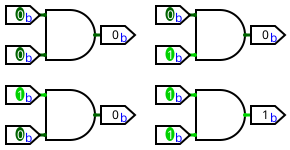
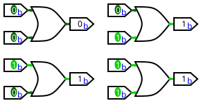
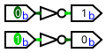
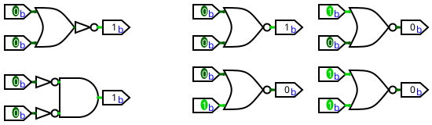
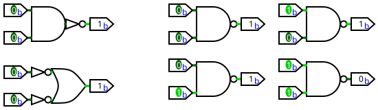
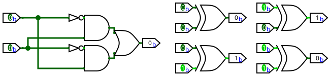
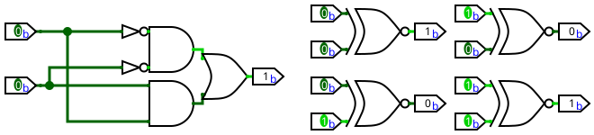
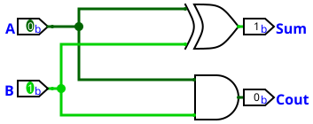
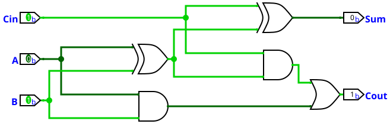
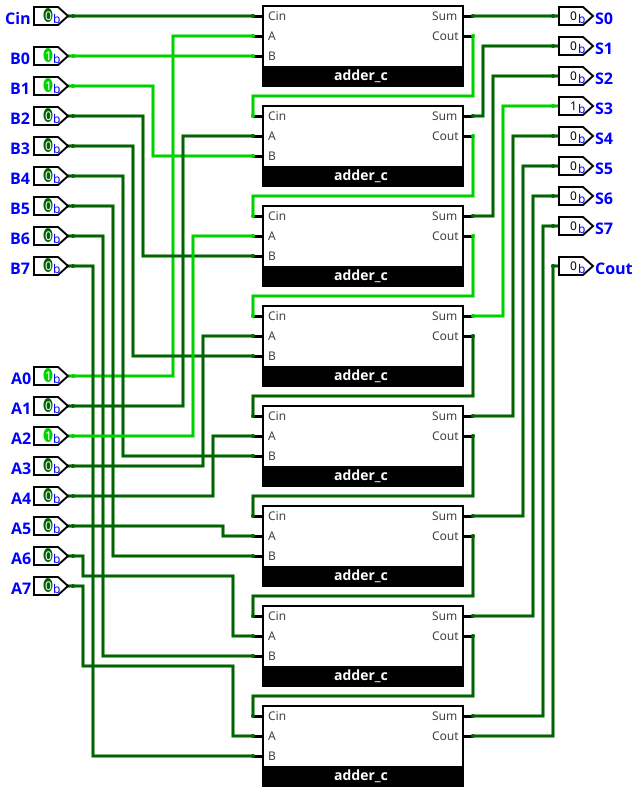

## 让机器认知到现实问题

假如我们正在设计自动售货机系统，最基本的，当顾客投入足够硬币**并且**按下商品按钮时，机器**应该**出货。把上面的逻辑换句话来说，就是判断投入的硬币**是否**足够以及**是否**按下商品按钮来得出机器**是否**应该出货。让人类来判断这段逻辑很简单，但是机器不明白什么叫做投入足够硬币或者按下商品按钮。那么怎么让机器能够明白呢？

众所周知，在电路中，电信号只有高电位和低电位这两种最基本的状态。所以说，我们可以通过一个电信号**是否**为高电位这一逻辑表示出所有情况。各位应该注意到了在前面**是否**这个词常常出现，如果我们把1当作是，把0当作否，这样我们就把复杂的现实问题抽象为了一系列的判断题，只需要用高电位和低电位两种状态就能表示所有可以用是与否表示的问题。

## 基础逻辑门

我们已经找到了让机器表示现实中问题的方法了，那怎么让机器能够进行判断呢？答案是逻辑门。关于逻辑门的电路实现我们在此不再赘述，总之逻辑门可以被看作最基本的决策单元。它们接收一个或多个二进制输入，最后产生单一的二进制输出。

回到我们的自动售货机系统，我们可以通过与门（AND）来实现**并且**这种逻辑：

当然，一个自动售货机系统不可能就这点逻辑。现在，我们的自动售货机不止接受硬币一种付款方式了，它还支持扫码支付。当顾客投入足够硬币**或者**扫码支付成功时，就应该视为钱**足够**了。这种逻辑可以通过或门（OR）来实现：

如果商品卖完了，就算顾客付了钱也选了它，机器也不能出货。只要这件商品**没有**卖完，就**可以**出货。这种逻辑可以通过非门（NOT）来实现：

## 更复杂的逻辑

现实中的问题可能会更加复杂，使用单一的与或非逻辑门无法进行判断。比如说为了省电，售货机在完全没人使用时，应该关闭屏幕背光，进入低功耗模式。当有人靠近**或者**有人触摸时，就**不能**进入节能模式。换句话说，当没人靠近**并且**没人触摸的情况下，就**可以**进入节能模式。这种逻辑被称为或非门（NOR）：

一个售货机应该有故障指示灯。当能检测到商品**并且**制冷系统正常时，故障指示灯就**不应该**亮起。换句话说，当检测不到商品**或者**制冷系统不正常时，故障指示灯就**应该**亮起。这种逻辑被称为与非门（NAND）：

假如我们现在正在搞一个促销活动，买一个汉堡或者一袋薯片，就可以半价购买一瓶可乐，但是如果全都买了或者全都没买，那就不可以参与这个活动。也就是说，如果买了汉堡**并且**没买薯片，**或者**买了薯片**并且**没买汉堡，才**可以**参与活动，这种判断两个输入是否不相同的逻辑被称为异或（XOR）:

还有一种逻辑是判断两个输入是否相同，即A是0**并且**B是0，**或者**A是1**并且**B是1，这种逻辑被称为同或（XNOR）:

:::tip
其实在异或门后面塞一个非门就是同或门了，不过为了逻辑展示没这么做。
:::

## 让机器学会算术

### 从二进制加法开始

众所周知，二进制加法需要两个输入（A、B），会产生“和”、“进位”两个输出。先让我们把所有的情况都枚举出来：

| A | B | 和 | 进位 |
|---:|---:|:---:|:----:|
| 0 | 0 | 0 | 0 |
| 0 | 1 | 1 | 0 |
| 1 | 0 | 1 | 0 |
| 1 | 1 | 0 | 1 |

仔细观察表格发现，当A、B**不相同**时，和为1；当A、B**相同**时，进位为1。这意味着我们只需要一个异或门和一个与门就能实现一个不太完整的一位加法器，我们称其为半加器：

为啥说它不完整呢？因为它没考虑从更低一位传过来的进位。比如在计算11+01的第二位时，半加器就处理不了。那怎么补全这个缺点呢？

来思考一下，我们算竖式的时候是怎么处理的进位？我们需要新加一个输入用来接收从更低一位传过来的进位。然后把进位加到当前的和上。想要实现这个操作，我们可以用两个半加器，设输入的更低一位的进位为Cin：先用第一个半加器计算A+B，得到一个临时的和S_temp和一个进位C1，再用第二个半加器，计算S_temp+Cin，得到最终的和Sum和另一个进位C2。只要C1**或者**C2任意一个是1，那么就有进位。这个逻辑我们可以用或门来实现，然后我们就得到了一个完美的一位加法器，我们称其为全加器：

在现实中机器要处理的不只是1位的数字，而是8位、16位甚至64位的。怎么实现多位相加的计算呢？很简单，要计算多少位的数字，就把多少个加法器连接起来，每个全加器的进位输出都作为下一个全加器的进位输入。比如我们要实现一个8位加法器：

当我们实现了一个8位加法器的时候，我们就很容易可以实现一个16位加法器——把两个8位加法器连起来就行了。以此类推，32位乃至64位的加法器也是可以实现的。

:::tip
这里实现的是行波进位加法器，优点是结构直观实现简单，缺点是效率极低。因为这玩意就像是一排多米诺骨牌，执行运算的全加器必须等待上一个的进位。对于一个N位加法器，最坏情况下的延迟大约是N乘以单个全加器的延迟。现代计算机大多实现的是更高效的设计，比如超前进位加法器等。
:::
