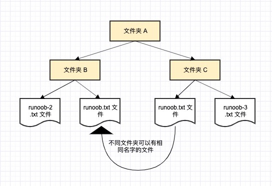
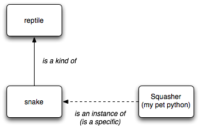
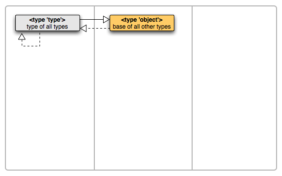
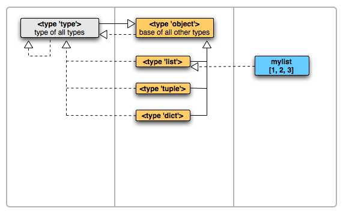
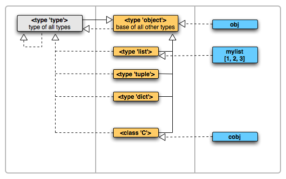
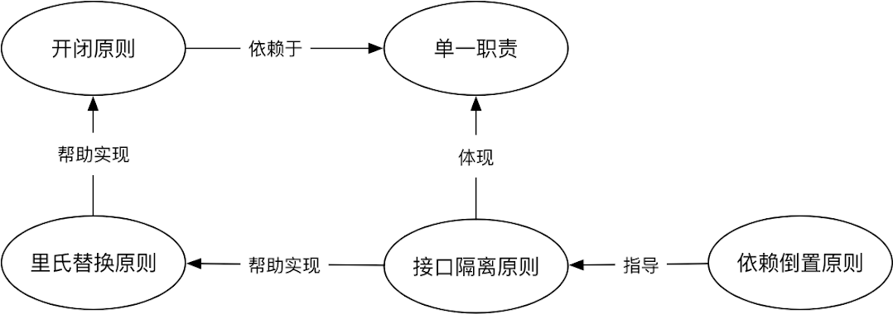
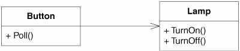

## 面向对象-序

当需求变得复杂时，单纯使用面向过程的思想编程会导致代码可读性和可维护性下降。假设你正在开发一个图书管理程序。最初，你可能会用这种最直接的方式记录书籍信息：

```python
book1_title = "Python编程从入门到实践"
book1_author = "埃里克·马瑟斯"
book1_isbn = "978-7115613639"
book1_stock = 5

book2_title = "流畅的Python"
book2_author = "卢西亚诺·拉马略"
book2_isbn = "978-1492056355"
book2_stock = 3
```

很快你发现，每新增一本书，都要重复定义一堆变量。于是你灵机一动，把每本书的数据都抽离出来变成一个列表：

```python
books = [
    ["Python编程从入门到实践", "埃里克·马瑟斯", "978-7115613639", 5],
    ["流畅的Python", "卢西亚诺·拉马略", "978-1492056355", 3]
]
```

但是这样每次查询书的信息都要依赖`books[0][0]`、`books[2][3]`等索引，这很不直观，要是单独看这段代码，你完全不知道这些索引都会访问什么数据。所幸，你想起了Python还有个东西叫字典：

```python
books = [
    {
        "title": "Python编程从入门到实践",
        "author": "埃里克·马瑟斯",
        "isbn": "978-7115613639",
        "stock": 5,
    },
    {
        "title": "流畅的Python",
        "author": "卢西亚诺·拉马略",
        "isbn": "978-1492056355",
        "stock": 3,
    },
]
```

好了，这下你感觉已经够用了，于是开始写功能：

```python
def borrow(book: dict) -> None:
    if book["stock"] > 0:
        book["stock"] -= 1
        print(f"{book['title']} 借阅成功！剩余库存：{book['stock']}")
    else:
        print("库存不足！")


def show_info(book: dict) -> None:
    print(
        f"《{book['title']}》，作者：{book['author']}，ISBN：{book['isbn']}，库存：{book['stock']}"
    )


def find_book(isbn: str) -> dict | None:
    for book in books:
        if book["isbn"] == isbn:
            return book
    return None


book = find_book("978-1492056355")
if book:
    show_info(book)
    borrow(book)
else:
    print("未找到该书！")
```

不错，已经迈出第一步了。但是一个成熟的图书管理系统不仅要管理书籍，还要记录谁借了哪本书，需要追踪每本书的借阅记录，包括借阅时间和归还时间，如果书籍逾期未还，需要计算罚款，需要支持查询某用户的借阅状态。如果继续面向过程，你会发现你得再加个用户字典，用户字典里面还要套一个借过什么书的字典列表，然后书籍字典里面也得套上被谁借走了的字典列表、借阅历史字典列表，代码里会塞满一堆循环查找、条件判断和嵌套操作，牵一发而动全身。这种代码能跑是没错，但是可读性以及可维护性就比较低了。

这时候你可能会想，要是能把数据和功能捆绑在一起就好了，这时候就需要类出场了。

## 约定

- 本文基准Python版本为3.12，所有高于Python3.12的特性都需要注明。
- 出于时效性考虑，所有参考资料必须标注年份。
- 出于时效性考虑，如果参考资料与当前时间相差超过2年，则必须进行实践验证。
- 代码块默认代表`main.py`文件的内容。
- 以`Output:`开头的注释代表该行代码的输出。
- 以`Raise:`开头的注释代表该行代码将会抛出的异常。
- 本文默认读者已经了解基本的Python面向过程编程。

## 基础概念

以防有人还没有接触过这些概念，在正式开始之前，我们先来对一些基本概念做一些讲解。

### 魔术方法

所有被双下划线所包围的方法都是魔术方法，如最常见的`__init__()`。这里先不展开讲魔术方法，等到后继章节再讲。需要注意的是，永远不要用以双下画线开头和结尾的名字定义你自己的方法，虽然现在可能没有特殊的用途，但不保证以后没有。

### 装饰器

这个也在后继章节讲。简而言之，装饰器可以用来修改函数或方法的功能，一般形式为`@xxxx`。

### 命名空间

假设我们要找一个叫"张伟"的朋友，但是全国一共有294282个张伟（2019），我们怎么确定哪个张伟才是我们要找的人？所以说除了名称以外，我们还需要用更多信息去确定这个人——比如住在哪个城市、在哪家公司工作等。

类似地，如果在多个地方定义了同名的方法或变量，Python解释器并不能确定你要调用的是哪一个。因此，命名空间这一概念应运而生。命名空间给名称分组，相同的名称在不同命名空间中指向不同对象，这样写代码时只需要在方法名或变量名前加上模块名，Python解释器就知道具体要调用哪一个了。

我们再举一个计算机系统中的例子，一个文件夹(目录)中可以包含多个文件夹，每个文件夹中不能有相同的文件名，但不同文件夹中的文件可以重名。


（图源 菜鸟教程）

以下为代码示例：

```python
# File: module1.py
def echo():
    return "来自模块1"
```

```python
# File: module2.py  
def echo():
    return "来自模块2"
```

```python
# File: main.py
import module1
import module2
print(module1.echo())  # Output: 来自模块1
print(module2.echo())  # Output: 来自模块2
```

在Python中，我们通过`.`操作符来访问对象的属性/方法。例如，在`module1.echo()`中，`module1`是一个模块对象，`echo`是它的一个方法，通过`.`调用。通过`module1.echo()`和`module2.echo()`，我们明确的告诉了Python解释器要调用哪个模块中的方法。

### 作用域与闭包

现在我们来讲讲Python的作用域。顾名思义，作用域是指名称能够起作用的区域，也就是”在哪里可以使用这个名称“。Python的作用域遵循LEGB规则，按以下顺序查找变量：

1. **Local**：当前函数的局部作用域。
2. **Enclosing**：包含当前函数的外部函数的作用域（如果有嵌套函数）。
3. **Global**：当前模块的全局作用域。
4. **Builtin**：Python内置的作用域。

更直观的可以直接看图：


（图源 菜鸟教程）

查找过程从内层到外层单向逐级进行，内层同名变量会遮蔽外层变量。例如：

```python
x = "全局变量"
def main():
    x = "局部变量"
    print(x)

main()  # Output: 局部变量
print(x)  # Output: 全局变量
```

每次调用函数时，都会创建其自身的局部作用域。传递给函数的参数会被复制到函数的形参中，这些形参仅能在函数的局部作用域内访问。函数完成执行后，由于垃圾回收机制，局部变量会从内存中释放：

```python
def add(a, b):
    print(f"函数内部: a = {a}")
    return a + b


result1 = add(2, 3)  # Output: 函数内部: a = 2
result2 = add(5, 7)  # Output: 函数内部: a = 5

print(a)  # Raise: NameError: name 'a' is not defined
```

所以可以说作用域具有一种“封闭性”。相信各位可能就已经意识到了，命名空间就是对作用域的一种抽象，利用作用域将名称“封在里面”的特性，实现分组的目的。

当在一个函数内部定义另一个函数时，内部函数属于外部函数的局部作用域：

```python
def outer():
    print("外部函数执行")
    
    def inner():
        print("内部函数执行")
    
    inner()

outer()
inner()  # Raise: NameError: name 'inner' is not defined.
```

在外部函数的局部作用域中调用是没有问题的，但我们试图从全局作用域调用这个内部函数就会抛出一个`NameError`，因为`inner`未在全局作用域中定义。

不过，有一种方法可以在局部作用域之外访问这个函数。我们可以返回内部函数对象而不是调用它，然后将返回的函数分配给一个变量：

```python
def outer():
    def inner():
        return "内部函数被调用了"
    
    return inner

func = outer()
print(func())   # Output: 内部函数被调用了
```

函数`outer`已经执行完毕，其局部作用域理应被销毁，为什么函数`inner`还能正常工作？因为只要还有对该对象的引用，Python解释器就会将其保留在内存中。

那如果内部函数引用到了外部函数作用域内的变量，会怎么样？下面是一个例子：

```python
def power(exponent):
    def inner(base):
        return base ** exponent
    return inner

power_of_two = power(2)
power_of_three = power(3)

print(power_of_two(5))  # Output: 25
print(power_of_three(5))  # Output: 125
```

理论上，外层函数`power`的局部作用域在函数执行完毕后应该销毁，其中的局部变量（如`exponent`）也应该随之消失。然而，实际运行时，内层函数`power_of_two`仍能访问`exponent`，且结果正确。这是因为Python为这种情况做了特殊处理。不在函数的局部作用域中定义，而在其外部作用域中定义的变量被称为非局部变量。如果内部函数引用了外部函数的变量，Python会将这些自由变量（在函数中使用但不在该函数内定义的变量）保存在一个特殊的属性`__closure__`中，这些变量被称为自由非局部变量（如例子中的`exponent`）。这样即使在包含它的函数的局部作用域被销毁，它仍保留在内存中。这种会携带其所在的环境的函数被称为闭包。

虽然闭包中可以读取到非局部变量，但试图直接赋值只会创建局部变量，不会修改非局部变量。这时候就需要用到`nonlocal`了。它的作用就是告诉Python解释器，某个变量引用的是最近的非局部作用域中已经绑定的变量，而不是想要创建一个新的局部变量：

```python
def main():
    x = 1
    def a():
        nonlocal x
        x = 2
    def b():
        x += 3  # Raise: UnboundLocalError: cannot access local variable 'x' where it is not associated with a value
    print(x)  # Output: 1
    a()
    print(x)  # Output: 2
    b()
    print(x)

main()
```

有人可能会疑惑，为什么`x += 3`这种操作会抛出`UnboundLocalError`，这是因为`x += 3`等价于`x = x + 3`，Python首先需要读取x的值才能进行后继运算，但由于直接赋值只会创建局部变量，所以x被标记为局部变量，而作为局部变量的x并没有被赋值，最后就会抛出`UnboundLocalError`。

当然，不涉及变量的重绑定（如操作可变对象）的话就可以直接用：

```python
def main():
    x = []

    def a():
        x.append(1)

    print(x)  # Output: []
    a()
    print(x)  # Output: [1]


main()
```

如果想要修改全局作用域的变量，我们可以用`global`：

```python
x = 1
def a():
    global x
    x = 2

print(x)  # Output: 1
a()
print(x)  # Output: 2
```

## 初探类与对象

面向对象编程的核心在于抽象——将现实世界的事物提炼为对象，以对象为基本单元封装数据和行为，实现程序功能。

想象一下我们日常生活中与各种物品的交互方式。看电视只需要用遥控器控制开关、音量和频道，完全不需要理解内部电路如何工作。面向对象编程也是如此，将相关的数据和操作这些数据的方法打包在一起成为类。调用者只需要知道提供了哪些接口，而不需要关心内部实现细节。

我们使用这些类来创建对象，这被称为实例化，被创建出来的对象被称为类的实例。很多语言中的类都被比作蓝图。而在Python中，比起蓝图这个比喻，类更像一个工厂，实例则是工厂生产的产品。通常情况下，除非有特殊需求，我们使用的是这些产品（实例），而非工厂（类）本身。

在Python中，我们使用`class`关键字来定义一个类。比如我们定义一个类`Book`:

```python
class Book:
    pass
```

要实例化这个类，我们只需调用它：

```python
my_book = Book()
```

这将创建类`Book`的新实例并将这个实例对象分配给局部变量`my_book`。我们可以用魔术方法`__class__`来查询实例所属的类，通过魔术方法`__name__`来查询所属类的名称。

```python
print(x.__class__)  # Output: <class '__main__.Book'>
print(x.__class__.__name__)  # Output: Book
```

一个空荡荡的工厂没什么用，我们需要它能生产出带有具体信息的产品。比如，每本书都应该有自己标题、作者和isbn号：

```python
class Book:
    def __init__(self, title, author, isbn, stock):
        self.title = title
        self.author = author
        self.isbn = isbn
        self.stock = stock

python_crash_course = Book("Python编程从入门到实践", "埃里克·马瑟斯", "978-7115613639", 5)
fluent_python = Book("流畅的Python", "卢西亚诺·拉马略", "978-1492056355", 3)

print(python_crash_course.title)  # Output: Python编程从入门到实践
print(fluent_python.title)  # Output: 流畅的Python
```

`__init__()`是一个在创建新实例时被自动调用的魔术方法，免去了手动调用的麻烦。

每个实例都拥有自己独立的数据副本。`python_crash_course`的`title`和`fluent_python`的`title`是互不影响的。这些与特定实例绑定的属性，我们称之为实例属性。通常情况下，我们可以使用`__dict__`查看一个由开发者自定义类创建的实例存储的所有属性：

```python
print(python_crash_course.__dict__)  # Output: {'title': 'Python编程从入门到实践', 'author': '埃里克·马瑟斯', 'isbn': '978-7115613639', 'stock': 5}
print(fluent_python.__dict__)  # Output: {'title': '流畅的Python', 'author': '卢西亚诺·拉马略', 'isbn': '978-1492056355', 'stock': 3}
```

在类中定义的函数，我们称之为方法。当一个方法需要访问或修改实例自身的属性时，它就应该是一个实例方法。实例方法的第一个参数必须用来接收实例对象本身，按照约定，这个参数应该叫`self`。让我们给类Book添加一个显示书籍信息的方法：

```python
class Book:
    def __init__(self, title, author, isbn, stock):
        self.title = title
        self.author = author
        self.isbn = isbn
        self.stock = stock

    def get_book_info(self):
        return f"《{self.title}》，作者：{self.author}（ISBN：{self.isbn}），库存：{self.stock}本"


fluent_python = Book("流畅的Python", "卢西亚诺·拉马略", "978-1492056355", 3)
print(fluent_python.get_book_info())  # Output: 《流畅的Python》，作者：卢西亚诺·拉马略（ISBN：978-1492056355），库存：3本
```

有时候，某些属性或行为是属于整个类的，而不是某个特定实例。例如，一个图书馆需要知道馆藏图书一共有多少种，这个信息不属于任何一本书，而是属于整个`Book`这个类。这种在所有实例之间共享的属性，就是类属性。

与此对应，如果一个方法操作的是类属性而不是实例属性，我们通常会将其定义为类方法。类方法使用`@classmethod`装饰器来标识，并且它的第一个参数必须用来接收类对象本身，按照约定，这个参数应该叫`cls`：

```python
class Book:
    _all_isbns = set()

    def __init__(self, title, author, isbn, stock):
        self.title = title
        self.author = author
        self.isbn = isbn
        self.stock = stock
        self._add_isbn(isbn)

    def get_book_info(self):
        return f"《{self.title}》，作者：{self.author}，库存：{self.stock}本"

    @classmethod
    def get_store_info(cls):
        return f"欢迎来到图书馆！当前馆藏图书共{len(cls._all_isbns)}种。"

    @classmethod
    def _add_isbn(cls, isbn: str):
        cls._all_isbns.add(isbn)

python_crash_course = Book("Python编程从入门到实践", "埃里克·马瑟斯", "978-7115613639", 5)
fluent_python = Book("流畅的Python", "卢西亚诺·拉马略", "978-1492056355", 3)


print(Book.get_store_info())  # Output: 欢迎来到图书馆！当前馆藏图书共2种。
print(fluent_python.get_store_info())  # Output: 欢迎来到图书馆！当前馆藏图书共2种。
```

可以通过类直接调用类方法。当然，通过实例调用也行，效果一样，但不推荐。

`self`和`cls`只是一种约定俗成的命名，关键在于它们必须是第一个参数。只要保证位置是在第一个无论叫什么都是可以运行的，比如你哪一天突发奇想把`self`和`cls`反过来用：

```python
class Book:
    _all_isbns = set()

    def __init__(cls, title, author, isbn, stock):
        cls.title = title
        cls.author = author
        cls.isbn = isbn
        cls.stock = stock
        cls._add_isbn(isbn)

    @classmethod
    def get_store_info(self):
        return f"欢迎来到图书馆！当前馆藏图书共{len(self._all_isbns)}种。"

    @classmethod
    def _add_isbn(self, isbn: str):
        self._all_isbns.add(isbn)

    def get_book_info(cls):
        return f"《{cls.title}》，作者：{cls.author}（ISBN：{cls.isbn}），库存：{cls.stock}本"
```

那确实也能跑，不过项目一旦要被其他人接手那你得更能跑。所谓“约定俗成”的意义就在于下一个接手代码的人不至于需要反应一下才能明白这参数是干啥的。

当一个方法既不需要用实例属性也不需要用类属性，但功能上与这个类相关时，这时候应该使用静态方法。比如我们添加一个验证isbn有效性的方法：

```python
class Book:
    _all_isbns = set()

    def __init__(self, title, author, isbn, stock):
        if not self._is_valid_isbn(isbn):
            raise ValueError("ISBN无效")
        self.title = title
        self.author = author
        self.isbn = isbn
        self.stock = stock
        self._add_isbn(isbn)

    def get_book_info(self):
        return f"《{self.title}》，作者：{self.author}，库存：{self.stock}本"

    @classmethod
    def get_store_info(cls):
        return f"欢迎来到图书馆！当前馆藏图书共{len(cls._all_isbns)}种。"

    @classmethod
    def _add_isbn(cls, isbn: str):
        cls._all_isbns.add(isbn)

    @staticmethod
    def _is_valid_isbn(isbn: str) -> bool:
        clean = isbn.replace("-", "").replace(" ", "")
        if len(clean) != 13 or not clean.isdigit():
            return False

        total = sum(int(d) * (1 if i % 2 == 0 else 3) for i, d in enumerate(clean))
        return total % 10 == 0

fluent_python = Book("流畅的Python", "卢西亚诺·拉马略", "123-4567890123", 3)  # Raise: ValueError: ISBN无效
```

类属性可以通过类方法赋值，也可以直接通过类赋值，但是不能在实例上赋值。实例上可以读取类属性，但是试图赋值就会创建一个新的实例属性而不是修改类属性(操作可变对象除外)：

```python
class Book:
    _all_isbns = set()
    test = 1

    def __init__(self, title, author, isbn, stock):
        self.title = title
        self.author = author
        self.isbn = isbn
        self.stock = stock
        self._add_isbn(isbn)

    @classmethod
    def _add_isbn(cls, isbn: str):
        cls._all_isbns.add(isbn)

python_crash_course = Book("Python编程从入门到实践", "埃里克·马瑟斯", "978-7115613639", 5)
print(Book.__dict__) # {'__module__': '__main__', '_all_isbns': {'978-7115613639'}, 'test': 1, '__init__': <function Book.__init__ at 0x0000020EF37AD1C0>, '_add_isbn': <classmethod(<function Book._add_isbn at 0x0000020EF37AD260>)>, '__dict__': <attribute '__dict__' of 'Book' objects>, '__weakref__': <attribute '__weakref__' of 'Book' objects>, '__doc__': None}
print(python_crash_course.__dict__) # {'title': 'Python编程从入门到实践', 'author': '埃里克·马瑟斯', 'isbn': '978-7115613639', 'stock': 5}
python_crash_course._all_isbns.add("978-1492056355")
python_crash_course.test = 123
print(Book.__dict__) # {'__module__': '__main__', '_all_isbns': {'978-7115613639', '978-1492056355'}, 'test': 1, '__init__': <function Book.__init__ at 0x0000020EF37AD1C0>, '_add_isbn': <classmethod(<function Book._add_isbn at 0x0000020EF37AD260>)>, '__dict__': <attribute '__dict__' of 'Book' objects>, '__weakref__': <attribute '__weakref__' of 'Book' objects>, '__doc__': None}
print(python_crash_course.__dict__) # {'title': 'Python编程从入门到实践', 'author': '埃里克·马瑟斯', 'isbn': '978-7115613639', 'stock': 5, 'test': 123}
```

### 通过类继承实现复用

在编写类时，并非总是要从头开始。如果要编写的类是一个既有的类的特殊版本，可使用继承。当一个类继承另一个类时，将自动获得后者的所有属性和方法。原有的类被称为父类，而新类被称为子类。子类不仅继承了父类的所有属性和方法，还可定义自己的属性和方法。

比如现在有一个交通工具类，我们想要再写一个汽车类，这时候就可以继承。继承语法非常直接，在定义类时把基类名称放括号里面就行了。

```python
class Vehicle:
    def __init__(self, brand):
        self.brand = brand

    def drive(self):
        print("交通工具正在行驶")

class Car(Vehicle):
    def __init__(self, brand):
        super().__init__(brand)

    def honk(self):
        print("嘀嘀")
```

`super()`可以让我们能够调用父类的方法。这行代码调用`Vehicle`类的`__init__()`方法，从而让`Car`实例包含这个方法定义的所有属性。

子类可以提供一个与父类方法同名的新实现，这个过程称为重写。这允许子类根据自身的特性，定制化地实现继承来的行为：

```python
class Car(Vehicle):
    def __init__(self, brand):
        super().__init__(brand)

    def drive(self):
        print(f"{self.brand}汽车正在行驶")

    def honk(self):
        print("嘀嘀")
```

假设我们不小心把`drive`写成了`driv`，即一个父类中不存在的方法，那我们试图调用子类的`drive`时，实际上会直接调用父类的`drive`。如果想要让类型检查器发现这个错误，可以使用`@override`注解来明确表示方法的覆盖关系：

```python
from typing import override

class Vehicle:
    def __init__(self, brand):
        self.brand = brand

    def drive(self):
        print("交通工具正在行驶")


class Car(Vehicle):
    def __init__(self, brand):
        super().__init__(brand)

    @override
    def driv(self):
        print(f"{self.brand}汽车正在行驶")

    def honk(self):
        print("嘀嘀")
```

Python允许一个类同时继承多个父类。比如：

```python
class Radio:
    def play_music(self, name):
        print(f"收音机正在播放：{name}")

class MusicCar(Car, Radio):
    pass

my_music_car = MusicCar("不知名")
my_music_car.drive()  # 来自 Car
my_music_car.play_music("大鱼 - 周深")  # 来自 Radio
```

当一个类有多个父类，并且这些父类可能拥有同名方法时，Python会遵循一个明确且可预测的顺序来查找方法（包括`super()`）。这个顺序就是MRO。一般来说我们不需要了解Python是怎么确认顺序的，我们可以用`__mro__`来直接查看排序结果：

```python
print(MusicCar.__mro__) # Output: (<class '__main__.MusicCar'>, <class '__main__.Car'>, <class '__main__.Vehicle'>, <class '__main__.Radio'>, <class 'object'>)
```

从执行结果来看，这个顺序是MusicCar->Car->Vehicle->Radio->object

我们可以使用`isinstance()`判断一个对象是否是某个类或其子类的实例：

```python
class Vehicle:
    def __init__(self, brand):
        self.brand = brand

    def drive(self):
        print("交通工具正在行驶")


class Car(Vehicle):
    def __init__(self, brand):
        super().__init__(brand)

    def drive(self):
        print(f"{self.brand}汽车正在行驶")


class Bike(Vehicle):
    def __init__(self, brand):
        super().__init__(brand)

    def drive(self):
        print(f"{self.brand}自行车正在行驶")

my_bike = Bike("不知名")
my_car = Car("不知名")

print(isinstance(my_bike, Bike))  # Output: True
print(isinstance(my_bike, Vehicle))  # Output: True
print(isinstance(my_car, Vehicle))  # Output: True
print(isinstance(my_car, Bike))  # Output: False
```

### 我们真的需要继承吗？

继承建立的是一种“属于”的关系，例如汽车属于交通工具。然而我们会遇到“包含”的关系，比如前例中`MusicCar`包含一个收音机。实际上这时候与其继承，不如直接把其他类的实例用作属性来进行一个组装。下面是一个具体的例子：

```python
class Radio:
    def play_music(self, name):
        print(f"收音机正在播放：{name}")

class Car:
    def __init__(self, brand):
        self.brand = brand
        self.radio = Radio()

    def drive(self):
        print(f"{self.brand}汽车正在行驶")

    def play_music(self, name):
        self.radio.play_music(name)

my_car = Car("不知名")
my_car.drive()  # Output: 不知名汽车正在行驶
my_car.play_music("大鱼 - 周深") # Output: 收音机正在播放：大鱼 - 周深
```

实际应用中到底是用继承还是组合就看这两个类之间是否有明确的从属关系。如果没有，那最好用组合的思路。

## 定制类的行为

有的时候我们需要自定义类的行为，这时候我们可以利用魔术方法（绝大多数情况）或元类（极少数情况）来实现我们的想法。

### 利用魔术方法

#### 通过__new__自定义实例化流程

我们最常用的魔术方法是`__init__()`。但`__init__()`并不是第一个被调用的，在它前面还有`__new__()`。默认情况下，`__new__()`函数创建实例并将其作为第一个参数传递给`__init__()`函数，`__init__()`函数接收这个新实例并直接返回它。通过重写`__init__()`我们可以实现自动为新创建的实例添加属性，而通过重写`__new__()`我们可以自定义实例创建流程。比如我们需要实现单例模式：

```python
class A:
    _instance = None
    _initialized = False
    
    def __new__(cls, *args, **kwargs):
        if not cls._instance:
            cls._instance = super().__new__(cls)
        return cls._instance

    def __init__(self, test):
        if not self._initialized:
            self._initialized = True
            self.test = test

a1 = A(test=10)
a2 = A(test=20)

print(a1 is a2)  # Output: True
print(a2.test)  # Output: 10
```

由于我们重写了`__new__()`，所以说我们必须显式调用父类（默认是`object`，这是所有类的父类）的实例化逻辑（即`super().__new__(cls)`）。而且我们必须返回一个实例，不然后继逻辑将不会执行，类的实例化将会被直接中断。如果我们在这里返回了另一个类的实例，那么后继流程使用的就是另一个类的实例。

此外，由于每次实例化都会调用`__init__()`，所以说我们需要限制`__init__()`的执行次数，否则后续的实例化会覆盖已存在单例的状态——除非这是预期行为。

还有一个和实例生命周期有关的魔术方法是`__del__()`。这个我不推荐自定义，Python官方文档也不建议用，我也不会讲。与其自定义这个不如写一个`close()`方法。

#### 自定义对象的字符串表示

当我们`print`我们定义的对象时，我们会发现显示的内容是类似于`<__main__.Book object at 0x00000230AA7EA060>`的：

```python
class Book:
    def __init__(self, title, author, isbn, stock):
        self.title = title
        self.author = author
        self.isbn = isbn
        self.stock = stock

fluent_python = Book("流畅的Python", "卢西亚诺·拉马略", "978-1492056355", 3)
print(fluent_python)  # Output: <__main__.Book object at 0x00000230AA7EA060>
```

如果想要返回一个易于阅读的对象字符串表示形式，似乎我们只能定义一个`get_book_info`方法——真的是这样吗？

我们可以通过魔术方法`__str__()`来定义对象的字符串表示形式:

```python
class Book:
    def __init__(self, title, author, isbn, stock):
        self.title = title
        self.author = author
        self.isbn = isbn
        self.stock = stock
    
    def __str__(self):
        return f"《{self.title}》 by {self.author} (ISBN: {self.isbn}) - 库存: {self.stock}"

fluent_python = Book("流畅的Python", "卢西亚诺·拉马略", "978-1492056355", 3)
print(fluent_python)  # Output: 《流畅的Python》 by 卢西亚诺·拉马略 (ISBN: 978-1492056355) - 库存: 3
```

现在看起来是不是更简单易懂了？但是这样显示有一个问题，我们没办法通过这个结果知道类都有什么变量，都有什么值，简而言之，就是不够正式。这时候我们可以定义一个`__repr__()`：

```python
class Book:
    def __init__(self, title, author, isbn, stock):
        self.title = title
        self.author = author
        self.isbn = isbn
        self.stock = stock

    def __str__(self):
        return f"《{self.title}》 by {self.author} (ISBN: {self.isbn}) - 库存: {self.stock}"
    
    def __repr__(self):
        return f"Book(title={self.title}, author={self.author}, isbn={self.isbn}, stock={self.stock})"

fluent_python = Book("流畅的Python", "卢西亚诺·拉马略", "978-1492056355", 3)
print(fluent_python)  # 《流畅的Python》 by 卢西亚诺·拉马略 (ISBN: 978-1492056355) - 库存: 3
print(f"{fluent_python!s}")  # 《流畅的Python》 by 卢西亚诺·拉马略 (ISBN: 978-1492056355) - 库存: 3
print(f"{fluent_python!r}")  # Book(title=流畅的Python, author=卢西亚诺·拉马略, isbn=978-1492056355, stock=3)
```

当没有指定的时候，打印出来的是`__str__`所定义的内容。当我们显式要求正式输出时，打印出来的是`__repr__`所定义的内容。

#### 使用魔术方法实现比较

以下是用于实现比较的魔术方法：

- `__eq__(self, other):`：定义等号行为 (==)。
- `__ne__(self, other):`：定义不等号行为 (!=)。
- `__lt__(self, other):`：定义小于号行为 (<)。
- `__le__(self, other):`：定义小于等于号行为 (<=)。
- `__gt__(self, other):`：定义大于号行为 (>)。
- `__ge__(self, other):`：定义大于等于号行为 (>=)。

举一个例子，创建一个类来表现一个词语。我们也许会想要比较单词的字典序(通过字母表)，通过默认的字符串比较的方法就可以实现，但是我们也想要通过一些其他的标准来实现，比如单词长度或者音节数量。在这个例子中，我们来比较长度实现。以下是实现代码:

```python
class Word(str):

    def __new__(cls, word):
        # 注意我们必须要用到__new__方法，因为str是不可变类型
        # 所以我们必须在创建的时候将它初始化
        if ' ' in word:
            print("Value contains spaces. Truncating to first space.")
            word = word[:word.index(' ')] #单词是第一个空格之前的所有字符
        return str.__new__(cls, word)

    def __gt__(self, other):
        return len(self) > len(other)
    def __lt__(self, other):
        return len(self) < len(other)
    def __ge__(self, other):
        return len(self) >= len(other)
    def __le__(self, other):
        return len(self) <= len(other)

word1 = Word('hello')
word2 = Word('world')
word3 = Word('python')

print(word1 > word2)  # Output: False
print(word1 < word3)  # Output: True
print(word2 >= word1) # Output: True
```

注意，我们没有定义``__eq__()``和``__ne__()``方法。这是因为将会产生一些怪异的结果（比如 Word('foo') == Word('bar') 将会返回true）。所以我们退回去，用`str`内置来进行比较。

#### 上下文管理器

上下文管理器可以确保资源在使用完毕后被正确清理。我们可以通过`__enter__()`和`__exit__()`这两个魔术方法来实现上下文管理器：

```python
class DatabaseConnection:
    def __init__(self, database_name):
        self.database_name = database_name
        self.connection = None
    
    def __enter__(self):
        print(f"连接到数据库: {self.database_name}")
        self.connection = self.database_name
        return self.connection
    
    def __exit__(self, exc_type, exc_value, traceback):
        print(f"关闭数据库连接: {self.database_name}")

with DatabaseConnection("用户数据库") as conn:
    print(f"使用连接: {conn}")
    print("执行数据库操作...")
```

`with`会在进入代码块时执行`__enter__()`中定义的操作，并把`__enter__()`的返回值绑定到`as`子句中指定的目标（如果有的话）。在离开代码块时会执行`__exit__`中定义的操作。

如果是异步，换成`__aenter__()`和`__aexit__()`即可。

#### 使用__slots__优化属性访问

默认情况下，Python对象使用字典来存储属性。优点是可以动态添加属性，缺点是占用内存可能较多并且查找操作相对较慢。这时候我们可以定义`__slots__`，这将阻止类创建`__dict__`和`__wekref__`。

要使用`__slots__`，你需要在类中定义一个名为`__slots__`的属性，并将允许的属性名提供给它：

```python
class Book:
    __slots__ = ("title", "author", "isbn", "stock")

    def __init__(self, title, author, isbn, stock):
        self.title = title
        self.author = author
        self.isbn = isbn
        self.stock = stock
```

需要注意的是，因为没有了`__wekref__`，这个类将不支持弱引用。如果需要弱引用支持，需要在`__slots__`中手动声明`__wekref__`。

当涉及继承时，如果父类定义了`__slots__`，子类也必须定义`__slots__`，否则子类实例将会有`__dict__`和`__wekref__`。

#### 迭代器与生成器

各位可能注意到了，大多数容器对象都可以使用for语句:

```python
for char in "abc":
    print(char)
```

在幕后，for语句会在容器对象上调用`iter()`。该函数返回一个定义了`__next__()`方法的迭代器对象，此方法将逐一访问容器中的元素。当元素用尽时，`__next__()`将引发`StopIteration`来通知终止for循环。我们可以使用`next()`来调用`__next__()`方法。下面是`for char in "abc"`的等价模拟：

```python
>>> s = 'abc'
>>> it = iter(s)
>>> next(it)
'a'
>>> next(it)
'b'
>>> next(it)
'c'
>>> next(it)
Traceback (most recent call last):
  File "<stdin>", line 1, in <module>
StopIteration
```

如果想让我们自己的类能够被迭代，那我们实现上面的操作就行了。定义`__iter__()`用于返回一个带有`__next__()`的对象，如果类已经定义了`__next__()`，那么直接返回self就行：

```python
class Reverse:
    """对一个序列执行反向循环的迭代器。"""
    def __init__(self, data):
        self.data = data
        self.index = len(data)

    def __iter__(self):
        return self

    def __next__(self):
        if self.index == 0:
            raise StopIteration
        self.index = self.index - 1
        return self.data[self.index]
```

来点题外话，有没有更简单的方式来实现迭代呢？我们可以用生成器。生成器的写法类似于标准的函数，但当它们要返回数据时会使用`yield`。它会自动创建`__iter__()`和`__next__()`，每次在生成器上调用`next()`，它就会从上次离开的位置恢复执行。当元素全部取出后，还会自动引发`StopIteration`。这种情况下，利用生成器创建迭代器可以和编写常规函数一样容易：

```python
def reverse(data):
    for index in range(len(data)-1, -1, -1):
        yield data[index]
```

### 利用元类

> 元类是一种99%的用户都无需关心的深奥魔法。如果你还在犹豫自己是否需要它，答案就是不需要。真正需要元类的人会非常清楚自己非用不可，根本不需要解释原因。
>
> ——Tim Peters

~~所以我决定不讲了~~

开个玩笑，我们继续。

#### 引入

让我们从"Hello, World!"开始：

```python
print("Hello, World!".__class__)  # Output: <class 'str'>
print(str.__class__)  # Output: <class 'type'>
print(str.__bases__)  # Output: (<class 'object'>,)

print("Hello, World!".__bases__)  # Raise: AttributeError: 'str' object has no attribute '__bases__'. Did you mean: '__class__'?
```

在Python中，万物皆对象。即使是基本数据类型，也都是由内置类创建的对象（其实这也是你能直接在字符串上面用方法的原因）。如代码所示，字符串"Hello, World!"内置类`str`的实例，而字符串实例本身没有基类。将视线移向内置类`str`，它是`type`类的实例，基类是`object`。众所周知，实例是类实例化的结果，也就是说，内置类`str`是由`type`类实例化的。

```python
class Book:
    pass

print(Book.__class__)  # <class 'type'>
print(Book.__bases__)  # (<class 'object'>,)
```

再来看看我们自定义的类。结果也是一样的，我们定义的类继承自`object`，是`type`类的实例。

#### Python对象系统——从根源开始

> [!NOTE]
> 本节内容主要参考Shalabh Chaturvedi所编写的《Python Types and Objects》，本人（Raven95676）出于教育目的进行整理与二次创作。由于原作者保留所有权利，本节内容不以CC BY-NC-SA 4.0协议发布。如原版权人认为本节内容涉及版权问题，请联系本人（Raven95676）移除相关内容。
>
> 本节内容引用图片较为古老，请自行将图中所有的形如`<type 'object'>`的视为`<class 'object'>`。

我们现在从头开始构建Python对象系统。让我们从最基本的地方开始——一张白纸。


在画图之前，我们先来介绍下关系。我们使用两种关系来连接两个对象：

- 子类-父类关系（继承）：表示一个对象是另一个对象的特化版本，例如“猫娘是幻想生物的一种”。
- 类型-实例关系（实例化）：表示一个对象是另一个对象的具体实例，例如“猫娘Nova是猫娘的实例”。

继承关系使用实线从子到父连接，实例化关系使用虚线从实例到类型连接，如下图示例：



我们从一切的根源开始探索：

```python
print(object.__class__)  # Output: <class 'type'>
print(object.__bases__)  # Output: ()

print(type.__class__)  # Output: <class 'type'>
print(type.__bases__)  # Output: (<class 'object'>,)
```

`object`类是由`type`类实例化而来的，没有父类。这意味`object`是继承的起点。`type`类是由自身实例化的，父类是`object`。

让我们把这些发现画在图上：



我们再引入`list`,`dict`,`tuple`这些内置数据类型来看看：

```python
print(list.__class__)  # Output: <class 'type'>
print(list.__bases__)  # Output: (<class 'object'>,)
print(tuple.__class__)  # Output: <class 'type'>
print(tuple.__bases__)  # Output: (<class 'object'>,)
print(dict.__class__)  # Output: <class 'type'>
print(dict.__bases__)  # Output: (<class 'object'>,)
```

它们的父类都是`object`，都是由`type`类实例化而来的。然后我们实例化一个list看看：

```python
mylist = [1,2,3]
print(mylist.__class__)  # Output: <class 'list'>
print(mylist.__bases__)  # Raise: AttributeError: 'list' object has no attribute '__bases__'. Did you mean: '__class__'?
```

`mylist`由`list`实例化而来，没有父类。

让我们把这些发现画在图上：



现在我们来根据现有的`object`类来定义属于自己的类（不写从哪继承默认继承自`object`），然后实例化：

```python
class C:
    pass

obj = object()
cobj = C()


print(C.__class__)  # Output: <class 'type'>
print(C.__bases__)  # Output: (<class 'object'>,)
print(obj.__class__)  # Output: <class 'object'>
print(cobj.__class__)  # Output: <class '__main__.C'>
```

让我们把这些发现画在图上：



实际上这三个格子都代表着什么已经跃然纸上了：


第一个格子，这是所有类的类，我们称之为元类。

第二个格子既是第三个格子的类，又是第一个格子的实例，我们称之为类型对象。

第三个格子是第二个格子的实例，我们就称之为实例。

元类实例化了类型对象，类型对象实例化了类。所以说一切新对象的创建都可以归结为实例化。

所以，下面的两段代码在本质上是等价的：

```python
class MyClass:
    pass

MyClass = type("MyClass", (), {})
```

#### 元类的用法

那么现在我们——

已知：默认情况下，类是使用`type`来构建的。

已知：类是可以被继承的。

那么我们可不可以继承`type`，创建一个新的元类，用新的元类来创建类呢——答案是当然可以，这就是元类的核心。

恭喜各位，我们终于要开始学习元类的用法了。

一个基本元类通常是继承自type并重写它的`__new__()`或者`__init__()`：

```python
class Meta(type):
    def __new__(cls, clsname: str, bases: tuple, clsdict: dict):
        return super().__new__(cls, clsname, bases, clsdict)

    def __init__(self, clsname: str, bases: tuple, clsdict: dict):
        super().__init__(clsname, bases, clsdict)
```

其中，`clsname`是类名，会成为新类的`__name__`属性。`bases`元组包含基类并会成为`__bases__`属性，如果为空，则会添加`object`,`clsdict`字典包含类体的属性和方法定义；它在成为`__dict__`属性之前可能会被拷贝或包装。

现在我们来给这个元类加点功能，这个元类会拒绝任何有混合大小写名字作为方法的类定义：

```python
class NoMixedCaseMeta(type):
    def __new__(cls, clsname, bases, clsdict):
        for name in clsdict:
            if name.lower() != name:
                raise TypeError('Bad attribute name: ' + name)
        return super().__new__(cls, clsname, bases, clsdict)
```

怎么应用元类呢？我们可以通过指定`metaclass`参数来实现：

```python
class A(metaclass=NoMixedCaseMeta):
    def foo_bar(self):
        pass

class B(metaclass=NoMixedCaseMeta):
    def fooBar(self):  # Raise: TypeError: Bad attribute name: fooBar
        pass
```

通过上面的讨论我们知道，类是由元类实例化来的，默认情况下的元类是`type`，所以说指定`metaclass`相当于从：

```python
A = type('A', (), {'foo_bar': lambda self: None})
B = type('B', (), {'fooBar': lambda self: None})
```

变成了：

```python
A = NoMixedCaseMeta('A', (), {'foo_bar': lambda self: None})
B = NoMixedCaseMeta('B', (), {'fooBar': lambda self: None})  # Raise: TypeError: Bad attribute name: fooBar
```

## Python面向对象编程实用技巧

### “私有”属性

Python中并没有真正意义上的私有属性。不过大多数Python代码都遵循这样一个约定：带有一个下划线的名称应该被当作是API的非公有部分 (无论它是函数、方法或是数据成员)。哪天这个实现没了或者行为变了概不负责。

当名称至少带有两个前缀下划线，至多一个后缀下划线时，名称将被替换为_classname__名称，其中classname为去除了前缀下划线的当前类名称。这种机制被称为名称改写。一般情况下，这种机制用于避免名称与子类所定义的名称相冲突。

网上有些教程说这个机制可以用来实现私有属性，说这样做可以保证内部可以访问，外部不能访问，其实后半部分是错的，名字改了不代表访问不到。而且个人不推荐因为这个用名称改写这个机制——无论怎么改，从本质上都能访问到，那就没有必要费这个功夫。

### 通过抽象基类定义接口

在多人协作的大型项目中，怎么保证不同开发者实现的类都遵循统一的接口规范？这时候我们可以使用抽象基类。它可以定义一组必须实现的方法，任何继承自该抽象基类的子类都必须实现这些抽象方法，否则在实例化时会直接抛出异常：

```python
from abc import ABC, abstractmethod


class CacheInterface(ABC):
    @abstractmethod
    def save_to_cache(self, key, value):
        pass

    @abstractmethod
    def load_from_cache(self, key):
        pass


class RedisCache(CacheInterface):
    def save_to_cache(self, key, value):
        print(f"保存到Redis: {key} = {value}")

    def load_from_cache(self, key):
        print(f"从Redis加载: {key}")
        return f"cached_{key}"


class FileCache(CacheInterface):
    def save_to_cache(self, key, value):
        print(f"保存到文件: {key} = {value}")

    def load_from_cache(self, key):
        print(f"从文件加载: {key}")
        return f"file_{key}"


class IncompleteCache(CacheInterface):
    def save_to_cache(self, key, value):
        print(f"保存: {key} = {value}")


redis_cache = RedisCache()
file_cache = FileCache()
test = IncompleteCache()  # Raise: TypeError: Can't instantiate abstract class IncompleteCache without an implementation for abstract method 'load_from_cache'
```

### 使用枚举类

写代码的时候我们经常需要表示一组固定的状态或类型，如订单状态（待支付、已支付、已发货）。这时候使用枚举类更加优雅：

```python
from enum import Enum, auto

class OrderStatus(Enum):
    PENDING = "pending"
    PAID = "paid"
    SHIPPED = "shipped"
    DELIVERED = "delivered"
    CANCELLED = "cancelled"
```

如果具体的枚举值无所谓是什么，可以使用`auto`自动生成：

```python
class Priority(Enum):
    LOW = auto()
    MEDIUM = auto()
    HIGH = auto()
```

### 通过装饰器消除重复代码

#### 开发者自定义装饰器

一般来说装饰器是一个函数，接收另一个函数作为参数，最后返回一个添加了额外行为的闭包（所以说叫“装饰器”）。假设我们现在需要编写生成邮件内容的函数：

```python
def welcome_message():
    print("欢迎加入我们的团队。")
```

众所周知，正式的电子邮件需要遵循一定的礼仪。但是添加的格式及内容是固定的，如果每个生成邮件内容的函数的函数都复制粘贴一份，如果将来决定更改邮件格式，那就必须修改每个函数中的相关内容。为了避免这种麻烦的情况，我们可以编写一个装饰器：

```python
def email_decorator(func):
    def wrapper():
        print("你好，")
        func()
        print("此致，\nRaven")
    return wrapper
```

让我们应用这个装饰器：

```python
@email_decorator
def welcome_message():
    print("欢迎加入我们的团队。")

welcome_message()
```

当我们在调用`welcome_message`时，实际上执行的是闭包`wrapper`。它先打印了问候语，然后调用了原始函数，最后打印了签名。

实际上，上述使用了`@`的代码等价于下面的代码：

```python
welcome_message = email_decorator(welcome_message)
```

`@`是一个方便使用的语法糖，不用这个语法糖也可以使用装饰器。

现在`welcome_message`不接受任何参数。如果我们想拓展一下，比如允许指定部门，应该怎么做？你可能会这样做：

```python
@email_decorator
def welcome_message(department):
    print(f"欢迎加入我们的{department}团队。")

welcome_message()  # Raise: TypeError: email_decorator.<locals>.wrapper() takes 0 positional arguments but 1 was given
```

但是这会抛出`TypeError`。注意看，我们的装饰器中`func()`并没有接收任何参数，这是问题的根源。为了让装饰器更通用，我们需要添加`*args`和`**kwargs`以接收任意数量的参数（当然，需要加入多少参数就加多少也可以）：

```python
def email_decorator(func):
    def wrapper(*args, **kwargs):
        print("你好，")
        func(*args, **kwargs)
        print("此致，\nRaven")

    return wrapper
```

各位可能注意到了，装饰器没有返回任何的值。被装饰的函数可能需要返回一个值，这时候就需要装饰器“捕获”这个值然后返回。这次让我们用一个测量函数执行时间的装饰器作为例子：

```python
import time

def timer_decorator(func):
    def wrapper(*args, **kwargs):
        start_time = time.time()
        result = func(*args, **kwargs)
        end_time = time.time()
        print(f"Function {func.__name__} took {end_time - start_time:.4f} seconds")
        return result
    return wrapper

@timer_decorator
def calc(n):
    def fibonacci(x):
        if x <= 1:
            return x
        return fibonacci(x - 1) + fibonacci(x - 2)

    result = fibonacci(n)

    return result

calc(35)
```

一个可能很少有人注意到的点是，当你试图获取原始函数的元数据时，比如`__name__`，你会发现输出的是`wrapper`而不是直觉上的`calc`。这很正常，因为实际调用的就是`wrapper`。但是有时我们就是需要原始函数的元数据，这时候就可以通过`functools`模块提供的`wraps`装饰器来实现：

```python
import time

from functools import wraps


def timer_decorator(func):
    @wraps(func)
    def wrapper(*args, **kwargs):
        start_time = time.perf_counter()
        result = func(*args, **kwargs)
        end_time = time.perf_counter()
        print(f"Function {func.__name__} took {end_time - start_time:.4f} seconds")
        return result

    return wrapper
```

回到我们的邮件装饰器。有的时候我们需要装饰器本身也能接收参数，比如我们需要装饰器可以可以自定义发件人。这时我们需要在现有装饰器结构之上再添加一层被称为装饰器工厂的函数，它接收参数并“生产”一个装饰器：

```python
from functools import wraps


def email_decorator(from_who):
    def decorator(func):
        @wraps(func)
        def wrapper(*args, **kwargs):
            print("你好，")
            func(*args, **kwargs)
            print(f"此致，\n{from_who}")

        return wrapper

    return decorator


@email_decorator(from_who="Raven")
def welcome_message(department):
    print(f"欢迎加入我们的{department}团队。")


welcome_message("开发")
```

为什么需要装饰器工厂？直接传参不行吗？因为`@`语法在应用装饰器时，只会将被装饰的函数传递给装饰器函数。如果我们希望装饰器本身也能接受参数，直接传参是不行的。这里使用的`@`语法等价于：

```python
decorated_welcome = email_decorator(from_who="Raven")(welcome_message)
```

这里，`email_decorator(from_who="Raven")`先执行，返回一个装饰器函数，然后这个装饰器再接收`welcome_message`来生成最终的装饰函数。

有的时候我们不止需要用一个装饰器来装饰函数，这种情况下我们直接堆叠装饰器就可以。需要注意的是，装饰器的应用顺序是从下到上的，顺序不要弄错：

```python
from functools import wraps


def email_decorator(from_who):
    def decorator(func):
        @wraps(func)
        def wrapper(*args, **kwargs):
            print("你好，")
            func(*args, **kwargs)
            print(f"此致，\n{from_who}")

        return wrapper

    return decorator

def add_studio_info(func):
    @wraps(func)
    def wrapper(*args, **kwargs):
        result = func(*args, **kwargs)
        print("---")
        print("Raven-Studio")
        return result
    return wrapper

@add_studio_info
@email_decorator(from_who="Raven")
def welcome_message(department):
    print(f"欢迎加入我们的{department}团队。")


welcome_message("开发")
```

实际上这个顺序也很好理解。这里使用的`@`等价于：

```python
welcome_message = add_studio_info(email_decorator(from_who="Raven")(welcome_message))
```

除了函数，其实类也可以用作装饰器。这在需要管理状态或者需要把复杂逻辑组织在一起时非常有用，这通常需要重写`__init__()`、`__call__()`这两个魔术方法:

```python
from functools import wraps


class EmailDecorator:
    def __init__(self, from_who):
        self.from_who = from_who

    def __call__(self, func):
        @wraps(func)
        def wrapper(*args, **kwargs):
            print("你好，")
            func(*args, **kwargs)
            print(f"此致，\n{self.from_who}")

        return wrapper


@EmailDecorator(from_who="Raven")
def welcome_message(department):
    print(f"欢迎加入我们的{department}团队。")


welcome_message("开发")
```

`__init__()`负责接收装饰器的参数，`__call__()`负责接收被装饰的函数，并返回包装后的函数。

当然，装饰器也可以用来装饰类，后面我们会在“元类的代替”这一节统一讲一下。

#### 使用lru_cache装饰器

现在让我们把视线转向之前的斐波那契数列计算函数：

```python
import time

from functools import wraps, lru_cache


def timer_decorator(func):
    @wraps(func)
    def wrapper(*args, **kwargs):
        start_time = time.perf_counter()
        result = func(*args, **kwargs)
        end_time = time.perf_counter()
        print(f"Function {func.__name__} took {end_time - start_time:.4f} seconds")
        return result
    return wrapper

@timer_decorator
def calc(n):
    @lru_cache(maxsize=4096)
    def fibonacci(x):
        if x <= 1:
            return x
        return fibonacci(x - 1) + fibonacci(x - 2)

    result = fibonacci(n)

    return result

calc(50)
```

`@lru_cache`会缓存函数调用的结果。当函数以相同的参数再次被调用时，它会立即返回缓存的结果，而无需重新计算。如果没有`@lru_cache`，计算`calc(50)`需要的时间比较长。加上`@lru_cache`之后，它几乎是瞬间完成的。

当然，也不是什么场景下都可以用`@lru_cache`的。首先参数需要是可哈希的。因为`@lru_cache`的内部实现依赖于一个字典，它使用函数的参数作为键。其次，函数需存在频繁使用相同参数调用的场景才有优化价值。并且，如果函数依赖未作为参数传递的会动态改变的数据（如当前时间或全局状态），使用缓存可能返回过时的计算结果。

#### 使用unique保证枚举值唯一

默认情况下，枚举允许多个名称作为一个值的别名。如果需要保证枚举中的值只用一次，可以使用`@unique`装饰器：

```python
from enum import Enum, unique

@unique
class Mistake(Enum):
    ONE = 1
    TWO = 2
    THREE = 3
    FOUR = 3  # Raise: ValueError: duplicate values found in <enum 'Mistake'>: FOUR -> THREE
```

#### 使用property装饰器

假设我们在开发某管理系统，需要一个`Person`类来管理一个人的信息：

```python
class Person:
    def __init__(self, name, age):
        self.name = name
        self.age = age

x = Person("M", 30)
print(x.age)  # Output: 30
x.age = 360
print(x.age)  # Output: 360
```

问题来了，属性的设置是不受控的，这意味着无论设置多么不合理的值都可以。我们需要在设置值时进行校验。我们可以选择通过编写set_xxx、get_xxx等方法来实现，但是这样在Python中不够优雅。这时候我们可以使用`@property`装饰器：

```python
class Person:
    def __init__(self, name, age):
        self.name = name
        self._age = age

    @property
    def age(self):
        return self._age

    @age.setter
    def age(self, value):
        if 0 <= value < 150:
            self._age = value
        else:
            raise ValueError("年龄必须在0到150之间")

x = Person("M", 30)
print(x.age)  # Output: 30
x.age = 45
print(x.age)  # Output: 45
x.age = 360  # Raise: ValueError: 年龄必须在0到150之间
```

顺带一提，如果不定义`setattr`，我们可以创建一个只读属性：

```python
class Person:
    def __init__(self, name, age):
        self.name = name
        self._age = age

    @property
    def age(self):
        return self._age

x = Person("M", 30)
print(x.age)  # Output: 30
x.age = 360  # Raise: AttributeError: property 'age' of 'Person' object has no setter
```

你还可以通过`deleter`定义当使用`del`删除属性时应该执行什么操作。顺带一提，如果不定义就del，那就会抛出`AttributeError`：

```python
class Person:
    def __init__(self, name, age):
        self.name = name
        self._age = age

    @property
    def age(self):
        return self._age

    @age.setter
    def age(self, value):
        if 0 <= value < 150:
            self._age = value
        else:
            raise ValueError("年龄必须在0到150之间")

    @age.deleter
    def age(self):
        self._age = 0

x = Person("M", 30)
print(x.age)  # Output: 30
del x.age
print(x.age)  # Output: 0
```

#### 使用dataclass装饰器

在Python里创建类来存储数据的时候，通常情况下我们需要编写很多样板代码。比如我们创建一个类来表示一个产品：

```python
class Product:
    def __init__(self, name: str, unit_price: float, quantity: int = 0):
        self.name = name
        self.unit_price = unit_price
        self.quantity = quantity

    def __repr__(self):
        return f"Product(name='{self.name}', unit_price={self.unit_price}, quantity={self.quantity})"

    def __eq__(self, other):
        if not isinstance(other, Product):
            return NotImplemented
        return (self.name, self.unit_price, self.quantity) == (
            other.name,
            other.unit_price,
            other.quantity,
        )
    
    def total_cost(self) -> float:
        return self.unit_price * self.quantity
```

每定义一个数据类都要写很多重复的代码，这很不优雅。所幸，我们可以使用`@dataclass`装饰器来自动生成样板代码：

```python
from dataclasses import dataclass

@dataclass
class Product:
    name: str
    unit_price: float
    quantity: int = 0

    def total_cost(self) -> float:
        return self.unit_price * self.quantity
```

在定义dataclass的时候，可以给字段指定默认值。需要注意的是所有没有默认值的字段必须在有默认值的字段上面，不然会抛出`TypeError`。对于不可变对象来说，直接赋值就好。但对于可变对象，必须使用`field`的`default_factory`参数来避免所有实例共享同一个可变对象（毕竟默认值定义在类属性上）：

```python
from dataclasses import dataclass, field


@dataclass
class Product:
    name: str
    unit_price: float
    quantity: int = 0
    tags: list[str] = field(default_factory=list)

    def total_cost(self) -> float:
        return self.unit_price * self.quantity
```

`default_factory`需要提供一个无参数的可调用对象，dataclass会在需要默认值时调用它生成新的值。这里直接填`list`是初始化为空列表。如果需要默认值是一个包含特定内容的列表，我们可以使用`lambda`定义一个匿名函数，比如`lambda: ["内容"]`。

顺带一提，如果需要指定默认值为不可变对象，可以直接用`default`参数。需要注意的是`default`和`default_factory`是冲突的——这也很好理解，有两个初始化默认值的方法Python根本不知道调用哪一个。

当然，`field`不止这点作用。比如我们如果不想让字段出现在`__init__()`当中，我们可以设定`init`参数为`False`。如果我们需要某个字段不参与比较，我们可以设定`compare`为`False`。如果我们需要设定某个字段为仅限关键字参数，我们可以把`kw_only`设定为`True`。

dataclass装饰器本身也有一些非常有用的参数。比如说我们可以设定`frozen`参数为`True`来创建一个不可修改值的数据类：

```python
from dataclasses import dataclass

@dataclass(frozen=True)
class Point:
    x: int
    y: int

p = Point(1, 2)
p.x = 3  # Raise: dataclasses.FrozenInstanceError: cannot assign to field 'x'
```

我们还可以设定`order`参数为`True`来让数据类实例可以进行大小比较，不仅限于相等判断。如果我们需要某些值是在初始化之后根据其他值动态计算出来的，我们可以定义`__post_init__`方法：

```python
import math

from dataclasses import dataclass, field

@dataclass
class Circle:
    radius: float
    area: float = field(init=False)

    def __post_init__(self):
        self.area = math.pi * (self.radius ** 2)

c = Circle(5.0)
print(c)  # Output: Circle(radius=5.0, area=78.53981633974483)
```

### 元类的替代

还是那句话，99%的情况都没必要上元类。以防有人认为只要是定制类就一定需要元类，这里讲一下元类的替代方案。

#### 类装饰器替代元类

对于对类的一次性修改/检查，可以用类装饰器。我们拿`NoMixedCaseMeta`的类装饰器等价实现来举例：

```python
def no_mixed_case(cls):
    for name in cls.__dict__:
        if name.lower() != name:
            raise TypeError('Bad attribute name: ' + name)

    return cls


@no_mixed_case
class A:
    def foo_bar(self):
        pass

@no_mixed_case
class B:
    def fooBar(self):  # Raise: TypeError: Bad attribute name: fooBar
        pass
```

#### 魔术方法替代元类

那如果我们需要继承的时候就能检查呢？这时候我们可以用魔术方法`__init_subclass__`。还是拿`NoMixedCaseMeta`的等价实现来举例：

```python
class NoMixedCaseBase:
    def __init_subclass__(cls, *args, **kwargs):
        super().__init_subclass__(*args, **kwargs)

        for name in cls.__dict__:
            if name.lower() != name:
                raise TypeError("Bad attribute name: " + name)


class A(NoMixedCaseBase):
    def foo_bar(self):
        pass


class B(NoMixedCaseBase):
    def fooBar(self):  # Raise: TypeError: Bad attribute name: fooBar
        pass
```

#### 真正非元类不可的场景

那有没有什么真正意义上的非元类不可，只有元类才能实现的功能呢？有的，比如我们突发奇想，想让MRO倒过来，这时候就要用元类：

```python
class PluginA:
    def test(self):
        return "Plugin A"


class PluginB:
    def test(self):
        return "Plugin B"


class ReverseMeta(type):
    def mro(cls):
        default_mro = list(type.mro(cls))
        reversed_mro = list(reversed(default_mro[:-1])) + [object]
        return tuple(reversed_mro)


class A(PluginA, PluginB):
    pass

class B(PluginA, PluginB, metaclass=ReverseMeta):
    pass

print(A.__mro__)  # (<class '__main__.A'>, <class '__main__.PluginA'>, <class '__main__.PluginB'>, <class 'object'>)
print(B.__mro__)  # (<class '__main__.PluginB'>, <class '__main__.PluginA'>, <class '__main__.B'>, <class 'object'>)

a = A()
b = B()

print(a.test())  # Output: Plugin A
print(b.test())  # Output: Plugin B
```

好吧我们讲个接地气的例子，比如我们要实现一个简易的ORM：

```python
class Field:
    def __init__(self, default=None):
        self.default = default

class CharField(Field):
    def __init__(self, default=""):
        super().__init__(default)

class IntegerField(Field):
    def __init__(self, default=0):
        super().__init__(default)

class ModelMeta(type):
    def __new__(mcs, name, bases, clsdict):
        if name == 'Model':
            return super().__new__(mcs, name, bases, clsdict)
        fields = {}
        for k, v in clsdict.items():
            if isinstance(v, Field):
                fields[k] = v
        for k in fields:
            del clsdict[k]
        clsdict['__fields__'] = fields
        return super().__new__(mcs, name, bases, clsdict)

class Model(metaclass=ModelMeta):
    def __init__(self, **kwargs):
        for field_name, field in self.__fields__.items():
            value = kwargs.get(field_name, field.default)
            setattr(self, field_name, value)
    
    def __repr__(self):
        field_values = []
        for field_name in self.__fields__:
            value = getattr(self, field_name)
            field_values.append(f"{field_name}={value!r}")
        return f"{self.__class__.__name__}({', '.join(field_values)})"
    
class Product(Model):
    title = CharField()
    price = IntegerField()
    description = CharField(default="无描述")

product1 = Product(title="笔记本电脑", price=7999, description="便携式电脑")
product2 = Product(title="手机", price=4999)

print(product1)  # Output: Product(title='笔记本电脑', price=7999, description='便携式电脑')
print(product2)  # Output: Product(title='手机', price=4999, description='无描述')
```

## 面向对象最佳实践

> 代码是写给人看的。除非你有必须这样做的理由并留下注释，或者写的是一次性代码，否则别把未来的自己或者接手的同事逼成考古学家。
>
> ——Raven

### KISS

Keep it simple stupid——这是最佳实践的总纲。始终追求简单、清晰的设计与实现，避免不必要的复杂性。

举一个最简单的例子。假设我们需要一个函数，它接受一个整数列表，然后返回这个列表中所有偶数的平方。一个较为复杂的写法如下：

```python
def process_data(data: list[int]) -> list[int]:
    result = []
    temp = []
    for item in data:
        if item % 2 == 0:
            temp.append(item)
    for num in temp:
        result.append(num**2)
    return result
```

实际上只需要用一个列表推导式即可：

```python
def process_data(data: list[int]) -> list[int]:
    return [x**2 for x in data if x % 2 == 0]
```

### YAGNI

YAGNI是You aren't gonna need it的缩写，直译就是“你不会需要它”。写代码的时候别想那么多，先把眼前的事搞定，等真需要的时候再改。不要假设“万一以后要用呢？”，要知道只要不是有明确的需求，所谓的“万一以后要用”那就只是万一，没必要为了一个可能性花费大把精力。

### SOLID

> [!NOTE]
> 本节内容参考了维基百科相关定义。由于维基百科相关内容遵循CC BY-SA 4.0协议，本节内容不以CC BY-NC-SA 4.0协议发布。
>
> 本节内容主要参考梅雪松所著的《写了这么多年代码，你真的了解SOLID吗？》。


（图源 写了这么多年代码，你真的了解SOLID吗？By 梅雪松）

> 总结来说，单一职责是所有设计原则的基础，开闭原则是设计的终极目标。里氏替换原则强调的是子类替换父类后程序运行时的正确性，它用来帮助实现开闭原则。而接口隔离原则用来帮助实现里氏替换原则，同时它也体现了单一职责。依赖倒置原则是过程式编程与面向对象编程的分水岭，同时它也被用来指导接口隔离原则。
>
> ——梅雪松

#### S-单一职责原则

> 对象应该仅具有一种单一功能。

根据罗伯特·C·马丁的定义，单一职责原则的核心思想是将"改变的原因"作为界定功能职责的标准，认为每个类或模块应当仅存在一个导致其变更的动机。如果你能够想到多于一个的动机去改变一个类，那么这个类就具有多于一个的职责。

以报表处理模块为例，想象有一个用于编辑和打印报表的模块。这样的一个模块存在两个改变的原因。第一，报表的内容可以改变（编辑）。第二，报表的格式可以改变（打印）。这两方面的改变会因为完全不同的起因而发生。单一功能原则认为这两方面的问题事实上是两个分离的功能，因此他们应该分离在不同的类或者模块里。

把有不同的改变原因的事物耦合在一起的设计是糟糕的。如果有一个对于报表编辑流程的修改，那么将存在极大的危险性，因为假设这两个功能存在于同一个类中，修改报表的编辑流程可能会导致公共状态或者依赖关系的改变，打印功能的代码会因此不工作。

变更频率是另一个值得考虑的变化原因。即使对同一类角色，需求变更的频率也会存在差异。最典型的例子是业务处理的需求比较稳定，而业务展示的需求更容易发生变更，毕竟人总是喜新厌旧的。因此这两类需求通常要在不同的类中实现。

单一职责原则某种程度上说是在分离关注点。分离不同角色的关注点，分离不同时间的关注点。

在实践中，怎么运用单一职责原则呢？什么时候要拆分，什么时候要合并？我们看看新厨师在学炒菜时，是如何掌握“盐少许”的。他会不断地品尝，直到味道刚好为止。写代码也一样，你需要识别需求变化的信号，不断“品尝”你的代码，当“味道”不够好时，持续重构，直到“味道”刚刚好。

#### O-开闭原则

> 软件应该是对于扩展开放的，但是对于修改封闭的。

一个设计良好的实体应该能够在无需修改源代码的情况下改变其行为。

为什么要这样呢？假设你是一名成功的开源类库作者，很多开发者使用你的类库。如果某天你要扩展功能，只能通过修改某些代码完成，结果导致类库的使用者都需要修改代码。更可怕的是，他们被迫修改了代码后，又可能造成别的依赖者也被迫修改代码。这种场景绝对是一场灾难。

然而，我们不可能在初始设计阶段就预见所有可能的扩展点，也不可能在所有地方都预留出扩展点。正确的做法是让需求变化驱动设计决策（即YAGNI）。

我们也许永远都无法完全做到开闭原则，但不妨碍它是设计的终极目标。SOLID的其它原则都直接或间接为开闭原则服务。

#### L-里氏替换原则

> 程序中的对象应该是可以在不改变程序正确性的前提下被它的子类所替换的。

程序中任何使用父类的地方，都应该可以用其子类来代替，并且程序的行为不会发生任何改变。子类应该延续父类的行为，而不是改变它。一个最经典的例子是罗伯特·C·马丁所著的《敏捷软件开发：原则、模式与实践》中讲到的正方形继承矩形：

```python
class Rectangle:
    def __init__(self, width: int, height: int) -> None:
        self._width = width
        self._height = height

    @property
    def width(self) -> int:
        return self._width

    @width.setter
    def width(self, value: int):
        self._width = value

    @property
    def height(self) -> int:
        return self._height

    @height.setter
    def height(self, value: int):
        self._height = value

    @property
    def area(self) -> int:
        return self._width * self._height


class Square(Rectangle):
    def __init__(self, size: int):
        super().__init__(size, size)

    @property
    def width(self) -> int:
        return super().width

    @width.setter
    def width(self, value: int):
        self._width = value
        self._height = value

    @property
    def height(self) -> int:
        return super().height

    @height.setter
    def height(self, value: int):
        self._width = value
        self._height = value


def print_area(rect: Rectangle):
    rect.width = 5
    rect.height = 10
    print(f"面积：{rect.area}")


rect = Rectangle(2, 3)
print_area(rect)  # Output: 面积：50

sq = Square(5)
print_area(sq)  # Output: 面积：100  <-- 行为发生了改变
```

虽然从常理的角度出发，正方形是一种特殊的矩形，正方形继承矩形似乎没什么问题。但是函数`print_area`假设传入的对象`Rectangle`在设置宽度为5、高度为10后，面积为50。当传入对象`Square`时，由于`Square`强制宽度和高度相等，`set_height(10)`将宽度和高度都设为10，导致面积为100。所以说对象`Square`不能完全替代对象`Rectangle`，因为它改变了函数`print_area`的预期行为。

总而言之，冲突源于父类`Rectangle`方法所隐含的行为契约。`Rectangle`的`setter`方法暗示了“宽度和高度可以被独立修改”，而`Square`的实现打破了这个契约，这也导致了其违背里氏替换原则。

如果你的设计满足里氏替换原则，那么子类（或接口的实现类）就可以保证正确性的前提下替换父类（或接口），改变系统的行为，从而实现扩展。Branch By Abstraction（引入一个抽象层，旧实现和新实现均遵循该抽象，逐步替换功能）和绞杀者模式（在新旧系统共存的过渡期，通过抽象层将请求路由到新旧实现，逐步将功能迁移到新系统）都是基于里氏替换原则，实现系统扩展和演进。这也就是对修改封闭，对扩展开放，因此里氏替换原则是实现开闭原则的一种解决方案。

而为了达成里氏替换原则，你需要接口隔离原则。

#### I-接口隔离原则

> 多个特定客户端接口要好于一个宽泛用途的接口。

接口之所以存在，是为了解耦。开发者常常有一个错误的认知，以为是实现类需要接口。其实是消费者需要接口，实现类只是提供服务，因此应该由消费者（客户端）来定义接口。理解了这一点，才能正确地站在消费者的角度定义Role interface，而不是从实现类中提取Header Interface。

举个例子，假设我们有一个包含打印、扫描、传真功能的现代打印机，如果直接提取以下接口，这就是Header Interface：

```python
from abc import ABC, abstractmethod


class PrinterInterface(ABC):
    @abstractmethod
    def print_doc(self, doc: str):
        pass

    @abstractmethod
    def scan_doc(self):
        pass

    @abstractmethod
    def fax_doc(self, doc: str, num: str):
        pass
```

但问题来了，假设现在有一台老式打印机，它只能打印，不支持扫描和传真。老式打印机被迫依赖了自己不需要的接口方法，这就违反了接口隔离原则：

```python
class OldPrinter(PrinterInterface):
    def print_doc(self, doc: str):
        print(f"打印文档: {doc}")

    def scan_doc(self):
        raise NotImplementedError("此打印机不支持扫描")

    def fax_doc(self, doc: str, num: str):
        raise NotImplementedError("此打印机不支持传真")
```

我们不能保证依赖该接口的客户端绝对不调用不支持的方法，所以正确的做法是站在消费者的角度，抽象出Role interface:

```python
from abc import ABC, abstractmethod


class Printable(ABC):
    @abstractmethod
    def print_doc(self, doc: str):
        pass


class Scannable(ABC):
    @abstractmethod
    def scan_doc(self):
        pass


class Faxable(ABC):
    @abstractmethod
    def fax_doc(self, doc: str, num: str):
        pass


class OldPrinter(Printable):
    def print_doc(self, doc: str):
        print(f"打印文档: {doc}")


class ModernPrinter(Printable, Scannable, Faxable):
    def print_doc(self, doc: str):
        print(f"打印文档: {doc}")

    def scan_doc(self):
        print("扫描文档")

    def fax_doc(self, doc: str, num: str):
        print(f"发送传真: {doc} 到 {num}")
```

有了Role interface，作为消费者的老式打印机和现代打印机就可以分别消费自己的接口。

实际上，接口隔离原则本质上也是单一职责原则的体现，同时它也服务于里氏替换原则。

#### D-依赖倒置原则

> 依赖于抽象而不是一个实例。

这个原则其实是在指导如何实现接口隔离原则，也就是前文提到的，高层的消费者不应该依赖于具体实现，应该由消费者定义并依赖于Role interface，底层的具体实现也依赖于Role interface，因为它要实现此接口。


（图源 A Simple DIP Example）

上图的关系中，当Button直接调用灯的开和关时，Button就依赖于灯了。其代码完全相当于过程式编程：

```python
class Lamp:
    def turn_on(self):
        print("Lamp is ON")

    def turn_off(self):
        print("Lamp is OFF")


class Button:
    def __init__(self, lamp: Lamp):
        self.lamp = lamp

    def press(self):
        self.lamp.turn_on()

    def release(self):
        self.lamp.turn_off()


lamp = Lamp()
button = Button(lamp)
button.press()  # Output: Lamp is ON
button.release()  # Output: Lamp is OFF
```


（图源 A Simple DIP Example）

如果Button还想控制电视机，微波炉怎么办？应对这种变化的办法就是抽象，抽象出Role interface ButtonServer:

```python
from abc import ABC, abstractmethod


class ButtonServer(ABC):
    @abstractmethod
    def turn_on(self):
        pass

    @abstractmethod
    def turn_off(self):
        pass


class Lamp(ButtonServer):
    def turn_on(self):
        print("Lamp is ON")

    def turn_off(self):
        print("Lamp is OFF")


class TV(ButtonServer):
    def turn_on(self):
        print("TV is ON")

    def turn_off(self):
        print("TV is OFF")


class Button:
    def __init__(self, device: ButtonServer):
        self.device = device

    def press(self):
        self.device.turn_on()

    def release(self):
        self.device.turn_off()


lamp = Lamp()
tv = TV()

button1 = Button(lamp)
button2 = Button(tv)

button1.press()  # Output: Lamp is ON
button1.release()  # Output: Lamp is OFF
button2.press()  # Output: TV is ON
button2.release()  # Output: TV is OFF
```

不管是电灯，还是电视机，只要实现了ButtonServer，Button都可以控制。这是面向对象的编程方式。

### DRY

DRY，即Don't repeat yourself。当代码存在高度重复时（比如通过大量复制粘贴实现功能），就应该好好想想是不是有更好的解决方案了。在Python当中我们通常可以使用装饰器来解决这类问题。

### 综述

上述所有的最佳实践都可以归结为两个操作——“解耦”和“复用”。

KISS强调简单性，而实现简单性的主要手段之一就是通过合理的解耦消除不必要的复杂依赖，通过有效的复用避免重复实现。YAGNI提醒我们解耦和复用应该基于实际需求而非臆测，防止为了解耦而解耦、为了复用而复用。SOLID和DRY则是为解耦和复用提供了具体的指导方针。而解耦和复用又是相关的。为了实现复用我们需要解耦，模块间充分解耦才能实现有效复用。

这些原则最终都指向同一个目标：构建可维护、可扩展、健壮且易理解的软件系统。

## 参考

- [【Latest】The Python Tutorial](https://docs.python.org/3.12/tutorial/)
- [【Latest】The Python Language Reference](https://docs.python.org/3.12/reference)
- [【2015】Python Crash Course, 3rd Edition](https://nostarch.com/python-crash-course-3rd-edition)
- [【2011】Python Cookbook, 3rd Edition](http://oreilly.com/catalog/errata.csp?isbn=9781449340377)
- [【Unknown】菜鸟教程 Python 3 教程](https://www.runoob.com/python3/python3-tutorial.html)
- [【2012】Python 魔术方法指南](https://pycoders-weekly-chinese.readthedocs.io/en/latest/issue6/a-guide-to-pythons-magic-methods.html)
- [【2006】A Simple DIP Example](https://flylib.com/books/en/4.444.1.71/1/)
- 【2018】写了这么多年代码，你真的了解SOLID吗？By 梅雪松(该地址已不可达)：`hxxps://insights.thoughtworks.cn/what-is-solid-principle/`
- 【2009】Python Types and Objects By Shalabh Chaturvedi(该地址已不可达)：`hxxp://www.cafepy.com/article/python_types_and_objects/python_types_and_objects.html`


